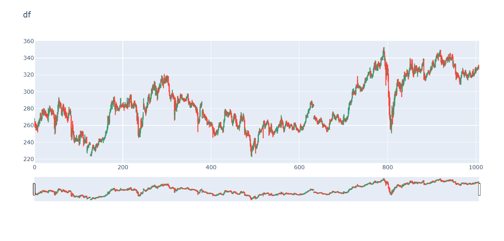
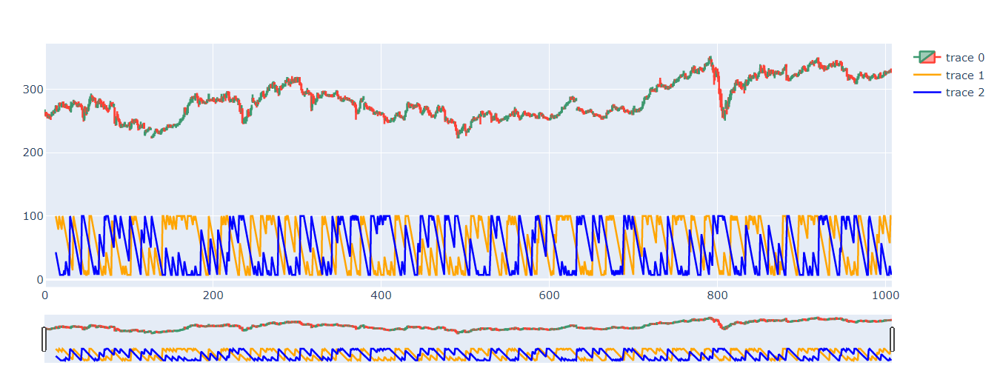
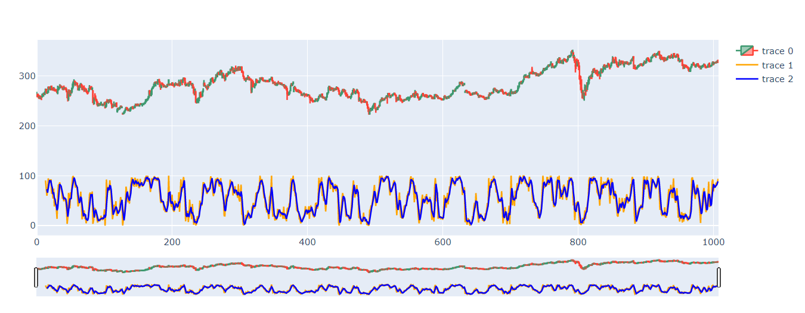

```python
!git clone https://github.com/ArseniyZu/AlgoTrading.git
%cd AlgoTrading/
```

    Cloning into 'AlgoTrading'...
    remote: Enumerating objects: 183, done.
    remote: Counting objects: 100% (183/183), done.
    remote: Compressing objects: 100% (176/176), done.
    remote: Total 183 (delta 101), reused 16 (delta 3), pack-reused 0
    Receiving objects: 100% (183/183), 106.99 KiB | 855.00 KiB/s, done.
    Resolving deltas: 100% (101/101), done.
    /content/AlgoTrading
    


```python
!git pull
```

    remote: Enumerating objects: 5, done.
    remote: Counting objects: 100% (5/5), done.
    remote: Compressing objects: 100% (3/3), done.
    remote: Total 3 (delta 2), reused 0 (delta 0), pack-reused 0
    Unpacking objects: 100% (3/3), done.
    From https://github.com/ArseniyZu/AlgoTrading
       2dd8f64..6fe119e  main       -> origin/main
    Updating 2dd8f64..6fe119e
    Fast-forward
     MACD.py | 2 +-
     1 file changed, 1 insertion(+), 1 deletion(-)
    


```python
pip install ta
```

    Collecting ta
      Downloading https://files.pythonhosted.org/packages/a9/22/a355ecf2d67da8150332d22ef65c3a1f79109528279bf5d40735b6f2bd72/ta-0.7.0.tar.gz
    Requirement already satisfied: numpy in /usr/local/lib/python3.7/dist-packages (from ta) (1.19.5)
    Requirement already satisfied: pandas in /usr/local/lib/python3.7/dist-packages (from ta) (1.1.5)
    Requirement already satisfied: pytz>=2017.2 in /usr/local/lib/python3.7/dist-packages (from pandas->ta) (2018.9)
    Requirement already satisfied: python-dateutil>=2.7.3 in /usr/local/lib/python3.7/dist-packages (from pandas->ta) (2.8.1)
    Requirement already satisfied: six>=1.5 in /usr/local/lib/python3.7/dist-packages (from python-dateutil>=2.7.3->pandas->ta) (1.15.0)
    Building wheels for collected packages: ta
      Building wheel for ta (setup.py) ... [?25l[?25hdone
      Created wheel for ta: filename=ta-0.7.0-cp37-none-any.whl size=28716 sha256=53c7b24ba212a0ee0d1b2793cd27484f53738d9a6cd3403ec19f9972bf589330
      Stored in directory: /root/.cache/pip/wheels/dd/88/30/de9553fb54a474eb7480b937cdbb140bdda613d29cf4da7994
    Successfully built ta
    Installing collected packages: ta
    Successfully installed ta-0.7.0
    


```python
import pandas as pd
import matplotlib.pyplot as plt
from draw import drawCandle, drawTrend, draw_Idic
from trend import trend
from operations import Operations
from BollingerBands import punch_bolBands, walking_bolBands
from figuresBolBands import find_W_figure
from MACD import MACD, find_cross
import ta
```


```python
df = pd.read_csv('МТС.txt', sep=";", usecols=["<OPEN>", "<DATE>", "<CLOSE>", "<LOW>", "<HIGH>"], decimal=",")
df.columns = ["Date", "Open", "High", "Low", "Close"]
df.head()
```


<div>
<style scoped>
    .dataframe tbody tr th:only-of-type {
        vertical-align: middle;
    }

    .dataframe tbody tr th {
        vertical-align: top;
    }

    .dataframe thead th {
        text-align: right;
    }
</style>
<table border="1" class="dataframe">
  <thead>
    <tr style="text-align: right;">
      <th></th>
      <th>Date</th>
      <th>Open</th>
      <th>High</th>
      <th>Low</th>
      <th>Close</th>
    </tr>
  </thead>
  <tbody>
    <tr>
      <th>0</th>
      <td>20170103</td>
      <td>259.95</td>
      <td>268.40</td>
      <td>259.00</td>
      <td>262.65</td>
    </tr>
    <tr>
      <th>1</th>
      <td>20170104</td>
      <td>262.85</td>
      <td>263.10</td>
      <td>257.05</td>
      <td>259.30</td>
    </tr>
    <tr>
      <th>2</th>
      <td>20170105</td>
      <td>260.80</td>
      <td>264.75</td>
      <td>258.00</td>
      <td>260.50</td>
    </tr>
    <tr>
      <th>3</th>
      <td>20170106</td>
      <td>259.45</td>
      <td>262.70</td>
      <td>254.00</td>
      <td>257.00</td>
    </tr>
    <tr>
      <th>4</th>
      <td>20170109</td>
      <td>257.00</td>
      <td>259.55</td>
      <td>255.45</td>
      <td>258.40</td>
    </tr>
  </tbody>
</table>
</div>


```python
df.shape
```


    (1008, 5)


```python
drawCandle(df, 0, len(df))
```



<html>
<head><meta charset="utf-8" /></head>
<body>
    <div>
            <script src="https://cdnjs.cloudflare.com/ajax/libs/mathjax/2.7.5/MathJax.js?config=TeX-AMS-MML_SVG"></script><script type="text/javascript">if (window.MathJax) {MathJax.Hub.Config({SVG: {font: "STIX-Web"}});}</script>
                <script type="text/javascript">window.PlotlyConfig = {MathJaxConfig: 'local'};</script>
        <script src="https://cdn.plot.ly/plotly-latest.min.js"></script>    
            <div id="70047547-c8df-4284-bb69-a5a5639bb408" class="plotly-graph-div" style="height:525px; width:100%;"></div>
            <script type="text/javascript">

                    window.PLOTLYENV=window.PLOTLYENV || {};

                if (document.getElementById("70047547-c8df-4284-bb69-a5a5639bb408")) {
                    Plotly.newPlot(
                        '70047547-c8df-4284-bb69-a5a5639bb408',
                        [{"close": [262.65, 259.3, 260.5, 257.0, 258.4, 255.7, 257.1, 257.95, 262.95, 263.35, 265.0, 263.6, 268.0, 272.9, 267.7, 265.7, 268.0, 277.5, 277.05, 276.35, 275.7, 279.0, 272.7, 274.35, 271.9, 275.9, 271.1, 272.2, 272.1, 270.75, 267.6, 273.45, 277.45, 277.5, 281.0, 278.55, 279.0, 277.05, 274.35, 275.5, 273.3, 275.0, 274.55, 273.0, 270.0, 257.0, 255.2, 271.8, 269.0, 260.1, 269.6, 268.15, 275.35, 283.75, 287.5, 290.0, 288.85, 283.0, 284.5, 285.05, 280.25, 272.6, 273.55, 279.1, 278.95, 284.55, 281.25, 273.5, 275.6, 275.0, 274.5, 270.8, 272.25, 269.1, 268.1, 265.9, 266.55, 274.35, 277.3, 277.6, 274.4, 273.85, 276.0, 247.3, 246.5, 256.0, 256.0, 253.1, 250.9, 246.5, 241.45, 243.7, 244.25, 242.4, 243.6, 246.4, 243.05, 242.0, 243.05, 243.0, 246.05, 236.5, 241.05, 248.8, 248.7, 248.05, 250.0, 249.0, 252.25, 249.65, 245.0, 240.75, 237.5, 239.4, 242.95, 240.35, 242.0, 244.3, 239.05, 232.0, 235.05, 234.0, 234.5, 237.0, 239.5, 237.55, 237.55, 224.05, 225.6, 227.95, 229.95, 233.45, 236.4, 234.8, 232.8, 231.0, 233.25, 230.55, 234.6, 236.4, 237.25, 237.8, 236.95, 236.2, 236.7, 240.1, 243.3, 241.05, 241.6, 243.55, 242.0, 240.6, 241.3, 243.85, 243.8, 243.8, 243.25, 244.0, 244.95, 245.25, 247.55, 252.0, 253.0, 252.0, 254.7, 257.7, 270.0, 264.9, 261.05, 264.25, 273.7, 275.45, 277.55, 283.5, 286.4, 285.9, 286.15, 288.0, 286.2, 292.45, 291.5, 288.0, 279.45, 277.55, 282.35, 283.85, 282.85, 282.05, 279.5, 279.7, 278.5, 278.6, 278.45, 282.8, 283.0, 291.95, 282.5, 283.7, 283.5, 282.3, 286.1, 281.55, 281.15, 280.75, 284.2, 284.15, 282.55, 283.4, 282.6, 281.5, 287.75, 281.6, 286.2, 291.8, 287.8, 288.5, 292.95, 295.95, 294.5, 284.2, 280.55, 283.0, 283.0, 284.3, 280.3, 283.1, 288.7, 285.9, 284.0, 282.0, 284.55, 277.4, 266.0, 264.0, 264.9, 248.0, 246.4, 252.9, 253.15, 250.85, 256.2, 266.0, 263.0, 262.15, 260.6, 269.0, 271.4, 285.5, 281.25, 280.5, 279.9, 276.0, 275.5, 282.1, 281.35, 283.05, 284.45, 293.0, 294.3, 294.7, 290.0, 287.05, 288.6, 292.2, 295.7, 301.9, 299.85, 305.3, 306.9, 303.8, 303.35, 309.0, 311.5, 304.4, 304.55, 302.75, 301.0, 295.75, 294.0, 301.0, 304.0, 300.8, 304.0, 306.15, 306.5, 307.4, 313.0, 311.0, 315.0, 316.1, 307.6, 310.6, 309.3, 315.0, 314.0, 313.25, 314.5, 313.5, 318.15, 313.0, 312.25, 316.85, 318.0, 308.1, 307.65, 300.1, 295.5, 292.85, 292.3, 295.0, 293.3, 294.15, 297.75, 295.8, 292.4, 294.1, 293.0, 272.5, 281.85, 279.0, 282.25, 279.0, 278.0, 283.2, 289.3, 289.5, 287.75, 287.15, 289.4, 289.15, 295.8, 295.1, 294.05, 296.4, 292.3, 290.55, 290.0, 291.45, 290.0, 289.85, 289.15, 290.0, 289.0, 289.05, 293.45, 293.4, 294.25, 297.3, 291.1, 286.5, 287.2, 287.15, 283.2, 283.85, 282.4, 283.1, 285.95, 285.9, 285.2, 286.05, 283.55, 284.9, 283.7, 282.75, 281.85, 282.85, 277.5, 276.55, 277.1, 272.9, 264.75, 264.95, 262.0, 266.7, 267.35, 278.1, 284.1, 281.1, 284.0, 288.0, 276.95, 278.8, 273.75, 272.9, 270.0, 269.15, 269.35, 270.4, 269.0, 268.3, 266.3, 262.0, 263.55, 262.8, 263.3, 263.95, 261.85, 263.8, 262.3, 261.3, 260.8, 261.95, 262.2, 257.5, 253.6, 253.7, 253.1, 251.0, 249.85, 248.8, 248.65, 249.15, 253.5, 253.6, 251.95, 251.55, 255.0, 258.9, 260.35, 259.15, 261.95, 263.45, 257.3, 257.95, 256.1, 256.0, 255.85, 252.5, 256.6, 264.5, 266.0, 276.65, 279.15, 275.55, 271.65, 276.65, 274.75, 274.05, 269.9, 273.1, 272.5, 274.7, 272.55, 276.3, 276.5, 275.1, 269.9, 264.0, 263.5, 262.4, 266.5, 269.65, 272.4, 271.05, 269.0, 270.4, 264.6, 262.2, 262.15, 261.5, 258.3, 258.9, 257.0, 257.6, 258.25, 262.2, 264.0, 270.95, 273.6, 269.3, 265.95, 268.3, 269.3, 271.5, 267.0, 266.3, 253.0, 252.4, 253.95, 248.9, 247.5, 249.0, 248.7, 252.7, 247.55, 248.7, 248.2, 248.2, 242.3, 237.0, 229.5, 224.0, 232.25, 232.6, 235.0, 235.0, 237.7, 240.1, 243.5, 244.75, 235.45, 232.5, 234.0, 233.35, 236.9, 238.0, 240.5, 248.6, 250.05, 252.0, 256.0, 252.8, 252.35, 252.45, 254.75, 255.25, 257.5, 260.0, 258.55, 264.45, 263.5, 261.0, 257.8, 259.55, 261.1, 260.75, 261.55, 263.25, 264.95, 263.15, 261.8, 255.0, 251.55, 255.35, 254.1, 257.2, 260.45, 253.9, 250.6, 251.0, 249.0, 249.05, 250.9, 252.5, 252.4, 253.0, 252.6, 255.95, 256.15, 257.5, 254.9, 256.6, 258.0, 260.25, 259.3, 260.0, 263.75, 261.95, 258.0, 268.0, 265.0, 262.0, 263.45, 257.75, 255.95, 252.45, 254.0, 258.0, 258.4, 262.2, 264.3, 260.85, 261.5, 259.4, 260.5, 259.05, 260.2, 257.45, 258.05, 259.0, 259.85, 261.25, 260.0, 258.8, 255.35, 257.0, 255.3, 254.9, 261.75, 262.9, 261.35, 258.6, 260.25, 255.4, 255.55, 255.45, 255.1, 254.5, 253.25, 253.15, 252.65, 253.8, 258.65, 256.7, 258.2, 255.05, 256.9, 258.25, 255.8, 258.8, 259.65, 259.2, 262.95, 263.15, 264.75, 269.95, 269.55, 270.1, 269.85, 274.2, 276.0, 278.0, 277.85, 279.6, 280.4, 287.05, 284.95, 284.9, 286.45, 281.4, 282.95, 282.85, 284.95, 268.6, 270.95, 269.0, 266.9, 268.55, 268.3, 266.8, 264.1, 261.8, 262.4, 262.7, 265.45, 265.5, 265.1, 266.0, 264.8, 267.2, 265.0, 263.85, 261.75, 257.8, 260.0, 259.35, 260.0, 258.75, 259.3, 258.25, 257.5, 256.5, 254.0, 256.05, 255.25, 256.25, 256.85, 256.35, 262.0, 261.05, 265.3, 264.6, 266.35, 266.7, 266.2, 273.4, 275.1, 272.3, 272.55, 269.0, 270.4, 267.4, 267.95, 269.3, 269.85, 271.0, 270.3, 273.05, 269.5, 266.15, 264.7, 266.0, 266.7, 265.0, 264.45, 262.35, 262.65, 263.4, 265.7, 260.9, 268.65, 272.75, 268.0, 265.5, 267.5, 267.75, 265.35, 269.1, 267.0, 270.3, 270.95, 275.25, 278.65, 285.7, 287.3, 287.75, 285.0, 286.3, 289.75, 291.8, 299.6, 300.3, 297.8, 299.5, 298.6, 297.3, 300.2, 297.45, 305.5, 306.1, 306.0, 305.15, 308.5, 304.5, 306.35, 306.7, 304.5, 305.85, 303.1, 303.6, 304.1, 300.8, 302.5, 302.4, 305.2, 305.1, 304.4, 306.85, 311.2, 313.85, 312.3, 313.7, 314.05, 314.0, 318.05, 319.7, 320.0, 319.95, 322.1, 323.45, 328.15, 324.3, 319.4, 319.45, 317.3, 318.65, 319.8, 321.15, 327.2, 328.7, 333.8, 329.95, 336.45, 326.75, 327.25, 328.5, 330.5, 326.4, 331.95, 332.95, 331.4, 331.0, 331.0, 330.7, 332.7, 339.0, 337.8, 340.55, 341.0, 341.4, 348.1, 347.5, 348.0, 337.5, 339.0, 329.0, 320.5, 327.2, 328.25, 328.75, 329.55, 318.8, 294.8, 293.3, 272.95, 269.0, 267.1, 268.45, 256.75, 265.5, 276.5, 262.1, 280.0, 278.35, 285.95, 290.0, 296.95, 299.1, 297.0, 299.3, 295.6, 308.85, 308.7, 313.85, 310.45, 310.95, 308.0, 310.95, 304.0, 303.4, 305.35, 306.0, 302.0, 309.7, 314.25, 306.8, 311.4, 313.5, 319.2, 319.6, 316.55, 320.4, 318.0, 320.3, 325.3, 323.6, 318.45, 315.15, 320.15, 325.5, 327.25, 332.55, 328.7, 327.1, 332.2, 331.9, 326.5, 324.05, 320.0, 319.6, 326.7, 329.7, 323.5, 326.25, 325.5, 329.15, 326.85, 322.8, 323.8, 328.0, 325.75, 326.05, 327.35, 325.0, 324.7, 325.45, 324.3, 325.95, 330.45, 330.85, 334.6, 338.1, 336.6, 321.1, 315.0, 314.95, 315.7, 317.0, 319.7, 321.0, 321.55, 322.75, 322.2, 323.85, 321.95, 321.0, 323.25, 326.7, 329.8, 325.6, 327.55, 333.3, 335.7, 333.95, 332.75, 329.75, 329.15, 329.55, 337.5, 337.9, 340.2, 341.95, 341.9, 342.0, 341.9, 341.5, 344.25, 344.75, 346.65, 348.7, 341.75, 335.9, 339.5, 335.8, 335.4, 336.0, 335.8, 332.35, 336.1, 332.2, 331.7, 333.7, 336.95, 338.75, 339.75, 337.45, 337.8, 339.45, 339.35, 337.2, 340.2, 344.4, 339.1, 338.7, 338.3, 340.45, 343.25, 340.2, 332.0, 335.15, 329.0, 330.8, 330.6, 332.6, 321.75, 321.75, 316.2, 320.8, 321.15, 320.45, 318.4, 317.25, 316.2, 313.15, 313.1, 311.6, 315.95, 319.25, 323.4, 323.65, 324.7, 322.6, 322.15, 318.95, 321.7, 323.15, 324.7, 321.6, 319.45, 317.7, 319.55, 314.85, 319.05, 318.8, 321.0, 321.65, 322.85, 321.0, 317.55, 316.85, 317.55, 318.05, 320.8, 324.0, 318.65, 318.95, 320.7, 321.4, 325.9, 328.05, 325.3, 326.85, 326.75, 326.45, 327.9, 327.65, 330.25, 331.2], "high": [268.4, 263.1, 264.75, 262.7, 259.55, 261.3, 258.2, 260.0, 263.55, 264.95, 267.1, 265.9, 269.3, 275.1, 274.8, 269.85, 269.7, 279.0, 279.55, 278.95, 277.65, 280.65, 279.9, 277.5, 275.75, 277.95, 275.45, 273.7, 273.0, 273.9, 270.95, 280.65, 278.0, 279.0, 283.65, 282.5, 280.9, 279.8, 278.0, 277.0, 279.6, 278.0, 275.5, 278.0, 274.6, 270.0, 260.0, 272.0, 273.0, 271.55, 269.6, 272.3, 275.85, 284.7, 287.8, 293.5, 291.25, 288.6, 287.65, 287.45, 286.5, 279.5, 276.2, 281.8, 283.9, 285.9, 285.0, 281.25, 276.65, 279.8, 281.4, 276.95, 273.8, 275.15, 271.4, 267.05, 270.9, 274.35, 282.0, 278.55, 278.8, 280.0, 277.5, 272.0, 255.2, 256.8, 265.4, 261.15, 253.1, 252.9, 247.65, 245.35, 245.4, 245.35, 244.4, 248.8, 244.5, 244.5, 243.4, 243.9, 247.9, 248.75, 242.0, 249.8, 253.85, 253.05, 253.3, 251.95, 252.25, 253.5, 252.35, 245.9, 243.75, 243.0, 249.0, 243.3, 243.15, 246.55, 246.45, 235.4, 235.4, 237.0, 237.25, 237.55, 239.7, 240.1, 239.35, 226.1, 226.0, 228.7, 231.0, 233.45, 236.5, 237.0, 236.75, 233.1, 233.35, 234.45, 235.3, 237.35, 237.95, 238.55, 238.3, 238.0, 238.85, 240.6, 244.45, 244.55, 243.7, 243.7, 243.85, 242.9, 242.9, 244.4, 245.95, 245.45, 243.65, 244.0, 246.25, 246.2, 248.0, 252.5, 253.0, 253.7, 254.7, 260.25, 271.45, 271.6, 270.5, 270.0, 275.45, 279.0, 280.0, 284.8, 286.75, 289.35, 288.15, 288.9, 289.95, 293.6, 293.3, 294.45, 289.8, 282.9, 284.95, 287.5, 285.35, 283.0, 283.0, 281.8, 280.35, 280.0, 281.0, 283.65, 284.8, 291.95, 283.65, 284.7, 284.25, 285.75, 286.3, 287.45, 284.6, 282.6, 285.0, 287.7, 285.75, 285.5, 284.2, 285.6, 292.9, 288.0, 286.9, 292.0, 291.8, 289.95, 295.0, 296.4, 296.95, 296.45, 288.5, 284.7, 283.85, 285.75, 286.5, 283.1, 289.45, 289.0, 286.8, 285.95, 284.55, 283.9, 277.3, 267.9, 275.0, 270.4, 254.7, 253.05, 256.65, 253.15, 257.95, 267.4, 269.2, 264.6, 263.1, 269.3, 275.7, 292.15, 285.75, 282.55, 280.3, 278.8, 278.9, 282.85, 282.6, 287.5, 287.25, 293.4, 295.9, 297.5, 297.85, 290.05, 292.65, 292.9, 298.0, 303.85, 303.7, 306.5, 308.85, 308.5, 308.5, 311.55, 312.85, 311.1, 307.5, 307.0, 305.0, 302.0, 295.45, 301.8, 304.7, 304.65, 307.0, 310.0, 308.3, 308.0, 315.0, 314.8, 319.5, 319.0, 317.5, 312.55, 313.0, 316.0, 321.0, 313.9, 316.4, 318.6, 318.35, 317.95, 319.75, 316.85, 318.8, 318.0, 310.0, 309.75, 300.95, 296.35, 295.15, 295.0, 297.3, 297.75, 302.25, 298.65, 298.2, 296.0, 295.55, 293.0, 288.95, 293.0, 290.0, 286.5, 284.4, 285.5, 295.0, 294.35, 290.75, 292.0, 289.8, 290.45, 295.8, 297.85, 295.2, 297.0, 295.95, 293.0, 292.15, 292.6, 291.0, 292.65, 291.75, 291.85, 291.25, 290.65, 293.45, 294.4, 295.95, 297.3, 297.45, 292.15, 288.8, 288.75, 287.9, 286.5, 286.85, 284.85, 286.8, 290.4, 286.9, 287.95, 286.0, 285.55, 285.55, 283.75, 284.35, 283.85, 282.3, 279.75, 281.6, 279.75, 275.05, 269.8, 267.65, 267.0, 271.4, 282.3, 285.9, 286.5, 285.0, 288.0, 277.65, 279.75, 278.65, 275.5, 272.85, 273.2, 273.7, 271.35, 271.55, 269.6, 269.55, 267.7, 264.85, 263.45, 264.35, 266.9, 264.5, 264.75, 264.4, 263.7, 261.5, 263.9, 263.65, 261.25, 257.9, 258.5, 255.0, 256.65, 252.75, 252.0, 250.5, 252.0, 253.65, 254.8, 254.95, 252.7, 255.4, 259.5, 263.3, 262.55, 263.3, 263.95, 263.95, 258.85, 259.0, 257.35, 257.75, 256.5, 259.3, 267.0, 267.5, 277.85, 279.15, 278.7, 277.5, 276.65, 276.6, 275.7, 275.1, 275.7, 273.35, 275.7, 275.5, 279.5, 278.45, 277.2, 274.8, 271.6, 265.55, 264.35, 267.0, 270.5, 274.0, 273.8, 274.4, 273.55, 272.1, 264.55, 267.4, 262.95, 260.15, 259.55, 258.95, 260.45, 258.45, 265.25, 267.5, 270.95, 275.7, 272.9, 271.0, 269.5, 269.45, 274.55, 272.35, 270.0, 265.95, 257.4, 255.0, 253.7, 251.8, 250.85, 250.85, 254.3, 253.75, 252.9, 249.8, 249.0, 248.05, 244.3, 238.2, 231.7, 233.85, 236.4, 235.65, 235.4, 238.75, 240.95, 244.2, 244.75, 244.3, 233.3, 235.35, 237.0, 237.85, 238.75, 241.5, 248.6, 253.0, 253.35, 256.0, 255.4, 253.65, 254.75, 255.2, 256.3, 257.9, 260.0, 259.5, 264.6, 266.3, 264.75, 262.5, 261.85, 262.3, 263.7, 265.0, 264.7, 267.0, 265.95, 262.95, 262.85, 253.35, 258.25, 256.75, 257.4, 262.8, 261.0, 255.45, 254.6, 252.8, 251.45, 251.7, 253.35, 253.3, 253.8, 255.4, 256.15, 256.65, 258.8, 256.0, 256.9, 258.85, 260.4, 261.65, 261.6, 264.4, 266.5, 264.6, 272.1, 269.25, 266.7, 265.95, 264.2, 258.85, 257.3, 254.85, 258.8, 260.95, 262.55, 265.25, 265.0, 263.8, 262.0, 262.95, 263.9, 263.25, 262.05, 259.6, 259.8, 260.25, 261.9, 261.65, 261.0, 259.5, 257.4, 258.5, 256.3, 262.5, 263.35, 262.25, 263.35, 260.8, 259.7, 257.85, 257.3, 256.3, 256.5, 254.15, 254.9, 254.2, 254.5, 258.95, 261.95, 258.4, 259.35, 257.55, 258.3, 257.85, 258.8, 261.35, 261.35, 263.2, 264.0, 265.35, 272.7, 271.85, 271.7, 274.0, 274.4, 277.85, 279.85, 278.3, 279.95, 281.5, 287.05, 287.75, 288.8, 289.7, 288.35, 285.2, 285.0, 285.5, 270.3, 271.9, 271.8, 270.5, 268.9, 269.95, 268.7, 268.25, 265.45, 265.55, 264.1, 265.45, 267.05, 267.85, 266.0, 267.9, 269.5, 268.45, 265.75, 265.45, 262.7, 261.75, 260.75, 262.3, 260.4, 260.8, 260.35, 259.2, 258.6, 256.8, 257.15, 258.45, 256.5, 257.5, 257.8, 262.5, 267.4, 265.3, 266.5, 267.1, 268.55, 267.2, 273.45, 276.6, 275.25, 274.3, 272.55, 272.9, 271.45, 270.1, 269.9, 270.75, 272.3, 273.05, 273.05, 272.35, 270.5, 267.7, 267.0, 266.95, 268.8, 266.8, 265.2, 263.25, 264.0, 266.1, 265.45, 270.85, 272.75, 268.6, 268.75, 268.3, 268.25, 267.8, 269.5, 269.5, 271.25, 271.15, 281.35, 280.0, 286.6, 287.3, 288.9, 289.25, 287.85, 290.6, 291.9, 299.8, 303.3, 299.55, 303.95, 300.2, 301.0, 301.25, 302.0, 306.0, 308.7, 306.45, 308.6, 318.55, 310.4, 308.45, 306.7, 306.25, 307.55, 306.15, 305.55, 305.7, 304.0, 305.0, 304.3, 305.85, 308.95, 306.6, 309.7, 311.2, 316.45, 316.5, 313.7, 317.4, 315.9, 318.7, 320.45, 323.75, 323.65, 322.85, 323.45, 328.5, 324.4, 324.15, 320.5, 321.4, 319.55, 319.8, 322.0, 327.2, 330.5, 334.15, 334.9, 336.45, 336.0, 331.7, 328.75, 332.5, 333.5, 332.2, 336.1, 335.5, 334.5, 334.15, 332.8, 334.15, 340.45, 340.15, 341.0, 342.6, 342.3, 348.9, 352.45, 353.05, 348.0, 342.7, 338.8, 333.3, 332.65, 335.4, 328.85, 331.55, 328.05, 321.35, 301.2, 299.9, 293.55, 272.9, 272.0, 268.4, 266.95, 283.3, 276.5, 280.0, 287.85, 287.65, 293.0, 297.0, 300.65, 299.75, 302.85, 304.4, 310.5, 314.55, 313.85, 314.7, 311.3, 311.35, 311.8, 311.0, 309.8, 309.85, 309.25, 304.95, 312.55, 314.25, 314.1, 311.95, 319.65, 323.15, 323.95, 318.05, 321.05, 321.9, 322.45, 326.6, 325.8, 324.4, 320.7, 322.35, 326.3, 328.85, 339.85, 337.95, 330.95, 332.35, 339.0, 337.7, 329.85, 324.85, 323.55, 327.6, 333.5, 330.6, 328.55, 331.45, 330.35, 331.2, 326.5, 325.2, 328.5, 328.9, 327.55, 330.0, 327.65, 326.3, 327.1, 326.95, 326.65, 333.0, 334.0, 335.0, 339.6, 338.55, 323.2, 322.0, 317.7, 318.8, 317.7, 319.95, 322.1, 322.15, 322.9, 325.85, 324.5, 325.2, 323.55, 323.7, 326.95, 330.3, 328.95, 328.4, 334.95, 336.0, 337.9, 335.3, 334.05, 332.3, 331.65, 338.25, 339.1, 342.1, 344.55, 343.65, 346.4, 344.25, 342.85, 346.0, 345.85, 346.75, 349.7, 349.1, 343.95, 341.3, 342.9, 339.3, 338.25, 337.0, 336.95, 336.65, 337.45, 333.75, 333.9, 337.5, 339.7, 340.4, 341.5, 338.0, 341.95, 344.5, 340.65, 340.85, 345.2, 346.2, 341.0, 340.8, 341.0, 344.3, 344.95, 341.75, 336.7, 331.15, 333.3, 332.9, 332.75, 333.55, 324.2, 323.75, 322.4, 321.95, 322.8, 321.35, 319.95, 319.35, 316.75, 315.95, 312.35, 317.0, 320.2, 324.0, 324.2, 328.3, 326.0, 324.3, 322.5, 321.95, 323.6, 325.9, 324.7, 323.1, 319.9, 320.1, 321.1, 319.4, 319.7, 321.95, 322.85, 325.4, 323.85, 322.4, 320.0, 320.1, 319.3, 324.2, 324.75, 327.2, 322.3, 320.95, 323.0, 326.8, 329.0, 329.45, 327.8, 328.2, 327.8, 329.7, 329.75, 331.7, 332.05], "low": [259.0, 257.05, 258.0, 254.0, 255.45, 253.6, 255.0, 251.65, 256.95, 259.2, 258.65, 261.5, 262.0, 268.1, 266.2, 265.1, 265.7, 268.0, 273.05, 273.9, 271.2, 272.8, 272.7, 272.85, 271.0, 271.45, 271.1, 269.1, 270.2, 268.05, 265.55, 263.5, 270.7, 272.45, 274.85, 278.25, 276.25, 276.4, 272.5, 271.5, 272.6, 273.7, 273.0, 273.0, 267.25, 256.0, 249.15, 250.5, 263.6, 259.4, 261.0, 264.5, 265.45, 273.15, 276.25, 282.1, 287.15, 280.0, 282.25, 284.75, 280.1, 272.6, 271.3, 270.6, 276.4, 276.65, 278.0, 273.4, 271.5, 271.25, 268.25, 270.15, 269.0, 268.65, 265.5, 263.05, 265.0, 268.0, 271.25, 273.3, 273.55, 272.2, 271.15, 246.0, 242.3, 243.55, 256.0, 250.9, 248.1, 241.15, 238.75, 239.6, 240.35, 241.0, 240.65, 242.35, 240.7, 241.55, 240.75, 241.7, 242.25, 236.5, 237.6, 238.05, 247.5, 246.25, 244.55, 246.5, 247.0, 248.8, 245.0, 235.1, 237.5, 238.55, 239.0, 239.5, 238.45, 240.05, 239.05, 226.7, 230.15, 233.55, 232.85, 234.05, 237.25, 237.5, 236.55, 224.0, 223.05, 223.6, 226.6, 230.3, 232.6, 233.65, 232.4, 230.1, 230.55, 230.15, 228.35, 230.55, 233.7, 235.5, 233.35, 233.6, 235.8, 236.15, 240.0, 240.0, 241.1, 240.7, 241.4, 240.1, 240.0, 241.45, 243.6, 242.5, 239.05, 241.8, 243.0, 244.15, 244.7, 247.3, 248.0, 250.0, 250.85, 254.25, 256.0, 263.2, 260.65, 261.0, 262.3, 274.25, 275.5, 277.5, 279.0, 285.15, 279.05, 284.65, 285.95, 282.05, 289.05, 288.0, 279.3, 272.25, 276.0, 282.55, 280.55, 277.1, 279.0, 277.35, 277.7, 276.45, 277.4, 279.15, 281.7, 282.35, 280.45, 281.75, 281.8, 282.3, 282.45, 281.55, 280.85, 277.25, 280.95, 283.65, 282.0, 281.5, 280.2, 280.95, 280.55, 279.0, 281.65, 285.0, 287.6, 281.7, 286.15, 290.8, 290.75, 281.9, 279.8, 280.6, 281.8, 283.0, 280.3, 280.3, 282.9, 285.1, 282.7, 281.05, 275.1, 276.05, 265.45, 261.25, 263.3, 247.75, 245.1, 246.05, 250.35, 245.85, 250.8, 254.95, 256.2, 258.0, 257.45, 258.6, 267.1, 278.6, 281.0, 278.5, 276.0, 274.4, 271.3, 273.4, 276.45, 281.0, 280.35, 283.45, 287.7, 290.95, 289.65, 285.2, 287.0, 287.9, 291.5, 295.0, 297.4, 297.3, 303.25, 301.8, 302.3, 301.0, 305.0, 302.3, 295.25, 296.0, 299.45, 295.75, 289.4, 291.0, 300.0, 298.1, 300.0, 303.0, 304.0, 305.35, 304.25, 311.0, 312.15, 313.4, 307.6, 306.8, 304.1, 309.2, 313.5, 309.45, 310.65, 309.85, 311.85, 313.0, 310.6, 311.0, 312.0, 307.45, 306.5, 299.65, 295.35, 290.85, 291.0, 288.2, 291.55, 293.65, 294.15, 294.55, 290.7, 291.7, 292.5, 265.5, 266.7, 277.0, 281.2, 277.5, 276.15, 280.45, 282.8, 287.0, 285.35, 286.05, 286.5, 286.25, 289.4, 292.5, 293.0, 291.45, 290.1, 290.0, 289.4, 289.8, 287.7, 288.15, 288.05, 288.5, 288.7, 288.3, 289.05, 291.25, 293.2, 293.15, 289.1, 284.1, 284.95, 286.3, 281.6, 280.5, 282.4, 281.45, 283.1, 285.05, 284.0, 285.0, 282.35, 283.7, 281.6, 281.75, 281.05, 278.25, 275.2, 274.2, 276.3, 271.25, 252.0, 264.1, 261.55, 262.35, 264.15, 270.1, 279.8, 281.0, 281.45, 283.5, 268.1, 275.3, 273.65, 269.0, 269.1, 269.1, 268.1, 266.0, 268.3, 265.2, 266.15, 260.0, 260.9, 260.65, 261.3, 261.9, 257.5, 260.25, 262.0, 258.5, 258.6, 260.0, 261.2, 255.6, 245.25, 250.1, 250.5, 248.85, 246.65, 248.55, 247.5, 248.45, 248.5, 252.05, 250.45, 248.0, 250.25, 254.5, 258.05, 257.5, 257.15, 261.1, 257.05, 254.75, 255.3, 254.5, 252.5, 250.85, 252.55, 257.9, 262.55, 265.45, 272.6, 271.6, 271.3, 270.5, 274.2, 272.7, 269.6, 269.25, 270.6, 271.25, 272.35, 273.15, 274.45, 272.5, 269.85, 264.0, 261.5, 259.0, 261.8, 263.15, 265.55, 270.25, 267.25, 268.45, 263.0, 258.55, 262.0, 257.55, 255.1, 255.55, 255.55, 256.5, 253.45, 257.7, 263.65, 262.05, 268.45, 265.85, 264.5, 264.9, 265.1, 267.0, 266.55, 263.6, 248.4, 250.0, 252.3, 248.1, 245.05, 247.1, 247.25, 248.2, 247.35, 247.8, 248.0, 245.4, 242.0, 234.25, 229.5, 223.55, 222.4, 228.75, 229.1, 231.75, 230.6, 234.2, 237.15, 239.75, 233.5, 226.4, 231.8, 231.85, 233.3, 235.5, 237.0, 239.55, 247.7, 249.1, 249.15, 251.8, 251.05, 251.55, 251.5, 253.95, 255.15, 256.75, 244.7, 257.7, 262.2, 260.05, 255.45, 256.35, 258.45, 260.0, 260.65, 261.8, 262.65, 261.9, 259.65, 247.5, 249.0, 251.35, 251.2, 251.7, 255.65, 253.05, 250.5, 250.2, 245.85, 247.3, 249.3, 248.75, 250.75, 250.6, 252.45, 252.75, 253.8, 256.1, 250.5, 252.6, 256.25, 257.1, 257.15, 259.65, 258.6, 260.35, 257.25, 256.65, 264.2, 260.7, 261.15, 257.05, 255.1, 251.5, 252.15, 254.8, 257.5, 258.55, 262.1, 260.0, 260.9, 258.25, 258.8, 258.7, 259.3, 255.8, 256.85, 256.5, 258.85, 259.3, 259.5, 258.3, 254.1, 254.5, 255.15, 254.35, 255.0, 261.2, 259.8, 258.5, 257.0, 254.5, 254.25, 253.7, 253.2, 253.85, 251.2, 251.3, 251.75, 251.9, 253.4, 256.2, 256.4, 255.05, 253.5, 255.75, 254.55, 254.45, 258.15, 258.2, 259.8, 261.8, 262.15, 264.1, 268.15, 269.0, 269.05, 268.75, 273.75, 276.7, 274.15, 277.8, 278.05, 279.9, 284.5, 284.35, 284.8, 280.5, 280.95, 281.85, 282.15, 267.05, 267.25, 267.85, 266.5, 265.0, 266.4, 266.55, 264.0, 261.05, 261.3, 261.0, 262.0, 264.0, 262.6, 262.85, 264.3, 264.35, 264.7, 262.9, 260.2, 257.0, 257.95, 258.3, 258.95, 258.4, 258.3, 257.7, 255.65, 255.3, 252.0, 253.8, 252.1, 254.2, 253.95, 255.05, 254.7, 260.85, 261.3, 263.65, 264.55, 264.75, 265.1, 267.1, 272.75, 271.5, 270.2, 267.6, 267.65, 267.0, 266.45, 265.65, 267.8, 269.5, 269.35, 268.35, 268.35, 265.8, 262.9, 265.3, 264.45, 264.55, 263.4, 262.1, 260.8, 261.75, 262.55, 260.55, 261.0, 268.65, 265.1, 265.0, 263.45, 267.0, 264.15, 264.9, 266.0, 266.65, 267.75, 270.35, 273.3, 277.9, 283.25, 284.9, 283.6, 284.9, 286.8, 287.75, 291.8, 297.0, 295.85, 298.5, 296.5, 297.3, 297.35, 295.2, 297.5, 303.9, 304.0, 304.95, 308.0, 304.5, 304.0, 304.0, 303.7, 304.45, 299.6, 300.4, 301.25, 300.8, 300.4, 301.25, 302.4, 305.0, 303.05, 304.7, 307.0, 310.0, 310.7, 310.3, 313.25, 312.5, 314.0, 317.8, 319.45, 319.05, 320.65, 321.3, 321.7, 315.65, 319.25, 316.65, 317.2, 315.4, 317.0, 317.75, 321.95, 323.6, 329.0, 326.05, 330.5, 325.1, 325.65, 326.25, 324.6, 326.0, 324.7, 330.55, 330.1, 329.45, 327.55, 326.85, 329.6, 331.05, 336.65, 338.0, 339.3, 337.3, 341.1, 346.95, 344.25, 337.5, 330.4, 326.0, 307.25, 314.1, 325.05, 319.25, 324.5, 311.8, 293.0, 283.1, 271.7, 266.0, 255.0, 256.2, 253.35, 250.55, 270.35, 261.0, 268.85, 269.5, 272.25, 281.35, 283.25, 291.0, 294.0, 295.85, 295.0, 297.3, 306.2, 306.1, 308.95, 306.05, 303.55, 307.8, 300.75, 299.25, 304.4, 303.5, 293.5, 299.45, 306.65, 306.1, 307.3, 308.7, 313.5, 317.3, 312.35, 317.35, 317.55, 318.0, 320.5, 320.3, 318.05, 315.05, 318.0, 320.3, 324.0, 327.0, 328.3, 325.1, 326.85, 331.55, 326.3, 321.7, 318.0, 316.85, 320.55, 326.75, 321.15, 321.7, 324.05, 324.65, 324.8, 322.05, 317.5, 325.55, 323.35, 323.55, 326.35, 322.7, 323.4, 321.65, 323.6, 324.5, 325.5, 329.5, 330.45, 335.3, 314.0, 317.85, 314.0, 312.5, 315.3, 313.15, 316.1, 317.35, 319.8, 320.2, 321.5, 322.05, 321.25, 319.2, 321.0, 323.0, 325.75, 324.35, 325.6, 326.55, 330.7, 333.25, 329.65, 328.9, 327.9, 328.2, 329.5, 335.4, 335.8, 339.15, 340.2, 340.2, 338.25, 336.6, 341.3, 342.45, 341.4, 345.85, 341.1, 334.1, 331.6, 333.55, 332.7, 332.2, 331.05, 328.2, 330.05, 331.35, 330.25, 331.6, 333.5, 336.5, 337.1, 337.0, 334.35, 335.8, 339.0, 336.35, 334.6, 339.85, 338.15, 337.7, 336.4, 337.45, 339.7, 339.4, 329.35, 332.05, 327.5, 329.55, 329.4, 329.2, 320.1, 313.7, 315.2, 316.0, 316.65, 318.0, 317.2, 316.3, 315.9, 310.1, 308.2, 308.6, 308.2, 316.5, 317.0, 320.65, 323.6, 320.55, 320.65, 318.3, 316.65, 320.35, 319.25, 319.2, 318.5, 316.25, 317.6, 314.1, 313.5, 317.4, 316.8, 318.3, 321.25, 320.1, 317.1, 316.2, 317.1, 316.5, 317.65, 320.55, 318.25, 318.0, 318.2, 319.5, 321.3, 322.25, 321.5, 323.55, 325.5, 326.1, 325.1, 327.15, 327.9, 326.1], "open": [259.95, 262.85, 260.8, 259.45, 257.0, 258.4, 255.05, 259.0, 259.0, 262.1, 262.8, 264.0, 263.55, 270.15, 272.9, 267.8, 266.0, 268.0, 277.45, 277.5, 275.55, 277.0, 279.4, 274.55, 275.75, 272.7, 274.95, 272.45, 272.35, 272.0, 270.85, 266.4, 273.0, 277.4, 277.5, 281.05, 278.5, 278.55, 277.05, 274.3, 279.6, 274.95, 274.65, 274.55, 273.95, 268.05, 256.4, 255.05, 270.95, 268.95, 262.3, 269.0, 269.1, 275.35, 280.05, 287.95, 288.85, 288.1, 283.65, 286.0, 284.7, 279.5, 272.4, 273.3, 280.4, 278.0, 282.9, 281.25, 273.5, 277.5, 276.0, 275.6, 270.85, 273.75, 270.0, 266.2, 268.05, 269.8, 274.4, 278.25, 276.9, 275.8, 275.2, 270.1, 248.0, 244.8, 260.0, 257.55, 253.1, 249.05, 247.5, 240.95, 241.0, 244.4, 242.4, 242.35, 243.0, 243.25, 241.0, 243.0, 243.0, 246.1, 238.15, 241.75, 249.0, 250.15, 249.05, 250.0, 248.6, 251.2, 249.2, 243.45, 240.0, 238.85, 240.5, 242.9, 239.9, 242.3, 245.75, 229.0, 232.0, 235.45, 233.65, 235.0, 237.25, 239.3, 237.05, 224.8, 225.0, 225.65, 227.6, 230.95, 233.0, 236.4, 234.05, 232.05, 230.8, 232.5, 230.6, 233.75, 236.0, 237.05, 238.3, 236.9, 236.65, 236.85, 240.0, 243.45, 241.9, 240.7, 243.1, 241.45, 240.0, 242.75, 243.85, 243.65, 243.15, 243.0, 243.0, 245.0, 245.05, 247.8, 251.5, 251.5, 252.2, 254.8, 257.7, 270.4, 264.0, 261.0, 263.65, 274.75, 276.15, 278.5, 283.5, 287.0, 285.9, 287.0, 288.0, 284.9, 291.0, 291.6, 288.0, 278.1, 277.1, 284.5, 285.0, 282.9, 282.0, 279.0, 279.85, 277.65, 279.0, 279.9, 283.45, 282.5, 283.0, 282.95, 283.7, 283.4, 283.5, 285.05, 283.0, 281.6, 281.0, 283.65, 284.5, 283.05, 283.5, 283.7, 282.4, 287.5, 282.0, 287.0, 291.5, 289.95, 288.0, 292.7, 295.9, 294.6, 285.0, 281.25, 283.0, 283.0, 285.95, 280.3, 283.1, 288.7, 285.3, 284.0, 282.0, 281.8, 277.3, 265.0, 264.0, 267.0, 249.65, 247.3, 253.05, 247.0, 250.9, 257.8, 266.5, 263.25, 261.0, 261.1, 270.35, 282.0, 285.5, 281.2, 279.0, 278.5, 276.0, 277.3, 282.0, 281.0, 283.55, 284.4, 292.85, 294.0, 294.7, 289.05, 288.95, 290.35, 292.4, 296.9, 302.05, 300.0, 304.0, 306.0, 303.8, 303.45, 307.5, 310.0, 302.0, 298.65, 304.0, 300.05, 294.0, 294.45, 301.0, 304.45, 304.9, 303.0, 305.2, 306.5, 307.2, 312.25, 312.8, 314.0, 315.85, 309.5, 310.6, 309.95, 315.8, 313.25, 313.1, 315.0, 312.05, 317.0, 313.35, 312.5, 315.9, 318.0, 309.9, 307.9, 299.0, 295.75, 294.0, 291.3, 294.1, 294.05, 294.15, 298.0, 297.0, 293.5, 293.7, 293.0, 272.95, 281.0, 283.0, 283.85, 276.85, 281.0, 283.05, 291.0, 290.0, 288.65, 288.0, 287.1, 290.0, 295.8, 293.85, 294.85, 295.95, 291.3, 290.9, 290.2, 290.5, 289.6, 289.85, 290.2, 291.15, 289.65, 289.55, 293.3, 293.2, 295.0, 296.45, 290.5, 286.5, 287.4, 287.9, 283.65, 284.65, 281.45, 283.1, 286.95, 286.4, 285.65, 286.0, 283.7, 285.4, 282.6, 282.45, 281.8, 281.75, 277.0, 276.8, 277.3, 274.8, 265.95, 265.15, 262.95, 265.7, 270.95, 280.6, 284.1, 281.95, 284.55, 269.0, 277.95, 276.6, 273.65, 270.75, 271.5, 271.0, 269.0, 271.0, 269.55, 268.3, 267.0, 262.8, 261.25, 264.0, 263.6, 263.2, 262.35, 263.8, 263.0, 261.3, 261.3, 262.2, 260.9, 257.05, 253.85, 252.5, 253.55, 250.15, 249.65, 249.2, 248.95, 250.0, 253.5, 253.8, 251.5, 252.5, 255.25, 258.85, 260.95, 259.25, 261.35, 263.7, 257.3, 258.05, 256.1, 255.8, 256.0, 252.7, 257.9, 264.55, 266.9, 276.35, 278.2, 275.0, 271.9, 275.55, 275.5, 275.0, 270.85, 273.25, 272.75, 275.0, 273.95, 276.95, 276.0, 274.15, 270.45, 264.0, 261.0, 262.9, 266.0, 270.65, 272.5, 271.0, 268.8, 270.5, 263.85, 262.75, 262.05, 258.5, 257.5, 258.8, 257.7, 257.0, 258.45, 265.05, 264.05, 273.0, 272.5, 269.45, 264.9, 268.45, 269.5, 271.55, 267.0, 265.95, 251.75, 253.0, 253.6, 248.9, 248.5, 248.7, 249.45, 250.35, 249.5, 248.9, 248.1, 247.85, 242.5, 237.0, 229.45, 224.65, 233.8, 233.6, 233.1, 232.7, 235.9, 238.35, 242.6, 244.25, 232.95, 232.65, 236.45, 233.35, 237.0, 240.9, 240.4, 248.6, 252.5, 251.15, 254.8, 251.6, 252.55, 252.5, 255.5, 256.3, 257.95, 259.0, 258.5, 263.8, 264.75, 261.0, 257.7, 260.2, 262.0, 260.65, 263.1, 263.95, 265.1, 262.8, 260.2, 252.0, 252.0, 255.35, 252.4, 257.25, 260.45, 253.75, 251.95, 251.4, 249.5, 250.5, 250.65, 252.8, 252.3, 253.6, 253.3, 254.85, 256.65, 250.8, 254.15, 257.5, 258.2, 260.45, 260.3, 261.4, 262.15, 260.5, 259.0, 268.2, 262.95, 262.0, 263.5, 257.8, 255.65, 253.95, 255.0, 258.0, 259.1, 263.0, 265.0, 262.0, 261.0, 259.05, 261.95, 260.55, 261.05, 258.35, 258.05, 259.5, 260.05, 260.7, 260.0, 257.1, 255.2, 257.8, 255.0, 255.0, 261.4, 261.8, 261.65, 259.2, 258.85, 255.5, 255.5, 255.6, 255.1, 254.15, 253.2, 253.25, 252.7, 254.0, 260.0, 257.45, 257.5, 254.75, 256.9, 256.35, 256.6, 258.7, 259.9, 260.0, 262.5, 264.0, 264.75, 269.4, 269.8, 270.15, 270.5, 274.3, 277.0, 277.8, 278.65, 280.0, 281.0, 286.95, 285.35, 286.0, 286.5, 280.95, 283.8, 282.95, 267.7, 268.9, 271.15, 269.35, 266.9, 268.6, 268.3, 265.5, 264.0, 262.5, 263.2, 262.95, 264.55, 265.5, 265.5, 265.6, 265.05, 267.0, 263.9, 261.55, 261.05, 258.0, 260.75, 260.1, 260.0, 259.3, 258.9, 259.2, 257.55, 256.05, 255.1, 256.45, 255.25, 256.0, 257.0, 255.3, 262.5, 262.15, 264.3, 265.0, 266.75, 266.55, 267.45, 272.75, 275.0, 272.3, 272.0, 268.95, 270.4, 266.8, 269.25, 269.5, 270.0, 271.8, 270.2, 272.35, 269.5, 265.95, 266.0, 266.0, 267.0, 265.25, 264.95, 262.0, 263.2, 264.2, 265.1, 261.0, 269.7, 265.3, 268.0, 265.1, 267.0, 266.5, 265.55, 269.5, 267.5, 269.9, 271.15, 276.9, 278.65, 286.35, 286.5, 289.0, 285.0, 287.0, 289.45, 292.9, 299.0, 299.55, 299.0, 298.65, 299.0, 298.5, 300.65, 297.5, 304.7, 306.45, 307.0, 313.5, 309.1, 305.3, 306.3, 305.95, 304.5, 306.0, 302.85, 302.25, 304.0, 300.8, 303.1, 302.6, 306.2, 305.95, 305.2, 307.05, 310.8, 313.6, 312.95, 313.6, 313.25, 314.45, 318.4, 319.5, 320.95, 321.0, 322.7, 323.45, 318.4, 324.15, 319.4, 319.65, 317.0, 318.65, 319.95, 322.15, 326.0, 329.6, 332.0, 330.5, 335.5, 327.0, 327.5, 328.0, 331.1, 325.45, 331.9, 333.3, 333.1, 332.15, 331.0, 330.0, 333.0, 339.65, 338.1, 340.4, 340.7, 341.5, 349.4, 347.45, 345.45, 337.0, 336.6, 321.0, 330.0, 333.4, 325.1, 331.55, 326.5, 300.0, 299.5, 287.1, 275.75, 270.75, 263.1, 262.2, 259.0, 270.8, 269.9, 270.0, 281.0, 278.95, 288.55, 287.0, 297.2, 297.6, 298.45, 298.5, 299.9, 310.5, 307.9, 314.65, 311.05, 310.9, 308.4, 311.0, 305.0, 306.35, 304.95, 303.5, 300.1, 312.05, 313.8, 308.0, 310.5, 315.0, 321.5, 314.75, 318.05, 321.2, 318.1, 320.6, 324.6, 322.3, 317.4, 318.0, 321.05, 326.6, 327.6, 333.45, 327.85, 327.25, 333.5, 331.45, 327.55, 323.2, 323.0, 321.0, 327.5, 329.6, 323.95, 327.0, 326.95, 329.15, 326.5, 321.45, 325.55, 328.0, 325.5, 326.35, 327.5, 325.55, 323.55, 326.0, 324.95, 326.1, 331.5, 331.0, 335.8, 338.55, 320.95, 321.15, 315.0, 316.3, 316.1, 317.55, 319.1, 320.05, 321.3, 322.95, 322.6, 324.3, 321.85, 321.75, 323.25, 326.7, 328.95, 326.3, 328.0, 332.6, 335.15, 335.25, 332.25, 330.7, 329.55, 329.75, 337.0, 339.15, 340.05, 342.3, 342.35, 341.0, 342.85, 342.15, 344.3, 344.7, 347.0, 349.0, 342.55, 337.4, 339.9, 337.05, 336.25, 335.95, 336.95, 331.15, 336.05, 332.85, 333.0, 333.75, 337.2, 337.5, 340.05, 337.85, 337.05, 340.75, 340.65, 337.1, 340.0, 345.0, 339.1, 340.35, 337.95, 339.7, 343.6, 341.45, 333.1, 328.8, 330.15, 331.45, 330.6, 331.6, 322.15, 322.5, 316.0, 321.95, 320.9, 320.85, 318.35, 317.75, 316.6, 313.65, 311.1, 311.75, 316.5, 321.95, 322.85, 324.1, 325.9, 322.7, 321.1, 319.8, 322.15, 322.9, 324.7, 322.0, 319.9, 318.2, 319.6, 316.3, 318.65, 318.15, 320.05, 321.95, 323.0, 321.4, 318.95, 317.65, 318.0, 318.25, 321.5, 324.75, 320.2, 319.95, 320.5, 322.05, 325.0, 327.75, 324.75, 326.7, 327.1, 327.0, 329.1, 328.0, 331.5], "type": "candlestick", "x": [0, 1, 2, 3, 4, 5, 6, 7, 8, 9, 10, 11, 12, 13, 14, 15, 16, 17, 18, 19, 20, 21, 22, 23, 24, 25, 26, 27, 28, 29, 30, 31, 32, 33, 34, 35, 36, 37, 38, 39, 40, 41, 42, 43, 44, 45, 46, 47, 48, 49, 50, 51, 52, 53, 54, 55, 56, 57, 58, 59, 60, 61, 62, 63, 64, 65, 66, 67, 68, 69, 70, 71, 72, 73, 74, 75, 76, 77, 78, 79, 80, 81, 82, 83, 84, 85, 86, 87, 88, 89, 90, 91, 92, 93, 94, 95, 96, 97, 98, 99, 100, 101, 102, 103, 104, 105, 106, 107, 108, 109, 110, 111, 112, 113, 114, 115, 116, 117, 118, 119, 120, 121, 122, 123, 124, 125, 126, 127, 128, 129, 130, 131, 132, 133, 134, 135, 136, 137, 138, 139, 140, 141, 142, 143, 144, 145, 146, 147, 148, 149, 150, 151, 152, 153, 154, 155, 156, 157, 158, 159, 160, 161, 162, 163, 164, 165, 166, 167, 168, 169, 170, 171, 172, 173, 174, 175, 176, 177, 178, 179, 180, 181, 182, 183, 184, 185, 186, 187, 188, 189, 190, 191, 192, 193, 194, 195, 196, 197, 198, 199, 200, 201, 202, 203, 204, 205, 206, 207, 208, 209, 210, 211, 212, 213, 214, 215, 216, 217, 218, 219, 220, 221, 222, 223, 224, 225, 226, 227, 228, 229, 230, 231, 232, 233, 234, 235, 236, 237, 238, 239, 240, 241, 242, 243, 244, 245, 246, 247, 248, 249, 250, 251, 252, 253, 254, 255, 256, 257, 258, 259, 260, 261, 262, 263, 264, 265, 266, 267, 268, 269, 270, 271, 272, 273, 274, 275, 276, 277, 278, 279, 280, 281, 282, 283, 284, 285, 286, 287, 288, 289, 290, 291, 292, 293, 294, 295, 296, 297, 298, 299, 300, 301, 302, 303, 304, 305, 306, 307, 308, 309, 310, 311, 312, 313, 314, 315, 316, 317, 318, 319, 320, 321, 322, 323, 324, 325, 326, 327, 328, 329, 330, 331, 332, 333, 334, 335, 336, 337, 338, 339, 340, 341, 342, 343, 344, 345, 346, 347, 348, 349, 350, 351, 352, 353, 354, 355, 356, 357, 358, 359, 360, 361, 362, 363, 364, 365, 366, 367, 368, 369, 370, 371, 372, 373, 374, 375, 376, 377, 378, 379, 380, 381, 382, 383, 384, 385, 386, 387, 388, 389, 390, 391, 392, 393, 394, 395, 396, 397, 398, 399, 400, 401, 402, 403, 404, 405, 406, 407, 408, 409, 410, 411, 412, 413, 414, 415, 416, 417, 418, 419, 420, 421, 422, 423, 424, 425, 426, 427, 428, 429, 430, 431, 432, 433, 434, 435, 436, 437, 438, 439, 440, 441, 442, 443, 444, 445, 446, 447, 448, 449, 450, 451, 452, 453, 454, 455, 456, 457, 458, 459, 460, 461, 462, 463, 464, 465, 466, 467, 468, 469, 470, 471, 472, 473, 474, 475, 476, 477, 478, 479, 480, 481, 482, 483, 484, 485, 486, 487, 488, 489, 490, 491, 492, 493, 494, 495, 496, 497, 498, 499, 500, 501, 502, 503, 504, 505, 506, 507, 508, 509, 510, 511, 512, 513, 514, 515, 516, 517, 518, 519, 520, 521, 522, 523, 524, 525, 526, 527, 528, 529, 530, 531, 532, 533, 534, 535, 536, 537, 538, 539, 540, 541, 542, 543, 544, 545, 546, 547, 548, 549, 550, 551, 552, 553, 554, 555, 556, 557, 558, 559, 560, 561, 562, 563, 564, 565, 566, 567, 568, 569, 570, 571, 572, 573, 574, 575, 576, 577, 578, 579, 580, 581, 582, 583, 584, 585, 586, 587, 588, 589, 590, 591, 592, 593, 594, 595, 596, 597, 598, 599, 600, 601, 602, 603, 604, 605, 606, 607, 608, 609, 610, 611, 612, 613, 614, 615, 616, 617, 618, 619, 620, 621, 622, 623, 624, 625, 626, 627, 628, 629, 630, 631, 632, 633, 634, 635, 636, 637, 638, 639, 640, 641, 642, 643, 644, 645, 646, 647, 648, 649, 650, 651, 652, 653, 654, 655, 656, 657, 658, 659, 660, 661, 662, 663, 664, 665, 666, 667, 668, 669, 670, 671, 672, 673, 674, 675, 676, 677, 678, 679, 680, 681, 682, 683, 684, 685, 686, 687, 688, 689, 690, 691, 692, 693, 694, 695, 696, 697, 698, 699, 700, 701, 702, 703, 704, 705, 706, 707, 708, 709, 710, 711, 712, 713, 714, 715, 716, 717, 718, 719, 720, 721, 722, 723, 724, 725, 726, 727, 728, 729, 730, 731, 732, 733, 734, 735, 736, 737, 738, 739, 740, 741, 742, 743, 744, 745, 746, 747, 748, 749, 750, 751, 752, 753, 754, 755, 756, 757, 758, 759, 760, 761, 762, 763, 764, 765, 766, 767, 768, 769, 770, 771, 772, 773, 774, 775, 776, 777, 778, 779, 780, 781, 782, 783, 784, 785, 786, 787, 788, 789, 790, 791, 792, 793, 794, 795, 796, 797, 798, 799, 800, 801, 802, 803, 804, 805, 806, 807, 808, 809, 810, 811, 812, 813, 814, 815, 816, 817, 818, 819, 820, 821, 822, 823, 824, 825, 826, 827, 828, 829, 830, 831, 832, 833, 834, 835, 836, 837, 838, 839, 840, 841, 842, 843, 844, 845, 846, 847, 848, 849, 850, 851, 852, 853, 854, 855, 856, 857, 858, 859, 860, 861, 862, 863, 864, 865, 866, 867, 868, 869, 870, 871, 872, 873, 874, 875, 876, 877, 878, 879, 880, 881, 882, 883, 884, 885, 886, 887, 888, 889, 890, 891, 892, 893, 894, 895, 896, 897, 898, 899, 900, 901, 902, 903, 904, 905, 906, 907, 908, 909, 910, 911, 912, 913, 914, 915, 916, 917, 918, 919, 920, 921, 922, 923, 924, 925, 926, 927, 928, 929, 930, 931, 932, 933, 934, 935, 936, 937, 938, 939, 940, 941, 942, 943, 944, 945, 946, 947, 948, 949, 950, 951, 952, 953, 954, 955, 956, 957, 958, 959, 960, 961, 962, 963, 964, 965, 966, 967, 968, 969, 970, 971, 972, 973, 974, 975, 976, 977, 978, 979, 980, 981, 982, 983, 984, 985, 986, 987, 988, 989, 990, 991, 992, 993, 994, 995, 996, 997, 998, 999, 1000, 1001, 1002, 1003, 1004, 1005, 1006, 1007, 1008]}],
                        {"template": {"data": {"bar": [{"error_x": {"color": "#2a3f5f"}, "error_y": {"color": "#2a3f5f"}, "marker": {"line": {"color": "#E5ECF6", "width": 0.5}}, "type": "bar"}], "barpolar": [{"marker": {"line": {"color": "#E5ECF6", "width": 0.5}}, "type": "barpolar"}], "carpet": [{"aaxis": {"endlinecolor": "#2a3f5f", "gridcolor": "white", "linecolor": "white", "minorgridcolor": "white", "startlinecolor": "#2a3f5f"}, "baxis": {"endlinecolor": "#2a3f5f", "gridcolor": "white", "linecolor": "white", "minorgridcolor": "white", "startlinecolor": "#2a3f5f"}, "type": "carpet"}], "choropleth": [{"colorbar": {"outlinewidth": 0, "ticks": ""}, "type": "choropleth"}], "contour": [{"colorbar": {"outlinewidth": 0, "ticks": ""}, "colorscale": [[0.0, "#0d0887"], [0.1111111111111111, "#46039f"], [0.2222222222222222, "#7201a8"], [0.3333333333333333, "#9c179e"], [0.4444444444444444, "#bd3786"], [0.5555555555555556, "#d8576b"], [0.6666666666666666, "#ed7953"], [0.7777777777777778, "#fb9f3a"], [0.8888888888888888, "#fdca26"], [1.0, "#f0f921"]], "type": "contour"}], "contourcarpet": [{"colorbar": {"outlinewidth": 0, "ticks": ""}, "type": "contourcarpet"}], "heatmap": [{"colorbar": {"outlinewidth": 0, "ticks": ""}, "colorscale": [[0.0, "#0d0887"], [0.1111111111111111, "#46039f"], [0.2222222222222222, "#7201a8"], [0.3333333333333333, "#9c179e"], [0.4444444444444444, "#bd3786"], [0.5555555555555556, "#d8576b"], [0.6666666666666666, "#ed7953"], [0.7777777777777778, "#fb9f3a"], [0.8888888888888888, "#fdca26"], [1.0, "#f0f921"]], "type": "heatmap"}], "heatmapgl": [{"colorbar": {"outlinewidth": 0, "ticks": ""}, "colorscale": [[0.0, "#0d0887"], [0.1111111111111111, "#46039f"], [0.2222222222222222, "#7201a8"], [0.3333333333333333, "#9c179e"], [0.4444444444444444, "#bd3786"], [0.5555555555555556, "#d8576b"], [0.6666666666666666, "#ed7953"], [0.7777777777777778, "#fb9f3a"], [0.8888888888888888, "#fdca26"], [1.0, "#f0f921"]], "type": "heatmapgl"}], "histogram": [{"marker": {"colorbar": {"outlinewidth": 0, "ticks": ""}}, "type": "histogram"}], "histogram2d": [{"colorbar": {"outlinewidth": 0, "ticks": ""}, "colorscale": [[0.0, "#0d0887"], [0.1111111111111111, "#46039f"], [0.2222222222222222, "#7201a8"], [0.3333333333333333, "#9c179e"], [0.4444444444444444, "#bd3786"], [0.5555555555555556, "#d8576b"], [0.6666666666666666, "#ed7953"], [0.7777777777777778, "#fb9f3a"], [0.8888888888888888, "#fdca26"], [1.0, "#f0f921"]], "type": "histogram2d"}], "histogram2dcontour": [{"colorbar": {"outlinewidth": 0, "ticks": ""}, "colorscale": [[0.0, "#0d0887"], [0.1111111111111111, "#46039f"], [0.2222222222222222, "#7201a8"], [0.3333333333333333, "#9c179e"], [0.4444444444444444, "#bd3786"], [0.5555555555555556, "#d8576b"], [0.6666666666666666, "#ed7953"], [0.7777777777777778, "#fb9f3a"], [0.8888888888888888, "#fdca26"], [1.0, "#f0f921"]], "type": "histogram2dcontour"}], "mesh3d": [{"colorbar": {"outlinewidth": 0, "ticks": ""}, "type": "mesh3d"}], "parcoords": [{"line": {"colorbar": {"outlinewidth": 0, "ticks": ""}}, "type": "parcoords"}], "pie": [{"automargin": true, "type": "pie"}], "scatter": [{"marker": {"colorbar": {"outlinewidth": 0, "ticks": ""}}, "type": "scatter"}], "scatter3d": [{"line": {"colorbar": {"outlinewidth": 0, "ticks": ""}}, "marker": {"colorbar": {"outlinewidth": 0, "ticks": ""}}, "type": "scatter3d"}], "scattercarpet": [{"marker": {"colorbar": {"outlinewidth": 0, "ticks": ""}}, "type": "scattercarpet"}], "scattergeo": [{"marker": {"colorbar": {"outlinewidth": 0, "ticks": ""}}, "type": "scattergeo"}], "scattergl": [{"marker": {"colorbar": {"outlinewidth": 0, "ticks": ""}}, "type": "scattergl"}], "scattermapbox": [{"marker": {"colorbar": {"outlinewidth": 0, "ticks": ""}}, "type": "scattermapbox"}], "scatterpolar": [{"marker": {"colorbar": {"outlinewidth": 0, "ticks": ""}}, "type": "scatterpolar"}], "scatterpolargl": [{"marker": {"colorbar": {"outlinewidth": 0, "ticks": ""}}, "type": "scatterpolargl"}], "scatterternary": [{"marker": {"colorbar": {"outlinewidth": 0, "ticks": ""}}, "type": "scatterternary"}], "surface": [{"colorbar": {"outlinewidth": 0, "ticks": ""}, "colorscale": [[0.0, "#0d0887"], [0.1111111111111111, "#46039f"], [0.2222222222222222, "#7201a8"], [0.3333333333333333, "#9c179e"], [0.4444444444444444, "#bd3786"], [0.5555555555555556, "#d8576b"], [0.6666666666666666, "#ed7953"], [0.7777777777777778, "#fb9f3a"], [0.8888888888888888, "#fdca26"], [1.0, "#f0f921"]], "type": "surface"}], "table": [{"cells": {"fill": {"color": "#EBF0F8"}, "line": {"color": "white"}}, "header": {"fill": {"color": "#C8D4E3"}, "line": {"color": "white"}}, "type": "table"}]}, "layout": {"annotationdefaults": {"arrowcolor": "#2a3f5f", "arrowhead": 0, "arrowwidth": 1}, "coloraxis": {"colorbar": {"outlinewidth": 0, "ticks": ""}}, "colorscale": {"diverging": [[0, "#8e0152"], [0.1, "#c51b7d"], [0.2, "#de77ae"], [0.3, "#f1b6da"], [0.4, "#fde0ef"], [0.5, "#f7f7f7"], [0.6, "#e6f5d0"], [0.7, "#b8e186"], [0.8, "#7fbc41"], [0.9, "#4d9221"], [1, "#276419"]], "sequential": [[0.0, "#0d0887"], [0.1111111111111111, "#46039f"], [0.2222222222222222, "#7201a8"], [0.3333333333333333, "#9c179e"], [0.4444444444444444, "#bd3786"], [0.5555555555555556, "#d8576b"], [0.6666666666666666, "#ed7953"], [0.7777777777777778, "#fb9f3a"], [0.8888888888888888, "#fdca26"], [1.0, "#f0f921"]], "sequentialminus": [[0.0, "#0d0887"], [0.1111111111111111, "#46039f"], [0.2222222222222222, "#7201a8"], [0.3333333333333333, "#9c179e"], [0.4444444444444444, "#bd3786"], [0.5555555555555556, "#d8576b"], [0.6666666666666666, "#ed7953"], [0.7777777777777778, "#fb9f3a"], [0.8888888888888888, "#fdca26"], [1.0, "#f0f921"]]}, "colorway": ["#636efa", "#EF553B", "#00cc96", "#ab63fa", "#FFA15A", "#19d3f3", "#FF6692", "#B6E880", "#FF97FF", "#FECB52"], "font": {"color": "#2a3f5f"}, "geo": {"bgcolor": "white", "lakecolor": "white", "landcolor": "#E5ECF6", "showlakes": true, "showland": true, "subunitcolor": "white"}, "hoverlabel": {"align": "left"}, "hovermode": "closest", "mapbox": {"style": "light"}, "paper_bgcolor": "white", "plot_bgcolor": "#E5ECF6", "polar": {"angularaxis": {"gridcolor": "white", "linecolor": "white", "ticks": ""}, "bgcolor": "#E5ECF6", "radialaxis": {"gridcolor": "white", "linecolor": "white", "ticks": ""}}, "scene": {"xaxis": {"backgroundcolor": "#E5ECF6", "gridcolor": "white", "gridwidth": 2, "linecolor": "white", "showbackground": true, "ticks": "", "zerolinecolor": "white"}, "yaxis": {"backgroundcolor": "#E5ECF6", "gridcolor": "white", "gridwidth": 2, "linecolor": "white", "showbackground": true, "ticks": "", "zerolinecolor": "white"}, "zaxis": {"backgroundcolor": "#E5ECF6", "gridcolor": "white", "gridwidth": 2, "linecolor": "white", "showbackground": true, "ticks": "", "zerolinecolor": "white"}}, "shapedefaults": {"line": {"color": "#2a3f5f"}}, "ternary": {"aaxis": {"gridcolor": "white", "linecolor": "white", "ticks": ""}, "baxis": {"gridcolor": "white", "linecolor": "white", "ticks": ""}, "bgcolor": "#E5ECF6", "caxis": {"gridcolor": "white", "linecolor": "white", "ticks": ""}}, "title": {"x": 0.05}, "xaxis": {"automargin": true, "gridcolor": "white", "linecolor": "white", "ticks": "", "title": {"standoff": 15}, "zerolinecolor": "white", "zerolinewidth": 2}, "yaxis": {"automargin": true, "gridcolor": "white", "linecolor": "white", "ticks": "", "title": {"standoff": 15}, "zerolinecolor": "white", "zerolinewidth": 2}}}, "title": {"text": "df"}},
                        {"responsive": true}
                    ).then(function(){

var gd = document.getElementById('70047547-c8df-4284-bb69-a5a5639bb408');
var x = new MutationObserver(function (mutations, observer) {{
        var display = window.getComputedStyle(gd).display;
        if (!display || display === 'none') {{
            console.log([gd, 'removed!']);
            Plotly.purge(gd);
            observer.disconnect();
        }}
}});

// Listen for the removal of the full notebook cells
var notebookContainer = gd.closest('#notebook-container');
if (notebookContainer) {{
    x.observe(notebookContainer, {childList: true});
}}

// Listen for the clearing of the current output cell
var outputEl = gd.closest('.output');
if (outputEl) {{
    x.observe(outputEl, {childList: true});
}}

                        })
                };

            </script>
        </div>
</body>
</html>


```python
df["aroon_up"] = ta.trend.aroon_up(df.Close, 14)
df["aroon_down"] = ta.trend.aroon_down(df.Close, 14)
df[15:20]
```


<div>
<style scoped>
    .dataframe tbody tr th:only-of-type {
        vertical-align: middle;
    }

    .dataframe tbody tr th {
        vertical-align: top;
    }

    .dataframe thead th {
        text-align: right;
    }
</style>
<table border="1" class="dataframe">
  <thead>
    <tr style="text-align: right;">
      <th></th>
      <th>Date</th>
      <th>Open</th>
      <th>High</th>
      <th>Low</th>
      <th>Close</th>
      <th>aroon_up</th>
      <th>aroon_down</th>
    </tr>
  </thead>
  <tbody>
    <tr>
      <th>15</th>
      <td>20170124</td>
      <td>267.80</td>
      <td>269.85</td>
      <td>265.10</td>
      <td>265.70</td>
      <td>85.714286</td>
      <td>28.571429</td>
    </tr>
    <tr>
      <th>16</th>
      <td>20170125</td>
      <td>266.00</td>
      <td>269.70</td>
      <td>265.70</td>
      <td>268.00</td>
      <td>78.571429</td>
      <td>21.428571</td>
    </tr>
    <tr>
      <th>17</th>
      <td>20170126</td>
      <td>268.00</td>
      <td>279.00</td>
      <td>268.00</td>
      <td>277.50</td>
      <td>100.000000</td>
      <td>14.285714</td>
    </tr>
    <tr>
      <th>18</th>
      <td>20170127</td>
      <td>277.45</td>
      <td>279.55</td>
      <td>273.05</td>
      <td>277.05</td>
      <td>92.857143</td>
      <td>7.142857</td>
    </tr>
    <tr>
      <th>19</th>
      <td>20170130</td>
      <td>277.50</td>
      <td>278.95</td>
      <td>273.90</td>
      <td>276.35</td>
      <td>85.714286</td>
      <td>7.142857</td>
    </tr>
  </tbody>
</table>
</div>


```python
df.Date.iloc[-1]
```


    20201230


```python
df.Date.iloc[0]
```


    20170103


```python
draw_Idic(df, df.aroon_up, df.aroon_down) # Up - orange, Down - Blue
```


<html>
<head><meta charset="utf-8" /></head>
<body>
    <div>
            <script src="https://cdnjs.cloudflare.com/ajax/libs/mathjax/2.7.5/MathJax.js?config=TeX-AMS-MML_SVG"></script><script type="text/javascript">if (window.MathJax) {MathJax.Hub.Config({SVG: {font: "STIX-Web"}});}</script>
                <script type="text/javascript">window.PlotlyConfig = {MathJaxConfig: 'local'};</script>
        <script src="https://cdn.plot.ly/plotly-latest.min.js"></script>    
            <div id="9546a19a-d493-471d-bfe5-49f4b9456518" class="plotly-graph-div" style="height:525px; width:100%;"></div>
            <script type="text/javascript">

                    window.PLOTLYENV=window.PLOTLYENV || {};

                if (document.getElementById("9546a19a-d493-471d-bfe5-49f4b9456518")) {
                    Plotly.newPlot(
                        '9546a19a-d493-471d-bfe5-49f4b9456518',
                        [{"close": [262.65, 259.3, 260.5, 257.0, 258.4, 255.7, 257.1, 257.95, 262.95, 263.35, 265.0, 263.6, 268.0, 272.9, 267.7, 265.7, 268.0, 277.5, 277.05, 276.35, 275.7, 279.0, 272.7, 274.35, 271.9, 275.9, 271.1, 272.2, 272.1, 270.75, 267.6, 273.45, 277.45, 277.5, 281.0, 278.55, 279.0, 277.05, 274.35, 275.5, 273.3, 275.0, 274.55, 273.0, 270.0, 257.0, 255.2, 271.8, 269.0, 260.1, 269.6, 268.15, 275.35, 283.75, 287.5, 290.0, 288.85, 283.0, 284.5, 285.05, 280.25, 272.6, 273.55, 279.1, 278.95, 284.55, 281.25, 273.5, 275.6, 275.0, 274.5, 270.8, 272.25, 269.1, 268.1, 265.9, 266.55, 274.35, 277.3, 277.6, 274.4, 273.85, 276.0, 247.3, 246.5, 256.0, 256.0, 253.1, 250.9, 246.5, 241.45, 243.7, 244.25, 242.4, 243.6, 246.4, 243.05, 242.0, 243.05, 243.0, 246.05, 236.5, 241.05, 248.8, 248.7, 248.05, 250.0, 249.0, 252.25, 249.65, 245.0, 240.75, 237.5, 239.4, 242.95, 240.35, 242.0, 244.3, 239.05, 232.0, 235.05, 234.0, 234.5, 237.0, 239.5, 237.55, 237.55, 224.05, 225.6, 227.95, 229.95, 233.45, 236.4, 234.8, 232.8, 231.0, 233.25, 230.55, 234.6, 236.4, 237.25, 237.8, 236.95, 236.2, 236.7, 240.1, 243.3, 241.05, 241.6, 243.55, 242.0, 240.6, 241.3, 243.85, 243.8, 243.8, 243.25, 244.0, 244.95, 245.25, 247.55, 252.0, 253.0, 252.0, 254.7, 257.7, 270.0, 264.9, 261.05, 264.25, 273.7, 275.45, 277.55, 283.5, 286.4, 285.9, 286.15, 288.0, 286.2, 292.45, 291.5, 288.0, 279.45, 277.55, 282.35, 283.85, 282.85, 282.05, 279.5, 279.7, 278.5, 278.6, 278.45, 282.8, 283.0, 291.95, 282.5, 283.7, 283.5, 282.3, 286.1, 281.55, 281.15, 280.75, 284.2, 284.15, 282.55, 283.4, 282.6, 281.5, 287.75, 281.6, 286.2, 291.8, 287.8, 288.5, 292.95, 295.95, 294.5, 284.2, 280.55, 283.0, 283.0, 284.3, 280.3, 283.1, 288.7, 285.9, 284.0, 282.0, 284.55, 277.4, 266.0, 264.0, 264.9, 248.0, 246.4, 252.9, 253.15, 250.85, 256.2, 266.0, 263.0, 262.15, 260.6, 269.0, 271.4, 285.5, 281.25, 280.5, 279.9, 276.0, 275.5, 282.1, 281.35, 283.05, 284.45, 293.0, 294.3, 294.7, 290.0, 287.05, 288.6, 292.2, 295.7, 301.9, 299.85, 305.3, 306.9, 303.8, 303.35, 309.0, 311.5, 304.4, 304.55, 302.75, 301.0, 295.75, 294.0, 301.0, 304.0, 300.8, 304.0, 306.15, 306.5, 307.4, 313.0, 311.0, 315.0, 316.1, 307.6, 310.6, 309.3, 315.0, 314.0, 313.25, 314.5, 313.5, 318.15, 313.0, 312.25, 316.85, 318.0, 308.1, 307.65, 300.1, 295.5, 292.85, 292.3, 295.0, 293.3, 294.15, 297.75, 295.8, 292.4, 294.1, 293.0, 272.5, 281.85, 279.0, 282.25, 279.0, 278.0, 283.2, 289.3, 289.5, 287.75, 287.15, 289.4, 289.15, 295.8, 295.1, 294.05, 296.4, 292.3, 290.55, 290.0, 291.45, 290.0, 289.85, 289.15, 290.0, 289.0, 289.05, 293.45, 293.4, 294.25, 297.3, 291.1, 286.5, 287.2, 287.15, 283.2, 283.85, 282.4, 283.1, 285.95, 285.9, 285.2, 286.05, 283.55, 284.9, 283.7, 282.75, 281.85, 282.85, 277.5, 276.55, 277.1, 272.9, 264.75, 264.95, 262.0, 266.7, 267.35, 278.1, 284.1, 281.1, 284.0, 288.0, 276.95, 278.8, 273.75, 272.9, 270.0, 269.15, 269.35, 270.4, 269.0, 268.3, 266.3, 262.0, 263.55, 262.8, 263.3, 263.95, 261.85, 263.8, 262.3, 261.3, 260.8, 261.95, 262.2, 257.5, 253.6, 253.7, 253.1, 251.0, 249.85, 248.8, 248.65, 249.15, 253.5, 253.6, 251.95, 251.55, 255.0, 258.9, 260.35, 259.15, 261.95, 263.45, 257.3, 257.95, 256.1, 256.0, 255.85, 252.5, 256.6, 264.5, 266.0, 276.65, 279.15, 275.55, 271.65, 276.65, 274.75, 274.05, 269.9, 273.1, 272.5, 274.7, 272.55, 276.3, 276.5, 275.1, 269.9, 264.0, 263.5, 262.4, 266.5, 269.65, 272.4, 271.05, 269.0, 270.4, 264.6, 262.2, 262.15, 261.5, 258.3, 258.9, 257.0, 257.6, 258.25, 262.2, 264.0, 270.95, 273.6, 269.3, 265.95, 268.3, 269.3, 271.5, 267.0, 266.3, 253.0, 252.4, 253.95, 248.9, 247.5, 249.0, 248.7, 252.7, 247.55, 248.7, 248.2, 248.2, 242.3, 237.0, 229.5, 224.0, 232.25, 232.6, 235.0, 235.0, 237.7, 240.1, 243.5, 244.75, 235.45, 232.5, 234.0, 233.35, 236.9, 238.0, 240.5, 248.6, 250.05, 252.0, 256.0, 252.8, 252.35, 252.45, 254.75, 255.25, 257.5, 260.0, 258.55, 264.45, 263.5, 261.0, 257.8, 259.55, 261.1, 260.75, 261.55, 263.25, 264.95, 263.15, 261.8, 255.0, 251.55, 255.35, 254.1, 257.2, 260.45, 253.9, 250.6, 251.0, 249.0, 249.05, 250.9, 252.5, 252.4, 253.0, 252.6, 255.95, 256.15, 257.5, 254.9, 256.6, 258.0, 260.25, 259.3, 260.0, 263.75, 261.95, 258.0, 268.0, 265.0, 262.0, 263.45, 257.75, 255.95, 252.45, 254.0, 258.0, 258.4, 262.2, 264.3, 260.85, 261.5, 259.4, 260.5, 259.05, 260.2, 257.45, 258.05, 259.0, 259.85, 261.25, 260.0, 258.8, 255.35, 257.0, 255.3, 254.9, 261.75, 262.9, 261.35, 258.6, 260.25, 255.4, 255.55, 255.45, 255.1, 254.5, 253.25, 253.15, 252.65, 253.8, 258.65, 256.7, 258.2, 255.05, 256.9, 258.25, 255.8, 258.8, 259.65, 259.2, 262.95, 263.15, 264.75, 269.95, 269.55, 270.1, 269.85, 274.2, 276.0, 278.0, 277.85, 279.6, 280.4, 287.05, 284.95, 284.9, 286.45, 281.4, 282.95, 282.85, 284.95, 268.6, 270.95, 269.0, 266.9, 268.55, 268.3, 266.8, 264.1, 261.8, 262.4, 262.7, 265.45, 265.5, 265.1, 266.0, 264.8, 267.2, 265.0, 263.85, 261.75, 257.8, 260.0, 259.35, 260.0, 258.75, 259.3, 258.25, 257.5, 256.5, 254.0, 256.05, 255.25, 256.25, 256.85, 256.35, 262.0, 261.05, 265.3, 264.6, 266.35, 266.7, 266.2, 273.4, 275.1, 272.3, 272.55, 269.0, 270.4, 267.4, 267.95, 269.3, 269.85, 271.0, 270.3, 273.05, 269.5, 266.15, 264.7, 266.0, 266.7, 265.0, 264.45, 262.35, 262.65, 263.4, 265.7, 260.9, 268.65, 272.75, 268.0, 265.5, 267.5, 267.75, 265.35, 269.1, 267.0, 270.3, 270.95, 275.25, 278.65, 285.7, 287.3, 287.75, 285.0, 286.3, 289.75, 291.8, 299.6, 300.3, 297.8, 299.5, 298.6, 297.3, 300.2, 297.45, 305.5, 306.1, 306.0, 305.15, 308.5, 304.5, 306.35, 306.7, 304.5, 305.85, 303.1, 303.6, 304.1, 300.8, 302.5, 302.4, 305.2, 305.1, 304.4, 306.85, 311.2, 313.85, 312.3, 313.7, 314.05, 314.0, 318.05, 319.7, 320.0, 319.95, 322.1, 323.45, 328.15, 324.3, 319.4, 319.45, 317.3, 318.65, 319.8, 321.15, 327.2, 328.7, 333.8, 329.95, 336.45, 326.75, 327.25, 328.5, 330.5, 326.4, 331.95, 332.95, 331.4, 331.0, 331.0, 330.7, 332.7, 339.0, 337.8, 340.55, 341.0, 341.4, 348.1, 347.5, 348.0, 337.5, 339.0, 329.0, 320.5, 327.2, 328.25, 328.75, 329.55, 318.8, 294.8, 293.3, 272.95, 269.0, 267.1, 268.45, 256.75, 265.5, 276.5, 262.1, 280.0, 278.35, 285.95, 290.0, 296.95, 299.1, 297.0, 299.3, 295.6, 308.85, 308.7, 313.85, 310.45, 310.95, 308.0, 310.95, 304.0, 303.4, 305.35, 306.0, 302.0, 309.7, 314.25, 306.8, 311.4, 313.5, 319.2, 319.6, 316.55, 320.4, 318.0, 320.3, 325.3, 323.6, 318.45, 315.15, 320.15, 325.5, 327.25, 332.55, 328.7, 327.1, 332.2, 331.9, 326.5, 324.05, 320.0, 319.6, 326.7, 329.7, 323.5, 326.25, 325.5, 329.15, 326.85, 322.8, 323.8, 328.0, 325.75, 326.05, 327.35, 325.0, 324.7, 325.45, 324.3, 325.95, 330.45, 330.85, 334.6, 338.1, 336.6, 321.1, 315.0, 314.95, 315.7, 317.0, 319.7, 321.0, 321.55, 322.75, 322.2, 323.85, 321.95, 321.0, 323.25, 326.7, 329.8, 325.6, 327.55, 333.3, 335.7, 333.95, 332.75, 329.75, 329.15, 329.55, 337.5, 337.9, 340.2, 341.95, 341.9, 342.0, 341.9, 341.5, 344.25, 344.75, 346.65, 348.7, 341.75, 335.9, 339.5, 335.8, 335.4, 336.0, 335.8, 332.35, 336.1, 332.2, 331.7, 333.7, 336.95, 338.75, 339.75, 337.45, 337.8, 339.45, 339.35, 337.2, 340.2, 344.4, 339.1, 338.7, 338.3, 340.45, 343.25, 340.2, 332.0, 335.15, 329.0, 330.8, 330.6, 332.6, 321.75, 321.75, 316.2, 320.8, 321.15, 320.45, 318.4, 317.25, 316.2, 313.15, 313.1, 311.6, 315.95, 319.25, 323.4, 323.65, 324.7, 322.6, 322.15, 318.95, 321.7, 323.15, 324.7, 321.6, 319.45, 317.7, 319.55, 314.85, 319.05, 318.8, 321.0, 321.65, 322.85, 321.0, 317.55, 316.85, 317.55, 318.05, 320.8, 324.0, 318.65, 318.95, 320.7, 321.4, 325.9, 328.05, 325.3, 326.85, 326.75, 326.45, 327.9, 327.65, 330.25, 331.2], "high": [268.4, 263.1, 264.75, 262.7, 259.55, 261.3, 258.2, 260.0, 263.55, 264.95, 267.1, 265.9, 269.3, 275.1, 274.8, 269.85, 269.7, 279.0, 279.55, 278.95, 277.65, 280.65, 279.9, 277.5, 275.75, 277.95, 275.45, 273.7, 273.0, 273.9, 270.95, 280.65, 278.0, 279.0, 283.65, 282.5, 280.9, 279.8, 278.0, 277.0, 279.6, 278.0, 275.5, 278.0, 274.6, 270.0, 260.0, 272.0, 273.0, 271.55, 269.6, 272.3, 275.85, 284.7, 287.8, 293.5, 291.25, 288.6, 287.65, 287.45, 286.5, 279.5, 276.2, 281.8, 283.9, 285.9, 285.0, 281.25, 276.65, 279.8, 281.4, 276.95, 273.8, 275.15, 271.4, 267.05, 270.9, 274.35, 282.0, 278.55, 278.8, 280.0, 277.5, 272.0, 255.2, 256.8, 265.4, 261.15, 253.1, 252.9, 247.65, 245.35, 245.4, 245.35, 244.4, 248.8, 244.5, 244.5, 243.4, 243.9, 247.9, 248.75, 242.0, 249.8, 253.85, 253.05, 253.3, 251.95, 252.25, 253.5, 252.35, 245.9, 243.75, 243.0, 249.0, 243.3, 243.15, 246.55, 246.45, 235.4, 235.4, 237.0, 237.25, 237.55, 239.7, 240.1, 239.35, 226.1, 226.0, 228.7, 231.0, 233.45, 236.5, 237.0, 236.75, 233.1, 233.35, 234.45, 235.3, 237.35, 237.95, 238.55, 238.3, 238.0, 238.85, 240.6, 244.45, 244.55, 243.7, 243.7, 243.85, 242.9, 242.9, 244.4, 245.95, 245.45, 243.65, 244.0, 246.25, 246.2, 248.0, 252.5, 253.0, 253.7, 254.7, 260.25, 271.45, 271.6, 270.5, 270.0, 275.45, 279.0, 280.0, 284.8, 286.75, 289.35, 288.15, 288.9, 289.95, 293.6, 293.3, 294.45, 289.8, 282.9, 284.95, 287.5, 285.35, 283.0, 283.0, 281.8, 280.35, 280.0, 281.0, 283.65, 284.8, 291.95, 283.65, 284.7, 284.25, 285.75, 286.3, 287.45, 284.6, 282.6, 285.0, 287.7, 285.75, 285.5, 284.2, 285.6, 292.9, 288.0, 286.9, 292.0, 291.8, 289.95, 295.0, 296.4, 296.95, 296.45, 288.5, 284.7, 283.85, 285.75, 286.5, 283.1, 289.45, 289.0, 286.8, 285.95, 284.55, 283.9, 277.3, 267.9, 275.0, 270.4, 254.7, 253.05, 256.65, 253.15, 257.95, 267.4, 269.2, 264.6, 263.1, 269.3, 275.7, 292.15, 285.75, 282.55, 280.3, 278.8, 278.9, 282.85, 282.6, 287.5, 287.25, 293.4, 295.9, 297.5, 297.85, 290.05, 292.65, 292.9, 298.0, 303.85, 303.7, 306.5, 308.85, 308.5, 308.5, 311.55, 312.85, 311.1, 307.5, 307.0, 305.0, 302.0, 295.45, 301.8, 304.7, 304.65, 307.0, 310.0, 308.3, 308.0, 315.0, 314.8, 319.5, 319.0, 317.5, 312.55, 313.0, 316.0, 321.0, 313.9, 316.4, 318.6, 318.35, 317.95, 319.75, 316.85, 318.8, 318.0, 310.0, 309.75, 300.95, 296.35, 295.15, 295.0, 297.3, 297.75, 302.25, 298.65, 298.2, 296.0, 295.55, 293.0, 288.95, 293.0, 290.0, 286.5, 284.4, 285.5, 295.0, 294.35, 290.75, 292.0, 289.8, 290.45, 295.8, 297.85, 295.2, 297.0, 295.95, 293.0, 292.15, 292.6, 291.0, 292.65, 291.75, 291.85, 291.25, 290.65, 293.45, 294.4, 295.95, 297.3, 297.45, 292.15, 288.8, 288.75, 287.9, 286.5, 286.85, 284.85, 286.8, 290.4, 286.9, 287.95, 286.0, 285.55, 285.55, 283.75, 284.35, 283.85, 282.3, 279.75, 281.6, 279.75, 275.05, 269.8, 267.65, 267.0, 271.4, 282.3, 285.9, 286.5, 285.0, 288.0, 277.65, 279.75, 278.65, 275.5, 272.85, 273.2, 273.7, 271.35, 271.55, 269.6, 269.55, 267.7, 264.85, 263.45, 264.35, 266.9, 264.5, 264.75, 264.4, 263.7, 261.5, 263.9, 263.65, 261.25, 257.9, 258.5, 255.0, 256.65, 252.75, 252.0, 250.5, 252.0, 253.65, 254.8, 254.95, 252.7, 255.4, 259.5, 263.3, 262.55, 263.3, 263.95, 263.95, 258.85, 259.0, 257.35, 257.75, 256.5, 259.3, 267.0, 267.5, 277.85, 279.15, 278.7, 277.5, 276.65, 276.6, 275.7, 275.1, 275.7, 273.35, 275.7, 275.5, 279.5, 278.45, 277.2, 274.8, 271.6, 265.55, 264.35, 267.0, 270.5, 274.0, 273.8, 274.4, 273.55, 272.1, 264.55, 267.4, 262.95, 260.15, 259.55, 258.95, 260.45, 258.45, 265.25, 267.5, 270.95, 275.7, 272.9, 271.0, 269.5, 269.45, 274.55, 272.35, 270.0, 265.95, 257.4, 255.0, 253.7, 251.8, 250.85, 250.85, 254.3, 253.75, 252.9, 249.8, 249.0, 248.05, 244.3, 238.2, 231.7, 233.85, 236.4, 235.65, 235.4, 238.75, 240.95, 244.2, 244.75, 244.3, 233.3, 235.35, 237.0, 237.85, 238.75, 241.5, 248.6, 253.0, 253.35, 256.0, 255.4, 253.65, 254.75, 255.2, 256.3, 257.9, 260.0, 259.5, 264.6, 266.3, 264.75, 262.5, 261.85, 262.3, 263.7, 265.0, 264.7, 267.0, 265.95, 262.95, 262.85, 253.35, 258.25, 256.75, 257.4, 262.8, 261.0, 255.45, 254.6, 252.8, 251.45, 251.7, 253.35, 253.3, 253.8, 255.4, 256.15, 256.65, 258.8, 256.0, 256.9, 258.85, 260.4, 261.65, 261.6, 264.4, 266.5, 264.6, 272.1, 269.25, 266.7, 265.95, 264.2, 258.85, 257.3, 254.85, 258.8, 260.95, 262.55, 265.25, 265.0, 263.8, 262.0, 262.95, 263.9, 263.25, 262.05, 259.6, 259.8, 260.25, 261.9, 261.65, 261.0, 259.5, 257.4, 258.5, 256.3, 262.5, 263.35, 262.25, 263.35, 260.8, 259.7, 257.85, 257.3, 256.3, 256.5, 254.15, 254.9, 254.2, 254.5, 258.95, 261.95, 258.4, 259.35, 257.55, 258.3, 257.85, 258.8, 261.35, 261.35, 263.2, 264.0, 265.35, 272.7, 271.85, 271.7, 274.0, 274.4, 277.85, 279.85, 278.3, 279.95, 281.5, 287.05, 287.75, 288.8, 289.7, 288.35, 285.2, 285.0, 285.5, 270.3, 271.9, 271.8, 270.5, 268.9, 269.95, 268.7, 268.25, 265.45, 265.55, 264.1, 265.45, 267.05, 267.85, 266.0, 267.9, 269.5, 268.45, 265.75, 265.45, 262.7, 261.75, 260.75, 262.3, 260.4, 260.8, 260.35, 259.2, 258.6, 256.8, 257.15, 258.45, 256.5, 257.5, 257.8, 262.5, 267.4, 265.3, 266.5, 267.1, 268.55, 267.2, 273.45, 276.6, 275.25, 274.3, 272.55, 272.9, 271.45, 270.1, 269.9, 270.75, 272.3, 273.05, 273.05, 272.35, 270.5, 267.7, 267.0, 266.95, 268.8, 266.8, 265.2, 263.25, 264.0, 266.1, 265.45, 270.85, 272.75, 268.6, 268.75, 268.3, 268.25, 267.8, 269.5, 269.5, 271.25, 271.15, 281.35, 280.0, 286.6, 287.3, 288.9, 289.25, 287.85, 290.6, 291.9, 299.8, 303.3, 299.55, 303.95, 300.2, 301.0, 301.25, 302.0, 306.0, 308.7, 306.45, 308.6, 318.55, 310.4, 308.45, 306.7, 306.25, 307.55, 306.15, 305.55, 305.7, 304.0, 305.0, 304.3, 305.85, 308.95, 306.6, 309.7, 311.2, 316.45, 316.5, 313.7, 317.4, 315.9, 318.7, 320.45, 323.75, 323.65, 322.85, 323.45, 328.5, 324.4, 324.15, 320.5, 321.4, 319.55, 319.8, 322.0, 327.2, 330.5, 334.15, 334.9, 336.45, 336.0, 331.7, 328.75, 332.5, 333.5, 332.2, 336.1, 335.5, 334.5, 334.15, 332.8, 334.15, 340.45, 340.15, 341.0, 342.6, 342.3, 348.9, 352.45, 353.05, 348.0, 342.7, 338.8, 333.3, 332.65, 335.4, 328.85, 331.55, 328.05, 321.35, 301.2, 299.9, 293.55, 272.9, 272.0, 268.4, 266.95, 283.3, 276.5, 280.0, 287.85, 287.65, 293.0, 297.0, 300.65, 299.75, 302.85, 304.4, 310.5, 314.55, 313.85, 314.7, 311.3, 311.35, 311.8, 311.0, 309.8, 309.85, 309.25, 304.95, 312.55, 314.25, 314.1, 311.95, 319.65, 323.15, 323.95, 318.05, 321.05, 321.9, 322.45, 326.6, 325.8, 324.4, 320.7, 322.35, 326.3, 328.85, 339.85, 337.95, 330.95, 332.35, 339.0, 337.7, 329.85, 324.85, 323.55, 327.6, 333.5, 330.6, 328.55, 331.45, 330.35, 331.2, 326.5, 325.2, 328.5, 328.9, 327.55, 330.0, 327.65, 326.3, 327.1, 326.95, 326.65, 333.0, 334.0, 335.0, 339.6, 338.55, 323.2, 322.0, 317.7, 318.8, 317.7, 319.95, 322.1, 322.15, 322.9, 325.85, 324.5, 325.2, 323.55, 323.7, 326.95, 330.3, 328.95, 328.4, 334.95, 336.0, 337.9, 335.3, 334.05, 332.3, 331.65, 338.25, 339.1, 342.1, 344.55, 343.65, 346.4, 344.25, 342.85, 346.0, 345.85, 346.75, 349.7, 349.1, 343.95, 341.3, 342.9, 339.3, 338.25, 337.0, 336.95, 336.65, 337.45, 333.75, 333.9, 337.5, 339.7, 340.4, 341.5, 338.0, 341.95, 344.5, 340.65, 340.85, 345.2, 346.2, 341.0, 340.8, 341.0, 344.3, 344.95, 341.75, 336.7, 331.15, 333.3, 332.9, 332.75, 333.55, 324.2, 323.75, 322.4, 321.95, 322.8, 321.35, 319.95, 319.35, 316.75, 315.95, 312.35, 317.0, 320.2, 324.0, 324.2, 328.3, 326.0, 324.3, 322.5, 321.95, 323.6, 325.9, 324.7, 323.1, 319.9, 320.1, 321.1, 319.4, 319.7, 321.95, 322.85, 325.4, 323.85, 322.4, 320.0, 320.1, 319.3, 324.2, 324.75, 327.2, 322.3, 320.95, 323.0, 326.8, 329.0, 329.45, 327.8, 328.2, 327.8, 329.7, 329.75, 331.7, 332.05], "low": [259.0, 257.05, 258.0, 254.0, 255.45, 253.6, 255.0, 251.65, 256.95, 259.2, 258.65, 261.5, 262.0, 268.1, 266.2, 265.1, 265.7, 268.0, 273.05, 273.9, 271.2, 272.8, 272.7, 272.85, 271.0, 271.45, 271.1, 269.1, 270.2, 268.05, 265.55, 263.5, 270.7, 272.45, 274.85, 278.25, 276.25, 276.4, 272.5, 271.5, 272.6, 273.7, 273.0, 273.0, 267.25, 256.0, 249.15, 250.5, 263.6, 259.4, 261.0, 264.5, 265.45, 273.15, 276.25, 282.1, 287.15, 280.0, 282.25, 284.75, 280.1, 272.6, 271.3, 270.6, 276.4, 276.65, 278.0, 273.4, 271.5, 271.25, 268.25, 270.15, 269.0, 268.65, 265.5, 263.05, 265.0, 268.0, 271.25, 273.3, 273.55, 272.2, 271.15, 246.0, 242.3, 243.55, 256.0, 250.9, 248.1, 241.15, 238.75, 239.6, 240.35, 241.0, 240.65, 242.35, 240.7, 241.55, 240.75, 241.7, 242.25, 236.5, 237.6, 238.05, 247.5, 246.25, 244.55, 246.5, 247.0, 248.8, 245.0, 235.1, 237.5, 238.55, 239.0, 239.5, 238.45, 240.05, 239.05, 226.7, 230.15, 233.55, 232.85, 234.05, 237.25, 237.5, 236.55, 224.0, 223.05, 223.6, 226.6, 230.3, 232.6, 233.65, 232.4, 230.1, 230.55, 230.15, 228.35, 230.55, 233.7, 235.5, 233.35, 233.6, 235.8, 236.15, 240.0, 240.0, 241.1, 240.7, 241.4, 240.1, 240.0, 241.45, 243.6, 242.5, 239.05, 241.8, 243.0, 244.15, 244.7, 247.3, 248.0, 250.0, 250.85, 254.25, 256.0, 263.2, 260.65, 261.0, 262.3, 274.25, 275.5, 277.5, 279.0, 285.15, 279.05, 284.65, 285.95, 282.05, 289.05, 288.0, 279.3, 272.25, 276.0, 282.55, 280.55, 277.1, 279.0, 277.35, 277.7, 276.45, 277.4, 279.15, 281.7, 282.35, 280.45, 281.75, 281.8, 282.3, 282.45, 281.55, 280.85, 277.25, 280.95, 283.65, 282.0, 281.5, 280.2, 280.95, 280.55, 279.0, 281.65, 285.0, 287.6, 281.7, 286.15, 290.8, 290.75, 281.9, 279.8, 280.6, 281.8, 283.0, 280.3, 280.3, 282.9, 285.1, 282.7, 281.05, 275.1, 276.05, 265.45, 261.25, 263.3, 247.75, 245.1, 246.05, 250.35, 245.85, 250.8, 254.95, 256.2, 258.0, 257.45, 258.6, 267.1, 278.6, 281.0, 278.5, 276.0, 274.4, 271.3, 273.4, 276.45, 281.0, 280.35, 283.45, 287.7, 290.95, 289.65, 285.2, 287.0, 287.9, 291.5, 295.0, 297.4, 297.3, 303.25, 301.8, 302.3, 301.0, 305.0, 302.3, 295.25, 296.0, 299.45, 295.75, 289.4, 291.0, 300.0, 298.1, 300.0, 303.0, 304.0, 305.35, 304.25, 311.0, 312.15, 313.4, 307.6, 306.8, 304.1, 309.2, 313.5, 309.45, 310.65, 309.85, 311.85, 313.0, 310.6, 311.0, 312.0, 307.45, 306.5, 299.65, 295.35, 290.85, 291.0, 288.2, 291.55, 293.65, 294.15, 294.55, 290.7, 291.7, 292.5, 265.5, 266.7, 277.0, 281.2, 277.5, 276.15, 280.45, 282.8, 287.0, 285.35, 286.05, 286.5, 286.25, 289.4, 292.5, 293.0, 291.45, 290.1, 290.0, 289.4, 289.8, 287.7, 288.15, 288.05, 288.5, 288.7, 288.3, 289.05, 291.25, 293.2, 293.15, 289.1, 284.1, 284.95, 286.3, 281.6, 280.5, 282.4, 281.45, 283.1, 285.05, 284.0, 285.0, 282.35, 283.7, 281.6, 281.75, 281.05, 278.25, 275.2, 274.2, 276.3, 271.25, 252.0, 264.1, 261.55, 262.35, 264.15, 270.1, 279.8, 281.0, 281.45, 283.5, 268.1, 275.3, 273.65, 269.0, 269.1, 269.1, 268.1, 266.0, 268.3, 265.2, 266.15, 260.0, 260.9, 260.65, 261.3, 261.9, 257.5, 260.25, 262.0, 258.5, 258.6, 260.0, 261.2, 255.6, 245.25, 250.1, 250.5, 248.85, 246.65, 248.55, 247.5, 248.45, 248.5, 252.05, 250.45, 248.0, 250.25, 254.5, 258.05, 257.5, 257.15, 261.1, 257.05, 254.75, 255.3, 254.5, 252.5, 250.85, 252.55, 257.9, 262.55, 265.45, 272.6, 271.6, 271.3, 270.5, 274.2, 272.7, 269.6, 269.25, 270.6, 271.25, 272.35, 273.15, 274.45, 272.5, 269.85, 264.0, 261.5, 259.0, 261.8, 263.15, 265.55, 270.25, 267.25, 268.45, 263.0, 258.55, 262.0, 257.55, 255.1, 255.55, 255.55, 256.5, 253.45, 257.7, 263.65, 262.05, 268.45, 265.85, 264.5, 264.9, 265.1, 267.0, 266.55, 263.6, 248.4, 250.0, 252.3, 248.1, 245.05, 247.1, 247.25, 248.2, 247.35, 247.8, 248.0, 245.4, 242.0, 234.25, 229.5, 223.55, 222.4, 228.75, 229.1, 231.75, 230.6, 234.2, 237.15, 239.75, 233.5, 226.4, 231.8, 231.85, 233.3, 235.5, 237.0, 239.55, 247.7, 249.1, 249.15, 251.8, 251.05, 251.55, 251.5, 253.95, 255.15, 256.75, 244.7, 257.7, 262.2, 260.05, 255.45, 256.35, 258.45, 260.0, 260.65, 261.8, 262.65, 261.9, 259.65, 247.5, 249.0, 251.35, 251.2, 251.7, 255.65, 253.05, 250.5, 250.2, 245.85, 247.3, 249.3, 248.75, 250.75, 250.6, 252.45, 252.75, 253.8, 256.1, 250.5, 252.6, 256.25, 257.1, 257.15, 259.65, 258.6, 260.35, 257.25, 256.65, 264.2, 260.7, 261.15, 257.05, 255.1, 251.5, 252.15, 254.8, 257.5, 258.55, 262.1, 260.0, 260.9, 258.25, 258.8, 258.7, 259.3, 255.8, 256.85, 256.5, 258.85, 259.3, 259.5, 258.3, 254.1, 254.5, 255.15, 254.35, 255.0, 261.2, 259.8, 258.5, 257.0, 254.5, 254.25, 253.7, 253.2, 253.85, 251.2, 251.3, 251.75, 251.9, 253.4, 256.2, 256.4, 255.05, 253.5, 255.75, 254.55, 254.45, 258.15, 258.2, 259.8, 261.8, 262.15, 264.1, 268.15, 269.0, 269.05, 268.75, 273.75, 276.7, 274.15, 277.8, 278.05, 279.9, 284.5, 284.35, 284.8, 280.5, 280.95, 281.85, 282.15, 267.05, 267.25, 267.85, 266.5, 265.0, 266.4, 266.55, 264.0, 261.05, 261.3, 261.0, 262.0, 264.0, 262.6, 262.85, 264.3, 264.35, 264.7, 262.9, 260.2, 257.0, 257.95, 258.3, 258.95, 258.4, 258.3, 257.7, 255.65, 255.3, 252.0, 253.8, 252.1, 254.2, 253.95, 255.05, 254.7, 260.85, 261.3, 263.65, 264.55, 264.75, 265.1, 267.1, 272.75, 271.5, 270.2, 267.6, 267.65, 267.0, 266.45, 265.65, 267.8, 269.5, 269.35, 268.35, 268.35, 265.8, 262.9, 265.3, 264.45, 264.55, 263.4, 262.1, 260.8, 261.75, 262.55, 260.55, 261.0, 268.65, 265.1, 265.0, 263.45, 267.0, 264.15, 264.9, 266.0, 266.65, 267.75, 270.35, 273.3, 277.9, 283.25, 284.9, 283.6, 284.9, 286.8, 287.75, 291.8, 297.0, 295.85, 298.5, 296.5, 297.3, 297.35, 295.2, 297.5, 303.9, 304.0, 304.95, 308.0, 304.5, 304.0, 304.0, 303.7, 304.45, 299.6, 300.4, 301.25, 300.8, 300.4, 301.25, 302.4, 305.0, 303.05, 304.7, 307.0, 310.0, 310.7, 310.3, 313.25, 312.5, 314.0, 317.8, 319.45, 319.05, 320.65, 321.3, 321.7, 315.65, 319.25, 316.65, 317.2, 315.4, 317.0, 317.75, 321.95, 323.6, 329.0, 326.05, 330.5, 325.1, 325.65, 326.25, 324.6, 326.0, 324.7, 330.55, 330.1, 329.45, 327.55, 326.85, 329.6, 331.05, 336.65, 338.0, 339.3, 337.3, 341.1, 346.95, 344.25, 337.5, 330.4, 326.0, 307.25, 314.1, 325.05, 319.25, 324.5, 311.8, 293.0, 283.1, 271.7, 266.0, 255.0, 256.2, 253.35, 250.55, 270.35, 261.0, 268.85, 269.5, 272.25, 281.35, 283.25, 291.0, 294.0, 295.85, 295.0, 297.3, 306.2, 306.1, 308.95, 306.05, 303.55, 307.8, 300.75, 299.25, 304.4, 303.5, 293.5, 299.45, 306.65, 306.1, 307.3, 308.7, 313.5, 317.3, 312.35, 317.35, 317.55, 318.0, 320.5, 320.3, 318.05, 315.05, 318.0, 320.3, 324.0, 327.0, 328.3, 325.1, 326.85, 331.55, 326.3, 321.7, 318.0, 316.85, 320.55, 326.75, 321.15, 321.7, 324.05, 324.65, 324.8, 322.05, 317.5, 325.55, 323.35, 323.55, 326.35, 322.7, 323.4, 321.65, 323.6, 324.5, 325.5, 329.5, 330.45, 335.3, 314.0, 317.85, 314.0, 312.5, 315.3, 313.15, 316.1, 317.35, 319.8, 320.2, 321.5, 322.05, 321.25, 319.2, 321.0, 323.0, 325.75, 324.35, 325.6, 326.55, 330.7, 333.25, 329.65, 328.9, 327.9, 328.2, 329.5, 335.4, 335.8, 339.15, 340.2, 340.2, 338.25, 336.6, 341.3, 342.45, 341.4, 345.85, 341.1, 334.1, 331.6, 333.55, 332.7, 332.2, 331.05, 328.2, 330.05, 331.35, 330.25, 331.6, 333.5, 336.5, 337.1, 337.0, 334.35, 335.8, 339.0, 336.35, 334.6, 339.85, 338.15, 337.7, 336.4, 337.45, 339.7, 339.4, 329.35, 332.05, 327.5, 329.55, 329.4, 329.2, 320.1, 313.7, 315.2, 316.0, 316.65, 318.0, 317.2, 316.3, 315.9, 310.1, 308.2, 308.6, 308.2, 316.5, 317.0, 320.65, 323.6, 320.55, 320.65, 318.3, 316.65, 320.35, 319.25, 319.2, 318.5, 316.25, 317.6, 314.1, 313.5, 317.4, 316.8, 318.3, 321.25, 320.1, 317.1, 316.2, 317.1, 316.5, 317.65, 320.55, 318.25, 318.0, 318.2, 319.5, 321.3, 322.25, 321.5, 323.55, 325.5, 326.1, 325.1, 327.15, 327.9, 326.1], "open": [259.95, 262.85, 260.8, 259.45, 257.0, 258.4, 255.05, 259.0, 259.0, 262.1, 262.8, 264.0, 263.55, 270.15, 272.9, 267.8, 266.0, 268.0, 277.45, 277.5, 275.55, 277.0, 279.4, 274.55, 275.75, 272.7, 274.95, 272.45, 272.35, 272.0, 270.85, 266.4, 273.0, 277.4, 277.5, 281.05, 278.5, 278.55, 277.05, 274.3, 279.6, 274.95, 274.65, 274.55, 273.95, 268.05, 256.4, 255.05, 270.95, 268.95, 262.3, 269.0, 269.1, 275.35, 280.05, 287.95, 288.85, 288.1, 283.65, 286.0, 284.7, 279.5, 272.4, 273.3, 280.4, 278.0, 282.9, 281.25, 273.5, 277.5, 276.0, 275.6, 270.85, 273.75, 270.0, 266.2, 268.05, 269.8, 274.4, 278.25, 276.9, 275.8, 275.2, 270.1, 248.0, 244.8, 260.0, 257.55, 253.1, 249.05, 247.5, 240.95, 241.0, 244.4, 242.4, 242.35, 243.0, 243.25, 241.0, 243.0, 243.0, 246.1, 238.15, 241.75, 249.0, 250.15, 249.05, 250.0, 248.6, 251.2, 249.2, 243.45, 240.0, 238.85, 240.5, 242.9, 239.9, 242.3, 245.75, 229.0, 232.0, 235.45, 233.65, 235.0, 237.25, 239.3, 237.05, 224.8, 225.0, 225.65, 227.6, 230.95, 233.0, 236.4, 234.05, 232.05, 230.8, 232.5, 230.6, 233.75, 236.0, 237.05, 238.3, 236.9, 236.65, 236.85, 240.0, 243.45, 241.9, 240.7, 243.1, 241.45, 240.0, 242.75, 243.85, 243.65, 243.15, 243.0, 243.0, 245.0, 245.05, 247.8, 251.5, 251.5, 252.2, 254.8, 257.7, 270.4, 264.0, 261.0, 263.65, 274.75, 276.15, 278.5, 283.5, 287.0, 285.9, 287.0, 288.0, 284.9, 291.0, 291.6, 288.0, 278.1, 277.1, 284.5, 285.0, 282.9, 282.0, 279.0, 279.85, 277.65, 279.0, 279.9, 283.45, 282.5, 283.0, 282.95, 283.7, 283.4, 283.5, 285.05, 283.0, 281.6, 281.0, 283.65, 284.5, 283.05, 283.5, 283.7, 282.4, 287.5, 282.0, 287.0, 291.5, 289.95, 288.0, 292.7, 295.9, 294.6, 285.0, 281.25, 283.0, 283.0, 285.95, 280.3, 283.1, 288.7, 285.3, 284.0, 282.0, 281.8, 277.3, 265.0, 264.0, 267.0, 249.65, 247.3, 253.05, 247.0, 250.9, 257.8, 266.5, 263.25, 261.0, 261.1, 270.35, 282.0, 285.5, 281.2, 279.0, 278.5, 276.0, 277.3, 282.0, 281.0, 283.55, 284.4, 292.85, 294.0, 294.7, 289.05, 288.95, 290.35, 292.4, 296.9, 302.05, 300.0, 304.0, 306.0, 303.8, 303.45, 307.5, 310.0, 302.0, 298.65, 304.0, 300.05, 294.0, 294.45, 301.0, 304.45, 304.9, 303.0, 305.2, 306.5, 307.2, 312.25, 312.8, 314.0, 315.85, 309.5, 310.6, 309.95, 315.8, 313.25, 313.1, 315.0, 312.05, 317.0, 313.35, 312.5, 315.9, 318.0, 309.9, 307.9, 299.0, 295.75, 294.0, 291.3, 294.1, 294.05, 294.15, 298.0, 297.0, 293.5, 293.7, 293.0, 272.95, 281.0, 283.0, 283.85, 276.85, 281.0, 283.05, 291.0, 290.0, 288.65, 288.0, 287.1, 290.0, 295.8, 293.85, 294.85, 295.95, 291.3, 290.9, 290.2, 290.5, 289.6, 289.85, 290.2, 291.15, 289.65, 289.55, 293.3, 293.2, 295.0, 296.45, 290.5, 286.5, 287.4, 287.9, 283.65, 284.65, 281.45, 283.1, 286.95, 286.4, 285.65, 286.0, 283.7, 285.4, 282.6, 282.45, 281.8, 281.75, 277.0, 276.8, 277.3, 274.8, 265.95, 265.15, 262.95, 265.7, 270.95, 280.6, 284.1, 281.95, 284.55, 269.0, 277.95, 276.6, 273.65, 270.75, 271.5, 271.0, 269.0, 271.0, 269.55, 268.3, 267.0, 262.8, 261.25, 264.0, 263.6, 263.2, 262.35, 263.8, 263.0, 261.3, 261.3, 262.2, 260.9, 257.05, 253.85, 252.5, 253.55, 250.15, 249.65, 249.2, 248.95, 250.0, 253.5, 253.8, 251.5, 252.5, 255.25, 258.85, 260.95, 259.25, 261.35, 263.7, 257.3, 258.05, 256.1, 255.8, 256.0, 252.7, 257.9, 264.55, 266.9, 276.35, 278.2, 275.0, 271.9, 275.55, 275.5, 275.0, 270.85, 273.25, 272.75, 275.0, 273.95, 276.95, 276.0, 274.15, 270.45, 264.0, 261.0, 262.9, 266.0, 270.65, 272.5, 271.0, 268.8, 270.5, 263.85, 262.75, 262.05, 258.5, 257.5, 258.8, 257.7, 257.0, 258.45, 265.05, 264.05, 273.0, 272.5, 269.45, 264.9, 268.45, 269.5, 271.55, 267.0, 265.95, 251.75, 253.0, 253.6, 248.9, 248.5, 248.7, 249.45, 250.35, 249.5, 248.9, 248.1, 247.85, 242.5, 237.0, 229.45, 224.65, 233.8, 233.6, 233.1, 232.7, 235.9, 238.35, 242.6, 244.25, 232.95, 232.65, 236.45, 233.35, 237.0, 240.9, 240.4, 248.6, 252.5, 251.15, 254.8, 251.6, 252.55, 252.5, 255.5, 256.3, 257.95, 259.0, 258.5, 263.8, 264.75, 261.0, 257.7, 260.2, 262.0, 260.65, 263.1, 263.95, 265.1, 262.8, 260.2, 252.0, 252.0, 255.35, 252.4, 257.25, 260.45, 253.75, 251.95, 251.4, 249.5, 250.5, 250.65, 252.8, 252.3, 253.6, 253.3, 254.85, 256.65, 250.8, 254.15, 257.5, 258.2, 260.45, 260.3, 261.4, 262.15, 260.5, 259.0, 268.2, 262.95, 262.0, 263.5, 257.8, 255.65, 253.95, 255.0, 258.0, 259.1, 263.0, 265.0, 262.0, 261.0, 259.05, 261.95, 260.55, 261.05, 258.35, 258.05, 259.5, 260.05, 260.7, 260.0, 257.1, 255.2, 257.8, 255.0, 255.0, 261.4, 261.8, 261.65, 259.2, 258.85, 255.5, 255.5, 255.6, 255.1, 254.15, 253.2, 253.25, 252.7, 254.0, 260.0, 257.45, 257.5, 254.75, 256.9, 256.35, 256.6, 258.7, 259.9, 260.0, 262.5, 264.0, 264.75, 269.4, 269.8, 270.15, 270.5, 274.3, 277.0, 277.8, 278.65, 280.0, 281.0, 286.95, 285.35, 286.0, 286.5, 280.95, 283.8, 282.95, 267.7, 268.9, 271.15, 269.35, 266.9, 268.6, 268.3, 265.5, 264.0, 262.5, 263.2, 262.95, 264.55, 265.5, 265.5, 265.6, 265.05, 267.0, 263.9, 261.55, 261.05, 258.0, 260.75, 260.1, 260.0, 259.3, 258.9, 259.2, 257.55, 256.05, 255.1, 256.45, 255.25, 256.0, 257.0, 255.3, 262.5, 262.15, 264.3, 265.0, 266.75, 266.55, 267.45, 272.75, 275.0, 272.3, 272.0, 268.95, 270.4, 266.8, 269.25, 269.5, 270.0, 271.8, 270.2, 272.35, 269.5, 265.95, 266.0, 266.0, 267.0, 265.25, 264.95, 262.0, 263.2, 264.2, 265.1, 261.0, 269.7, 265.3, 268.0, 265.1, 267.0, 266.5, 265.55, 269.5, 267.5, 269.9, 271.15, 276.9, 278.65, 286.35, 286.5, 289.0, 285.0, 287.0, 289.45, 292.9, 299.0, 299.55, 299.0, 298.65, 299.0, 298.5, 300.65, 297.5, 304.7, 306.45, 307.0, 313.5, 309.1, 305.3, 306.3, 305.95, 304.5, 306.0, 302.85, 302.25, 304.0, 300.8, 303.1, 302.6, 306.2, 305.95, 305.2, 307.05, 310.8, 313.6, 312.95, 313.6, 313.25, 314.45, 318.4, 319.5, 320.95, 321.0, 322.7, 323.45, 318.4, 324.15, 319.4, 319.65, 317.0, 318.65, 319.95, 322.15, 326.0, 329.6, 332.0, 330.5, 335.5, 327.0, 327.5, 328.0, 331.1, 325.45, 331.9, 333.3, 333.1, 332.15, 331.0, 330.0, 333.0, 339.65, 338.1, 340.4, 340.7, 341.5, 349.4, 347.45, 345.45, 337.0, 336.6, 321.0, 330.0, 333.4, 325.1, 331.55, 326.5, 300.0, 299.5, 287.1, 275.75, 270.75, 263.1, 262.2, 259.0, 270.8, 269.9, 270.0, 281.0, 278.95, 288.55, 287.0, 297.2, 297.6, 298.45, 298.5, 299.9, 310.5, 307.9, 314.65, 311.05, 310.9, 308.4, 311.0, 305.0, 306.35, 304.95, 303.5, 300.1, 312.05, 313.8, 308.0, 310.5, 315.0, 321.5, 314.75, 318.05, 321.2, 318.1, 320.6, 324.6, 322.3, 317.4, 318.0, 321.05, 326.6, 327.6, 333.45, 327.85, 327.25, 333.5, 331.45, 327.55, 323.2, 323.0, 321.0, 327.5, 329.6, 323.95, 327.0, 326.95, 329.15, 326.5, 321.45, 325.55, 328.0, 325.5, 326.35, 327.5, 325.55, 323.55, 326.0, 324.95, 326.1, 331.5, 331.0, 335.8, 338.55, 320.95, 321.15, 315.0, 316.3, 316.1, 317.55, 319.1, 320.05, 321.3, 322.95, 322.6, 324.3, 321.85, 321.75, 323.25, 326.7, 328.95, 326.3, 328.0, 332.6, 335.15, 335.25, 332.25, 330.7, 329.55, 329.75, 337.0, 339.15, 340.05, 342.3, 342.35, 341.0, 342.85, 342.15, 344.3, 344.7, 347.0, 349.0, 342.55, 337.4, 339.9, 337.05, 336.25, 335.95, 336.95, 331.15, 336.05, 332.85, 333.0, 333.75, 337.2, 337.5, 340.05, 337.85, 337.05, 340.75, 340.65, 337.1, 340.0, 345.0, 339.1, 340.35, 337.95, 339.7, 343.6, 341.45, 333.1, 328.8, 330.15, 331.45, 330.6, 331.6, 322.15, 322.5, 316.0, 321.95, 320.9, 320.85, 318.35, 317.75, 316.6, 313.65, 311.1, 311.75, 316.5, 321.95, 322.85, 324.1, 325.9, 322.7, 321.1, 319.8, 322.15, 322.9, 324.7, 322.0, 319.9, 318.2, 319.6, 316.3, 318.65, 318.15, 320.05, 321.95, 323.0, 321.4, 318.95, 317.65, 318.0, 318.25, 321.5, 324.75, 320.2, 319.95, 320.5, 322.05, 325.0, 327.75, 324.75, 326.7, 327.1, 327.0, 329.1, 328.0, 331.5], "type": "candlestick", "x": [0, 1, 2, 3, 4, 5, 6, 7, 8, 9, 10, 11, 12, 13, 14, 15, 16, 17, 18, 19, 20, 21, 22, 23, 24, 25, 26, 27, 28, 29, 30, 31, 32, 33, 34, 35, 36, 37, 38, 39, 40, 41, 42, 43, 44, 45, 46, 47, 48, 49, 50, 51, 52, 53, 54, 55, 56, 57, 58, 59, 60, 61, 62, 63, 64, 65, 66, 67, 68, 69, 70, 71, 72, 73, 74, 75, 76, 77, 78, 79, 80, 81, 82, 83, 84, 85, 86, 87, 88, 89, 90, 91, 92, 93, 94, 95, 96, 97, 98, 99, 100, 101, 102, 103, 104, 105, 106, 107, 108, 109, 110, 111, 112, 113, 114, 115, 116, 117, 118, 119, 120, 121, 122, 123, 124, 125, 126, 127, 128, 129, 130, 131, 132, 133, 134, 135, 136, 137, 138, 139, 140, 141, 142, 143, 144, 145, 146, 147, 148, 149, 150, 151, 152, 153, 154, 155, 156, 157, 158, 159, 160, 161, 162, 163, 164, 165, 166, 167, 168, 169, 170, 171, 172, 173, 174, 175, 176, 177, 178, 179, 180, 181, 182, 183, 184, 185, 186, 187, 188, 189, 190, 191, 192, 193, 194, 195, 196, 197, 198, 199, 200, 201, 202, 203, 204, 205, 206, 207, 208, 209, 210, 211, 212, 213, 214, 215, 216, 217, 218, 219, 220, 221, 222, 223, 224, 225, 226, 227, 228, 229, 230, 231, 232, 233, 234, 235, 236, 237, 238, 239, 240, 241, 242, 243, 244, 245, 246, 247, 248, 249, 250, 251, 252, 253, 254, 255, 256, 257, 258, 259, 260, 261, 262, 263, 264, 265, 266, 267, 268, 269, 270, 271, 272, 273, 274, 275, 276, 277, 278, 279, 280, 281, 282, 283, 284, 285, 286, 287, 288, 289, 290, 291, 292, 293, 294, 295, 296, 297, 298, 299, 300, 301, 302, 303, 304, 305, 306, 307, 308, 309, 310, 311, 312, 313, 314, 315, 316, 317, 318, 319, 320, 321, 322, 323, 324, 325, 326, 327, 328, 329, 330, 331, 332, 333, 334, 335, 336, 337, 338, 339, 340, 341, 342, 343, 344, 345, 346, 347, 348, 349, 350, 351, 352, 353, 354, 355, 356, 357, 358, 359, 360, 361, 362, 363, 364, 365, 366, 367, 368, 369, 370, 371, 372, 373, 374, 375, 376, 377, 378, 379, 380, 381, 382, 383, 384, 385, 386, 387, 388, 389, 390, 391, 392, 393, 394, 395, 396, 397, 398, 399, 400, 401, 402, 403, 404, 405, 406, 407, 408, 409, 410, 411, 412, 413, 414, 415, 416, 417, 418, 419, 420, 421, 422, 423, 424, 425, 426, 427, 428, 429, 430, 431, 432, 433, 434, 435, 436, 437, 438, 439, 440, 441, 442, 443, 444, 445, 446, 447, 448, 449, 450, 451, 452, 453, 454, 455, 456, 457, 458, 459, 460, 461, 462, 463, 464, 465, 466, 467, 468, 469, 470, 471, 472, 473, 474, 475, 476, 477, 478, 479, 480, 481, 482, 483, 484, 485, 486, 487, 488, 489, 490, 491, 492, 493, 494, 495, 496, 497, 498, 499, 500, 501, 502, 503, 504, 505, 506, 507, 508, 509, 510, 511, 512, 513, 514, 515, 516, 517, 518, 519, 520, 521, 522, 523, 524, 525, 526, 527, 528, 529, 530, 531, 532, 533, 534, 535, 536, 537, 538, 539, 540, 541, 542, 543, 544, 545, 546, 547, 548, 549, 550, 551, 552, 553, 554, 555, 556, 557, 558, 559, 560, 561, 562, 563, 564, 565, 566, 567, 568, 569, 570, 571, 572, 573, 574, 575, 576, 577, 578, 579, 580, 581, 582, 583, 584, 585, 586, 587, 588, 589, 590, 591, 592, 593, 594, 595, 596, 597, 598, 599, 600, 601, 602, 603, 604, 605, 606, 607, 608, 609, 610, 611, 612, 613, 614, 615, 616, 617, 618, 619, 620, 621, 622, 623, 624, 625, 626, 627, 628, 629, 630, 631, 632, 633, 634, 635, 636, 637, 638, 639, 640, 641, 642, 643, 644, 645, 646, 647, 648, 649, 650, 651, 652, 653, 654, 655, 656, 657, 658, 659, 660, 661, 662, 663, 664, 665, 666, 667, 668, 669, 670, 671, 672, 673, 674, 675, 676, 677, 678, 679, 680, 681, 682, 683, 684, 685, 686, 687, 688, 689, 690, 691, 692, 693, 694, 695, 696, 697, 698, 699, 700, 701, 702, 703, 704, 705, 706, 707, 708, 709, 710, 711, 712, 713, 714, 715, 716, 717, 718, 719, 720, 721, 722, 723, 724, 725, 726, 727, 728, 729, 730, 731, 732, 733, 734, 735, 736, 737, 738, 739, 740, 741, 742, 743, 744, 745, 746, 747, 748, 749, 750, 751, 752, 753, 754, 755, 756, 757, 758, 759, 760, 761, 762, 763, 764, 765, 766, 767, 768, 769, 770, 771, 772, 773, 774, 775, 776, 777, 778, 779, 780, 781, 782, 783, 784, 785, 786, 787, 788, 789, 790, 791, 792, 793, 794, 795, 796, 797, 798, 799, 800, 801, 802, 803, 804, 805, 806, 807, 808, 809, 810, 811, 812, 813, 814, 815, 816, 817, 818, 819, 820, 821, 822, 823, 824, 825, 826, 827, 828, 829, 830, 831, 832, 833, 834, 835, 836, 837, 838, 839, 840, 841, 842, 843, 844, 845, 846, 847, 848, 849, 850, 851, 852, 853, 854, 855, 856, 857, 858, 859, 860, 861, 862, 863, 864, 865, 866, 867, 868, 869, 870, 871, 872, 873, 874, 875, 876, 877, 878, 879, 880, 881, 882, 883, 884, 885, 886, 887, 888, 889, 890, 891, 892, 893, 894, 895, 896, 897, 898, 899, 900, 901, 902, 903, 904, 905, 906, 907, 908, 909, 910, 911, 912, 913, 914, 915, 916, 917, 918, 919, 920, 921, 922, 923, 924, 925, 926, 927, 928, 929, 930, 931, 932, 933, 934, 935, 936, 937, 938, 939, 940, 941, 942, 943, 944, 945, 946, 947, 948, 949, 950, 951, 952, 953, 954, 955, 956, 957, 958, 959, 960, 961, 962, 963, 964, 965, 966, 967, 968, 969, 970, 971, 972, 973, 974, 975, 976, 977, 978, 979, 980, 981, 982, 983, 984, 985, 986, 987, 988, 989, 990, 991, 992, 993, 994, 995, 996, 997, 998, 999, 1000, 1001, 1002, 1003, 1004, 1005, 1006, 1007]}, {"line": {"color": "orange"}, "mode": "lines", "type": "scatter", "x": [0, 1, 2, 3, 4, 5, 6, 7, 8, 9, 10, 11, 12, 13, 14, 15, 16, 17, 18, 19, 20, 21, 22, 23, 24, 25, 26, 27, 28, 29, 30, 31, 32, 33, 34, 35, 36, 37, 38, 39, 40, 41, 42, 43, 44, 45, 46, 47, 48, 49, 50, 51, 52, 53, 54, 55, 56, 57, 58, 59, 60, 61, 62, 63, 64, 65, 66, 67, 68, 69, 70, 71, 72, 73, 74, 75, 76, 77, 78, 79, 80, 81, 82, 83, 84, 85, 86, 87, 88, 89, 90, 91, 92, 93, 94, 95, 96, 97, 98, 99, 100, 101, 102, 103, 104, 105, 106, 107, 108, 109, 110, 111, 112, 113, 114, 115, 116, 117, 118, 119, 120, 121, 122, 123, 124, 125, 126, 127, 128, 129, 130, 131, 132, 133, 134, 135, 136, 137, 138, 139, 140, 141, 142, 143, 144, 145, 146, 147, 148, 149, 150, 151, 152, 153, 154, 155, 156, 157, 158, 159, 160, 161, 162, 163, 164, 165, 166, 167, 168, 169, 170, 171, 172, 173, 174, 175, 176, 177, 178, 179, 180, 181, 182, 183, 184, 185, 186, 187, 188, 189, 190, 191, 192, 193, 194, 195, 196, 197, 198, 199, 200, 201, 202, 203, 204, 205, 206, 207, 208, 209, 210, 211, 212, 213, 214, 215, 216, 217, 218, 219, 220, 221, 222, 223, 224, 225, 226, 227, 228, 229, 230, 231, 232, 233, 234, 235, 236, 237, 238, 239, 240, 241, 242, 243, 244, 245, 246, 247, 248, 249, 250, 251, 252, 253, 254, 255, 256, 257, 258, 259, 260, 261, 262, 263, 264, 265, 266, 267, 268, 269, 270, 271, 272, 273, 274, 275, 276, 277, 278, 279, 280, 281, 282, 283, 284, 285, 286, 287, 288, 289, 290, 291, 292, 293, 294, 295, 296, 297, 298, 299, 300, 301, 302, 303, 304, 305, 306, 307, 308, 309, 310, 311, 312, 313, 314, 315, 316, 317, 318, 319, 320, 321, 322, 323, 324, 325, 326, 327, 328, 329, 330, 331, 332, 333, 334, 335, 336, 337, 338, 339, 340, 341, 342, 343, 344, 345, 346, 347, 348, 349, 350, 351, 352, 353, 354, 355, 356, 357, 358, 359, 360, 361, 362, 363, 364, 365, 366, 367, 368, 369, 370, 371, 372, 373, 374, 375, 376, 377, 378, 379, 380, 381, 382, 383, 384, 385, 386, 387, 388, 389, 390, 391, 392, 393, 394, 395, 396, 397, 398, 399, 400, 401, 402, 403, 404, 405, 406, 407, 408, 409, 410, 411, 412, 413, 414, 415, 416, 417, 418, 419, 420, 421, 422, 423, 424, 425, 426, 427, 428, 429, 430, 431, 432, 433, 434, 435, 436, 437, 438, 439, 440, 441, 442, 443, 444, 445, 446, 447, 448, 449, 450, 451, 452, 453, 454, 455, 456, 457, 458, 459, 460, 461, 462, 463, 464, 465, 466, 467, 468, 469, 470, 471, 472, 473, 474, 475, 476, 477, 478, 479, 480, 481, 482, 483, 484, 485, 486, 487, 488, 489, 490, 491, 492, 493, 494, 495, 496, 497, 498, 499, 500, 501, 502, 503, 504, 505, 506, 507, 508, 509, 510, 511, 512, 513, 514, 515, 516, 517, 518, 519, 520, 521, 522, 523, 524, 525, 526, 527, 528, 529, 530, 531, 532, 533, 534, 535, 536, 537, 538, 539, 540, 541, 542, 543, 544, 545, 546, 547, 548, 549, 550, 551, 552, 553, 554, 555, 556, 557, 558, 559, 560, 561, 562, 563, 564, 565, 566, 567, 568, 569, 570, 571, 572, 573, 574, 575, 576, 577, 578, 579, 580, 581, 582, 583, 584, 585, 586, 587, 588, 589, 590, 591, 592, 593, 594, 595, 596, 597, 598, 599, 600, 601, 602, 603, 604, 605, 606, 607, 608, 609, 610, 611, 612, 613, 614, 615, 616, 617, 618, 619, 620, 621, 622, 623, 624, 625, 626, 627, 628, 629, 630, 631, 632, 633, 634, 635, 636, 637, 638, 639, 640, 641, 642, 643, 644, 645, 646, 647, 648, 649, 650, 651, 652, 653, 654, 655, 656, 657, 658, 659, 660, 661, 662, 663, 664, 665, 666, 667, 668, 669, 670, 671, 672, 673, 674, 675, 676, 677, 678, 679, 680, 681, 682, 683, 684, 685, 686, 687, 688, 689, 690, 691, 692, 693, 694, 695, 696, 697, 698, 699, 700, 701, 702, 703, 704, 705, 706, 707, 708, 709, 710, 711, 712, 713, 714, 715, 716, 717, 718, 719, 720, 721, 722, 723, 724, 725, 726, 727, 728, 729, 730, 731, 732, 733, 734, 735, 736, 737, 738, 739, 740, 741, 742, 743, 744, 745, 746, 747, 748, 749, 750, 751, 752, 753, 754, 755, 756, 757, 758, 759, 760, 761, 762, 763, 764, 765, 766, 767, 768, 769, 770, 771, 772, 773, 774, 775, 776, 777, 778, 779, 780, 781, 782, 783, 784, 785, 786, 787, 788, 789, 790, 791, 792, 793, 794, 795, 796, 797, 798, 799, 800, 801, 802, 803, 804, 805, 806, 807, 808, 809, 810, 811, 812, 813, 814, 815, 816, 817, 818, 819, 820, 821, 822, 823, 824, 825, 826, 827, 828, 829, 830, 831, 832, 833, 834, 835, 836, 837, 838, 839, 840, 841, 842, 843, 844, 845, 846, 847, 848, 849, 850, 851, 852, 853, 854, 855, 856, 857, 858, 859, 860, 861, 862, 863, 864, 865, 866, 867, 868, 869, 870, 871, 872, 873, 874, 875, 876, 877, 878, 879, 880, 881, 882, 883, 884, 885, 886, 887, 888, 889, 890, 891, 892, 893, 894, 895, 896, 897, 898, 899, 900, 901, 902, 903, 904, 905, 906, 907, 908, 909, 910, 911, 912, 913, 914, 915, 916, 917, 918, 919, 920, 921, 922, 923, 924, 925, 926, 927, 928, 929, 930, 931, 932, 933, 934, 935, 936, 937, 938, 939, 940, 941, 942, 943, 944, 945, 946, 947, 948, 949, 950, 951, 952, 953, 954, 955, 956, 957, 958, 959, 960, 961, 962, 963, 964, 965, 966, 967, 968, 969, 970, 971, 972, 973, 974, 975, 976, 977, 978, 979, 980, 981, 982, 983, 984, 985, 986, 987, 988, 989, 990, 991, 992, 993, 994, 995, 996, 997, 998, 999, 1000, 1001, 1002, 1003, 1004, 1005, 1006, 1007], "y": [null, null, null, null, null, null, null, null, null, null, null, null, null, 100.0, 92.85714285714286, 85.71428571428571, 78.57142857142857, 100.0, 92.85714285714286, 85.71428571428571, 78.57142857142857, 100.0, 92.85714285714286, 85.71428571428571, 78.57142857142857, 71.42857142857143, 64.28571428571429, 57.14285714285714, 50.0, 42.857142857142854, 35.714285714285715, 28.57142857142857, 21.428571428571427, 14.285714285714285, 100.0, 92.85714285714286, 85.71428571428571, 78.57142857142857, 71.42857142857143, 64.28571428571429, 57.14285714285714, 50.0, 42.857142857142854, 35.714285714285715, 28.57142857142857, 21.428571428571427, 14.285714285714285, 7.142857142857142, 14.285714285714285, 7.142857142857142, 7.142857142857142, 14.285714285714285, 7.142857142857142, 100.0, 100.0, 100.0, 92.85714285714286, 85.71428571428571, 78.57142857142857, 71.42857142857143, 64.28571428571429, 57.14285714285714, 50.0, 42.857142857142854, 35.714285714285715, 28.57142857142857, 21.428571428571427, 14.285714285714285, 7.142857142857142, 7.142857142857142, 21.428571428571427, 14.285714285714285, 7.142857142857142, 42.857142857142854, 35.714285714285715, 28.57142857142857, 21.428571428571427, 14.285714285714285, 7.142857142857142, 7.142857142857142, 92.85714285714286, 85.71428571428571, 78.57142857142857, 71.42857142857143, 64.28571428571429, 57.14285714285714, 50.0, 42.857142857142854, 35.714285714285715, 28.57142857142857, 21.428571428571427, 14.285714285714285, 7.142857142857142, 21.428571428571427, 14.285714285714285, 7.142857142857142, 21.428571428571427, 14.285714285714285, 7.142857142857142, 7.142857142857142, 7.142857142857142, 7.142857142857142, 7.142857142857142, 100.0, 92.85714285714286, 85.71428571428571, 100.0, 92.85714285714286, 100.0, 92.85714285714286, 85.71428571428571, 78.57142857142857, 71.42857142857143, 64.28571428571429, 57.14285714285714, 50.0, 42.857142857142854, 35.714285714285715, 28.57142857142857, 21.428571428571427, 14.285714285714285, 7.142857142857142, 7.142857142857142, 7.142857142857142, 50.0, 42.857142857142854, 35.714285714285715, 28.57142857142857, 21.428571428571427, 14.285714285714285, 7.142857142857142, 50.0, 42.857142857142854, 35.714285714285715, 28.57142857142857, 21.428571428571427, 14.285714285714285, 7.142857142857142, 7.142857142857142, 7.142857142857142, 100.0, 100.0, 92.85714285714286, 85.71428571428571, 78.57142857142857, 100.0, 100.0, 92.85714285714286, 85.71428571428571, 100.0, 92.85714285714286, 85.71428571428571, 78.57142857142857, 100.0, 92.85714285714286, 85.71428571428571, 78.57142857142857, 100.0, 100.0, 100.0, 100.0, 100.0, 100.0, 92.85714285714286, 100.0, 100.0, 100.0, 92.85714285714286, 85.71428571428571, 78.57142857142857, 100.0, 100.0, 100.0, 100.0, 100.0, 92.85714285714286, 85.71428571428571, 100.0, 92.85714285714286, 100.0, 92.85714285714286, 85.71428571428571, 78.57142857142857, 71.42857142857143, 64.28571428571429, 57.14285714285714, 50.0, 42.857142857142854, 35.714285714285715, 28.57142857142857, 21.428571428571427, 14.285714285714285, 7.142857142857142, 7.142857142857142, 7.142857142857142, 100.0, 92.85714285714286, 85.71428571428571, 78.57142857142857, 71.42857142857143, 64.28571428571429, 57.14285714285714, 50.0, 42.857142857142854, 35.714285714285715, 28.57142857142857, 21.428571428571427, 14.285714285714285, 7.142857142857142, 35.714285714285715, 100.0, 92.85714285714286, 85.71428571428571, 100.0, 92.85714285714286, 85.71428571428571, 100.0, 100.0, 92.85714285714286, 85.71428571428571, 78.57142857142857, 71.42857142857143, 64.28571428571429, 57.14285714285714, 50.0, 42.857142857142854, 35.714285714285715, 28.57142857142857, 21.428571428571427, 14.285714285714285, 7.142857142857142, 7.142857142857142, 57.14285714285714, 50.0, 42.857142857142854, 35.714285714285715, 28.57142857142857, 21.428571428571427, 14.285714285714285, 7.142857142857142, 7.142857142857142, 21.428571428571427, 14.285714285714285, 7.142857142857142, 7.142857142857142, 100.0, 100.0, 100.0, 92.85714285714286, 85.71428571428571, 78.57142857142857, 71.42857142857143, 64.28571428571429, 57.14285714285714, 50.0, 42.857142857142854, 35.714285714285715, 100.0, 100.0, 100.0, 92.85714285714286, 85.71428571428571, 78.57142857142857, 71.42857142857143, 100.0, 100.0, 92.85714285714286, 100.0, 100.0, 92.85714285714286, 85.71428571428571, 100.0, 100.0, 92.85714285714286, 85.71428571428571, 78.57142857142857, 71.42857142857143, 64.28571428571429, 57.14285714285714, 50.0, 42.857142857142854, 35.714285714285715, 28.57142857142857, 21.428571428571427, 14.285714285714285, 7.142857142857142, 100.0, 92.85714285714286, 100.0, 100.0, 92.85714285714286, 85.71428571428571, 78.57142857142857, 71.42857142857143, 64.28571428571429, 57.14285714285714, 50.0, 42.857142857142854, 100.0, 92.85714285714286, 85.71428571428571, 78.57142857142857, 71.42857142857143, 64.28571428571429, 57.14285714285714, 50.0, 42.857142857142854, 35.714285714285715, 28.57142857142857, 21.428571428571427, 14.285714285714285, 7.142857142857142, 28.57142857142857, 21.428571428571427, 14.285714285714285, 7.142857142857142, 7.142857142857142, 7.142857142857142, 7.142857142857142, 50.0, 42.857142857142854, 35.714285714285715, 28.57142857142857, 21.428571428571427, 14.285714285714285, 7.142857142857142, 7.142857142857142, 14.285714285714285, 7.142857142857142, 7.142857142857142, 100.0, 92.85714285714286, 85.71428571428571, 100.0, 92.85714285714286, 85.71428571428571, 78.57142857142857, 71.42857142857143, 64.28571428571429, 57.14285714285714, 50.0, 42.857142857142854, 35.714285714285715, 28.57142857142857, 21.428571428571427, 14.285714285714285, 7.142857142857142, 100.0, 92.85714285714286, 85.71428571428571, 78.57142857142857, 71.42857142857143, 64.28571428571429, 57.14285714285714, 50.0, 42.857142857142854, 35.714285714285715, 28.57142857142857, 21.428571428571427, 14.285714285714285, 7.142857142857142, 7.142857142857142, 14.285714285714285, 7.142857142857142, 7.142857142857142, 57.14285714285714, 50.0, 42.857142857142854, 35.714285714285715, 28.57142857142857, 21.428571428571427, 14.285714285714285, 7.142857142857142, 14.285714285714285, 7.142857142857142, 7.142857142857142, 100.0, 92.85714285714286, 85.71428571428571, 100.0, 92.85714285714286, 85.71428571428571, 78.57142857142857, 71.42857142857143, 64.28571428571429, 57.14285714285714, 50.0, 42.857142857142854, 35.714285714285715, 28.57142857142857, 21.428571428571427, 14.285714285714285, 7.142857142857142, 14.285714285714285, 7.142857142857142, 7.142857142857142, 7.142857142857142, 28.57142857142857, 21.428571428571427, 14.285714285714285, 7.142857142857142, 7.142857142857142, 7.142857142857142, 7.142857142857142, 35.714285714285715, 28.57142857142857, 21.428571428571427, 14.285714285714285, 7.142857142857142, 14.285714285714285, 7.142857142857142, 7.142857142857142, 28.57142857142857, 21.428571428571427, 14.285714285714285, 7.142857142857142, 7.142857142857142, 100.0, 100.0, 92.85714285714286, 100.0, 100.0, 92.85714285714286, 85.71428571428571, 78.57142857142857, 71.42857142857143, 64.28571428571429, 57.14285714285714, 50.0, 100.0, 100.0, 100.0, 100.0, 92.85714285714286, 85.71428571428571, 78.57142857142857, 71.42857142857143, 64.28571428571429, 57.14285714285714, 50.0, 42.857142857142854, 35.714285714285715, 28.57142857142857, 21.428571428571427, 14.285714285714285, 7.142857142857142, 21.428571428571427, 14.285714285714285, 7.142857142857142, 64.28571428571429, 57.14285714285714, 50.0, 42.857142857142854, 35.714285714285715, 28.57142857142857, 21.428571428571427, 14.285714285714285, 7.142857142857142, 7.142857142857142, 50.0, 42.857142857142854, 35.714285714285715, 28.57142857142857, 21.428571428571427, 14.285714285714285, 7.142857142857142, 7.142857142857142, 100.0, 100.0, 92.85714285714286, 85.71428571428571, 78.57142857142857, 71.42857142857143, 64.28571428571429, 57.14285714285714, 50.0, 42.857142857142854, 35.714285714285715, 28.57142857142857, 21.428571428571427, 14.285714285714285, 7.142857142857142, 35.714285714285715, 28.57142857142857, 21.428571428571427, 14.285714285714285, 7.142857142857142, 7.142857142857142, 7.142857142857142, 21.428571428571427, 14.285714285714285, 7.142857142857142, 35.714285714285715, 28.57142857142857, 21.428571428571427, 14.285714285714285, 7.142857142857142, 14.285714285714285, 7.142857142857142, 7.142857142857142, 7.142857142857142, 85.71428571428571, 78.57142857142857, 71.42857142857143, 64.28571428571429, 57.14285714285714, 50.0, 100.0, 100.0, 100.0, 100.0, 92.85714285714286, 85.71428571428571, 78.57142857142857, 71.42857142857143, 64.28571428571429, 100.0, 100.0, 92.85714285714286, 100.0, 92.85714285714286, 85.71428571428571, 78.57142857142857, 71.42857142857143, 64.28571428571429, 57.14285714285714, 50.0, 42.857142857142854, 100.0, 92.85714285714286, 85.71428571428571, 78.57142857142857, 71.42857142857143, 64.28571428571429, 57.14285714285714, 50.0, 42.857142857142854, 35.714285714285715, 28.57142857142857, 21.428571428571427, 14.285714285714285, 7.142857142857142, 7.142857142857142, 7.142857142857142, 42.857142857142854, 35.714285714285715, 28.57142857142857, 21.428571428571427, 14.285714285714285, 7.142857142857142, 92.85714285714286, 85.71428571428571, 100.0, 100.0, 92.85714285714286, 85.71428571428571, 100.0, 92.85714285714286, 85.71428571428571, 100.0, 92.85714285714286, 85.71428571428571, 78.57142857142857, 71.42857142857143, 64.28571428571429, 57.14285714285714, 50.0, 42.857142857142854, 35.714285714285715, 28.57142857142857, 21.428571428571427, 14.285714285714285, 7.142857142857142, 7.142857142857142, 71.42857142857143, 64.28571428571429, 57.14285714285714, 50.0, 42.857142857142854, 35.714285714285715, 28.57142857142857, 21.428571428571427, 14.285714285714285, 7.142857142857142, 14.285714285714285, 7.142857142857142, 64.28571428571429, 57.14285714285714, 100.0, 100.0, 92.85714285714286, 85.71428571428571, 78.57142857142857, 71.42857142857143, 64.28571428571429, 57.14285714285714, 50.0, 42.857142857142854, 35.714285714285715, 28.57142857142857, 21.428571428571427, 14.285714285714285, 7.142857142857142, 7.142857142857142, 14.285714285714285, 7.142857142857142, 71.42857142857143, 64.28571428571429, 57.14285714285714, 100.0, 100.0, 92.85714285714286, 100.0, 100.0, 100.0, 100.0, 92.85714285714286, 100.0, 92.85714285714286, 100.0, 100.0, 100.0, 92.85714285714286, 100.0, 100.0, 100.0, 92.85714285714286, 85.71428571428571, 78.57142857142857, 71.42857142857143, 64.28571428571429, 57.14285714285714, 50.0, 42.857142857142854, 35.714285714285715, 28.57142857142857, 21.428571428571427, 14.285714285714285, 7.142857142857142, 21.428571428571427, 14.285714285714285, 7.142857142857142, 28.57142857142857, 21.428571428571427, 14.285714285714285, 7.142857142857142, 14.285714285714285, 7.142857142857142, 7.142857142857142, 14.285714285714285, 7.142857142857142, 7.142857142857142, 78.57142857142857, 71.42857142857143, 64.28571428571429, 57.14285714285714, 50.0, 42.857142857142854, 35.714285714285715, 28.57142857142857, 21.428571428571427, 14.285714285714285, 7.142857142857142, 7.142857142857142, 7.142857142857142, 7.142857142857142, 14.285714285714285, 7.142857142857142, 100.0, 92.85714285714286, 100.0, 92.85714285714286, 100.0, 100.0, 92.85714285714286, 100.0, 100.0, 92.85714285714286, 85.71428571428571, 78.57142857142857, 71.42857142857143, 64.28571428571429, 57.14285714285714, 50.0, 42.857142857142854, 35.714285714285715, 28.57142857142857, 21.428571428571427, 14.285714285714285, 7.142857142857142, 78.57142857142857, 71.42857142857143, 64.28571428571429, 57.14285714285714, 50.0, 42.857142857142854, 35.714285714285715, 28.57142857142857, 21.428571428571427, 14.285714285714285, 7.142857142857142, 100.0, 92.85714285714286, 85.71428571428571, 78.57142857142857, 71.42857142857143, 64.28571428571429, 57.14285714285714, 50.0, 42.857142857142854, 35.714285714285715, 100.0, 100.0, 100.0, 100.0, 100.0, 92.85714285714286, 85.71428571428571, 100.0, 100.0, 100.0, 100.0, 92.85714285714286, 85.71428571428571, 78.57142857142857, 71.42857142857143, 64.28571428571429, 57.14285714285714, 100.0, 100.0, 92.85714285714286, 85.71428571428571, 100.0, 92.85714285714286, 85.71428571428571, 78.57142857142857, 71.42857142857143, 64.28571428571429, 57.14285714285714, 50.0, 42.857142857142854, 35.714285714285715, 28.57142857142857, 21.428571428571427, 14.285714285714285, 7.142857142857142, 21.428571428571427, 100.0, 100.0, 100.0, 92.85714285714286, 85.71428571428571, 100.0, 92.85714285714286, 100.0, 100.0, 100.0, 92.85714285714286, 100.0, 100.0, 100.0, 92.85714285714286, 85.71428571428571, 78.57142857142857, 71.42857142857143, 64.28571428571429, 57.14285714285714, 50.0, 42.857142857142854, 100.0, 100.0, 92.85714285714286, 100.0, 92.85714285714286, 85.71428571428571, 78.57142857142857, 71.42857142857143, 64.28571428571429, 57.14285714285714, 50.0, 42.857142857142854, 35.714285714285715, 28.57142857142857, 21.428571428571427, 14.285714285714285, 100.0, 92.85714285714286, 100.0, 100.0, 100.0, 100.0, 92.85714285714286, 85.71428571428571, 78.57142857142857, 71.42857142857143, 64.28571428571429, 57.14285714285714, 50.0, 42.857142857142854, 35.714285714285715, 28.57142857142857, 21.428571428571427, 14.285714285714285, 7.142857142857142, 14.285714285714285, 7.142857142857142, 14.285714285714285, 7.142857142857142, 42.857142857142854, 35.714285714285715, 28.57142857142857, 21.428571428571427, 14.285714285714285, 7.142857142857142, 7.142857142857142, 7.142857142857142, 100.0, 100.0, 92.85714285714286, 100.0, 92.85714285714286, 100.0, 92.85714285714286, 100.0, 92.85714285714286, 85.71428571428571, 78.57142857142857, 71.42857142857143, 64.28571428571429, 57.14285714285714, 50.0, 42.857142857142854, 35.714285714285715, 28.57142857142857, 100.0, 92.85714285714286, 85.71428571428571, 78.57142857142857, 100.0, 100.0, 92.85714285714286, 100.0, 92.85714285714286, 85.71428571428571, 100.0, 92.85714285714286, 85.71428571428571, 78.57142857142857, 71.42857142857143, 100.0, 100.0, 100.0, 92.85714285714286, 85.71428571428571, 78.57142857142857, 71.42857142857143, 64.28571428571429, 57.14285714285714, 50.0, 42.857142857142854, 35.714285714285715, 28.57142857142857, 21.428571428571427, 14.285714285714285, 7.142857142857142, 21.428571428571427, 14.285714285714285, 7.142857142857142, 7.142857142857142, 42.857142857142854, 35.714285714285715, 28.57142857142857, 21.428571428571427, 14.285714285714285, 7.142857142857142, 28.57142857142857, 21.428571428571427, 14.285714285714285, 100.0, 100.0, 100.0, 100.0, 92.85714285714286, 85.71428571428571, 78.57142857142857, 71.42857142857143, 64.28571428571429, 57.14285714285714, 50.0, 42.857142857142854, 35.714285714285715, 28.57142857142857, 21.428571428571427, 14.285714285714285, 7.142857142857142, 7.142857142857142, 78.57142857142857, 100.0, 100.0, 92.85714285714286, 85.71428571428571, 100.0, 100.0, 92.85714285714286, 85.71428571428571, 78.57142857142857, 71.42857142857143, 64.28571428571429, 100.0, 100.0, 100.0, 100.0, 92.85714285714286, 100.0, 92.85714285714286, 85.71428571428571, 100.0, 100.0, 100.0, 100.0, 92.85714285714286, 85.71428571428571, 78.57142857142857, 71.42857142857143, 64.28571428571429, 57.14285714285714, 50.0, 42.857142857142854, 35.714285714285715, 28.57142857142857, 21.428571428571427, 14.285714285714285, 7.142857142857142, 7.142857142857142, 100.0, 92.85714285714286, 85.71428571428571, 78.57142857142857, 71.42857142857143, 64.28571428571429, 100.0, 100.0, 92.85714285714286, 85.71428571428571, 78.57142857142857, 71.42857142857143, 64.28571428571429, 57.14285714285714, 50.0, 42.857142857142854, 35.714285714285715, 28.57142857142857, 21.428571428571427, 14.285714285714285, 7.142857142857142, 35.714285714285715, 28.57142857142857, 21.428571428571427, 14.285714285714285, 7.142857142857142, 7.142857142857142, 14.285714285714285, 7.142857142857142, 28.57142857142857, 21.428571428571427, 14.285714285714285, 7.142857142857142, 7.142857142857142, 100.0, 100.0, 100.0, 92.85714285714286, 85.71428571428571, 78.57142857142857, 71.42857142857143, 64.28571428571429, 57.14285714285714, 50.0, 42.857142857142854, 35.714285714285715, 28.57142857142857, 21.428571428571427, 14.285714285714285, 7.142857142857142, 42.857142857142854, 35.714285714285715, 28.57142857142857, 21.428571428571427, 14.285714285714285, 7.142857142857142, 71.42857142857143, 64.28571428571429, 57.14285714285714, 100.0, 92.85714285714286, 85.71428571428571, 78.57142857142857, 71.42857142857143, 100.0, 100.0, 92.85714285714286, 85.71428571428571, 78.57142857142857, 71.42857142857143, 64.28571428571429, 57.14285714285714, 100.0, 100.0]}, {"line": {"color": "blue"}, "mode": "lines", "type": "scatter", "x": [0, 1, 2, 3, 4, 5, 6, 7, 8, 9, 10, 11, 12, 13, 14, 15, 16, 17, 18, 19, 20, 21, 22, 23, 24, 25, 26, 27, 28, 29, 30, 31, 32, 33, 34, 35, 36, 37, 38, 39, 40, 41, 42, 43, 44, 45, 46, 47, 48, 49, 50, 51, 52, 53, 54, 55, 56, 57, 58, 59, 60, 61, 62, 63, 64, 65, 66, 67, 68, 69, 70, 71, 72, 73, 74, 75, 76, 77, 78, 79, 80, 81, 82, 83, 84, 85, 86, 87, 88, 89, 90, 91, 92, 93, 94, 95, 96, 97, 98, 99, 100, 101, 102, 103, 104, 105, 106, 107, 108, 109, 110, 111, 112, 113, 114, 115, 116, 117, 118, 119, 120, 121, 122, 123, 124, 125, 126, 127, 128, 129, 130, 131, 132, 133, 134, 135, 136, 137, 138, 139, 140, 141, 142, 143, 144, 145, 146, 147, 148, 149, 150, 151, 152, 153, 154, 155, 156, 157, 158, 159, 160, 161, 162, 163, 164, 165, 166, 167, 168, 169, 170, 171, 172, 173, 174, 175, 176, 177, 178, 179, 180, 181, 182, 183, 184, 185, 186, 187, 188, 189, 190, 191, 192, 193, 194, 195, 196, 197, 198, 199, 200, 201, 202, 203, 204, 205, 206, 207, 208, 209, 210, 211, 212, 213, 214, 215, 216, 217, 218, 219, 220, 221, 222, 223, 224, 225, 226, 227, 228, 229, 230, 231, 232, 233, 234, 235, 236, 237, 238, 239, 240, 241, 242, 243, 244, 245, 246, 247, 248, 249, 250, 251, 252, 253, 254, 255, 256, 257, 258, 259, 260, 261, 262, 263, 264, 265, 266, 267, 268, 269, 270, 271, 272, 273, 274, 275, 276, 277, 278, 279, 280, 281, 282, 283, 284, 285, 286, 287, 288, 289, 290, 291, 292, 293, 294, 295, 296, 297, 298, 299, 300, 301, 302, 303, 304, 305, 306, 307, 308, 309, 310, 311, 312, 313, 314, 315, 316, 317, 318, 319, 320, 321, 322, 323, 324, 325, 326, 327, 328, 329, 330, 331, 332, 333, 334, 335, 336, 337, 338, 339, 340, 341, 342, 343, 344, 345, 346, 347, 348, 349, 350, 351, 352, 353, 354, 355, 356, 357, 358, 359, 360, 361, 362, 363, 364, 365, 366, 367, 368, 369, 370, 371, 372, 373, 374, 375, 376, 377, 378, 379, 380, 381, 382, 383, 384, 385, 386, 387, 388, 389, 390, 391, 392, 393, 394, 395, 396, 397, 398, 399, 400, 401, 402, 403, 404, 405, 406, 407, 408, 409, 410, 411, 412, 413, 414, 415, 416, 417, 418, 419, 420, 421, 422, 423, 424, 425, 426, 427, 428, 429, 430, 431, 432, 433, 434, 435, 436, 437, 438, 439, 440, 441, 442, 443, 444, 445, 446, 447, 448, 449, 450, 451, 452, 453, 454, 455, 456, 457, 458, 459, 460, 461, 462, 463, 464, 465, 466, 467, 468, 469, 470, 471, 472, 473, 474, 475, 476, 477, 478, 479, 480, 481, 482, 483, 484, 485, 486, 487, 488, 489, 490, 491, 492, 493, 494, 495, 496, 497, 498, 499, 500, 501, 502, 503, 504, 505, 506, 507, 508, 509, 510, 511, 512, 513, 514, 515, 516, 517, 518, 519, 520, 521, 522, 523, 524, 525, 526, 527, 528, 529, 530, 531, 532, 533, 534, 535, 536, 537, 538, 539, 540, 541, 542, 543, 544, 545, 546, 547, 548, 549, 550, 551, 552, 553, 554, 555, 556, 557, 558, 559, 560, 561, 562, 563, 564, 565, 566, 567, 568, 569, 570, 571, 572, 573, 574, 575, 576, 577, 578, 579, 580, 581, 582, 583, 584, 585, 586, 587, 588, 589, 590, 591, 592, 593, 594, 595, 596, 597, 598, 599, 600, 601, 602, 603, 604, 605, 606, 607, 608, 609, 610, 611, 612, 613, 614, 615, 616, 617, 618, 619, 620, 621, 622, 623, 624, 625, 626, 627, 628, 629, 630, 631, 632, 633, 634, 635, 636, 637, 638, 639, 640, 641, 642, 643, 644, 645, 646, 647, 648, 649, 650, 651, 652, 653, 654, 655, 656, 657, 658, 659, 660, 661, 662, 663, 664, 665, 666, 667, 668, 669, 670, 671, 672, 673, 674, 675, 676, 677, 678, 679, 680, 681, 682, 683, 684, 685, 686, 687, 688, 689, 690, 691, 692, 693, 694, 695, 696, 697, 698, 699, 700, 701, 702, 703, 704, 705, 706, 707, 708, 709, 710, 711, 712, 713, 714, 715, 716, 717, 718, 719, 720, 721, 722, 723, 724, 725, 726, 727, 728, 729, 730, 731, 732, 733, 734, 735, 736, 737, 738, 739, 740, 741, 742, 743, 744, 745, 746, 747, 748, 749, 750, 751, 752, 753, 754, 755, 756, 757, 758, 759, 760, 761, 762, 763, 764, 765, 766, 767, 768, 769, 770, 771, 772, 773, 774, 775, 776, 777, 778, 779, 780, 781, 782, 783, 784, 785, 786, 787, 788, 789, 790, 791, 792, 793, 794, 795, 796, 797, 798, 799, 800, 801, 802, 803, 804, 805, 806, 807, 808, 809, 810, 811, 812, 813, 814, 815, 816, 817, 818, 819, 820, 821, 822, 823, 824, 825, 826, 827, 828, 829, 830, 831, 832, 833, 834, 835, 836, 837, 838, 839, 840, 841, 842, 843, 844, 845, 846, 847, 848, 849, 850, 851, 852, 853, 854, 855, 856, 857, 858, 859, 860, 861, 862, 863, 864, 865, 866, 867, 868, 869, 870, 871, 872, 873, 874, 875, 876, 877, 878, 879, 880, 881, 882, 883, 884, 885, 886, 887, 888, 889, 890, 891, 892, 893, 894, 895, 896, 897, 898, 899, 900, 901, 902, 903, 904, 905, 906, 907, 908, 909, 910, 911, 912, 913, 914, 915, 916, 917, 918, 919, 920, 921, 922, 923, 924, 925, 926, 927, 928, 929, 930, 931, 932, 933, 934, 935, 936, 937, 938, 939, 940, 941, 942, 943, 944, 945, 946, 947, 948, 949, 950, 951, 952, 953, 954, 955, 956, 957, 958, 959, 960, 961, 962, 963, 964, 965, 966, 967, 968, 969, 970, 971, 972, 973, 974, 975, 976, 977, 978, 979, 980, 981, 982, 983, 984, 985, 986, 987, 988, 989, 990, 991, 992, 993, 994, 995, 996, 997, 998, 999, 1000, 1001, 1002, 1003, 1004, 1005, 1006, 1007], "y": [null, null, null, null, null, null, null, null, null, null, null, null, null, 42.857142857142854, 35.714285714285715, 28.57142857142857, 21.428571428571427, 14.285714285714285, 7.142857142857142, 7.142857142857142, 7.142857142857142, 7.142857142857142, 7.142857142857142, 14.285714285714285, 7.142857142857142, 28.57142857142857, 21.428571428571427, 14.285714285714285, 7.142857142857142, 7.142857142857142, 100.0, 92.85714285714286, 85.71428571428571, 78.57142857142857, 71.42857142857143, 64.28571428571429, 57.14285714285714, 50.0, 42.857142857142854, 35.714285714285715, 28.57142857142857, 21.428571428571427, 14.285714285714285, 7.142857142857142, 100.0, 100.0, 100.0, 92.85714285714286, 85.71428571428571, 78.57142857142857, 71.42857142857143, 64.28571428571429, 57.14285714285714, 50.0, 42.857142857142854, 35.714285714285715, 28.57142857142857, 21.428571428571427, 14.285714285714285, 7.142857142857142, 21.428571428571427, 14.285714285714285, 7.142857142857142, 14.285714285714285, 7.142857142857142, 71.42857142857143, 64.28571428571429, 57.14285714285714, 50.0, 42.857142857142854, 35.714285714285715, 100.0, 92.85714285714286, 100.0, 100.0, 100.0, 92.85714285714286, 85.71428571428571, 78.57142857142857, 71.42857142857143, 64.28571428571429, 57.14285714285714, 50.0, 100.0, 100.0, 92.85714285714286, 85.71428571428571, 78.57142857142857, 71.42857142857143, 64.28571428571429, 100.0, 92.85714285714286, 85.71428571428571, 78.57142857142857, 71.42857142857143, 64.28571428571429, 57.14285714285714, 50.0, 42.857142857142854, 35.714285714285715, 28.57142857142857, 100.0, 92.85714285714286, 85.71428571428571, 78.57142857142857, 71.42857142857143, 64.28571428571429, 57.14285714285714, 50.0, 42.857142857142854, 35.714285714285715, 28.57142857142857, 21.428571428571427, 14.285714285714285, 7.142857142857142, 78.57142857142857, 71.42857142857143, 64.28571428571429, 57.14285714285714, 100.0, 92.85714285714286, 85.71428571428571, 78.57142857142857, 71.42857142857143, 64.28571428571429, 57.14285714285714, 50.0, 100.0, 92.85714285714286, 85.71428571428571, 78.57142857142857, 71.42857142857143, 64.28571428571429, 57.14285714285714, 50.0, 42.857142857142854, 35.714285714285715, 28.57142857142857, 21.428571428571427, 14.285714285714285, 7.142857142857142, 7.142857142857142, 7.142857142857142, 7.142857142857142, 50.0, 42.857142857142854, 35.714285714285715, 28.57142857142857, 21.428571428571427, 14.285714285714285, 7.142857142857142, 7.142857142857142, 35.714285714285715, 28.57142857142857, 21.428571428571427, 14.285714285714285, 7.142857142857142, 7.142857142857142, 7.142857142857142, 42.857142857142854, 35.714285714285715, 28.57142857142857, 21.428571428571427, 14.285714285714285, 7.142857142857142, 7.142857142857142, 28.57142857142857, 21.428571428571427, 14.285714285714285, 7.142857142857142, 7.142857142857142, 7.142857142857142, 7.142857142857142, 7.142857142857142, 7.142857142857142, 14.285714285714285, 7.142857142857142, 7.142857142857142, 7.142857142857142, 21.428571428571427, 14.285714285714285, 7.142857142857142, 7.142857142857142, 7.142857142857142, 7.142857142857142, 7.142857142857142, 78.57142857142857, 71.42857142857143, 64.28571428571429, 57.14285714285714, 50.0, 42.857142857142854, 35.714285714285715, 28.57142857142857, 21.428571428571427, 14.285714285714285, 7.142857142857142, 64.28571428571429, 57.14285714285714, 50.0, 42.857142857142854, 35.714285714285715, 28.57142857142857, 21.428571428571427, 14.285714285714285, 7.142857142857142, 78.57142857142857, 71.42857142857143, 64.28571428571429, 57.14285714285714, 50.0, 42.857142857142854, 35.714285714285715, 28.57142857142857, 21.428571428571427, 14.285714285714285, 7.142857142857142, 42.857142857142854, 35.714285714285715, 28.57142857142857, 100.0, 92.85714285714286, 85.71428571428571, 78.57142857142857, 100.0, 92.85714285714286, 85.71428571428571, 78.57142857142857, 71.42857142857143, 64.28571428571429, 57.14285714285714, 100.0, 100.0, 100.0, 92.85714285714286, 100.0, 100.0, 92.85714285714286, 85.71428571428571, 78.57142857142857, 71.42857142857143, 64.28571428571429, 57.14285714285714, 50.0, 42.857142857142854, 35.714285714285715, 28.57142857142857, 21.428571428571427, 14.285714285714285, 7.142857142857142, 21.428571428571427, 14.285714285714285, 7.142857142857142, 7.142857142857142, 28.57142857142857, 21.428571428571427, 14.285714285714285, 7.142857142857142, 7.142857142857142, 7.142857142857142, 42.857142857142854, 35.714285714285715, 28.57142857142857, 21.428571428571427, 14.285714285714285, 7.142857142857142, 14.285714285714285, 7.142857142857142, 7.142857142857142, 7.142857142857142, 35.714285714285715, 28.57142857142857, 21.428571428571427, 14.285714285714285, 7.142857142857142, 7.142857142857142, 7.142857142857142, 7.142857142857142, 100.0, 92.85714285714286, 85.71428571428571, 78.57142857142857, 71.42857142857143, 64.28571428571429, 57.14285714285714, 50.0, 42.857142857142854, 35.714285714285715, 28.57142857142857, 21.428571428571427, 14.285714285714285, 7.142857142857142, 21.428571428571427, 14.285714285714285, 7.142857142857142, 7.142857142857142, 7.142857142857142, 7.142857142857142, 7.142857142857142, 35.714285714285715, 28.57142857142857, 21.428571428571427, 14.285714285714285, 7.142857142857142, 100.0, 100.0, 100.0, 100.0, 100.0, 92.85714285714286, 85.71428571428571, 78.57142857142857, 71.42857142857143, 64.28571428571429, 57.14285714285714, 50.0, 42.857142857142854, 100.0, 92.85714285714286, 85.71428571428571, 78.57142857142857, 71.42857142857143, 64.28571428571429, 57.14285714285714, 50.0, 42.857142857142854, 35.714285714285715, 28.57142857142857, 21.428571428571427, 14.285714285714285, 7.142857142857142, 35.714285714285715, 28.57142857142857, 21.428571428571427, 14.285714285714285, 7.142857142857142, 7.142857142857142, 28.57142857142857, 21.428571428571427, 14.285714285714285, 7.142857142857142, 14.285714285714285, 100.0, 92.85714285714286, 85.71428571428571, 78.57142857142857, 71.42857142857143, 64.28571428571429, 57.14285714285714, 100.0, 92.85714285714286, 85.71428571428571, 100.0, 92.85714285714286, 100.0, 92.85714285714286, 85.71428571428571, 78.57142857142857, 71.42857142857143, 64.28571428571429, 57.14285714285714, 50.0, 42.857142857142854, 35.714285714285715, 100.0, 92.85714285714286, 100.0, 100.0, 92.85714285714286, 100.0, 100.0, 92.85714285714286, 100.0, 92.85714285714286, 85.71428571428571, 78.57142857142857, 71.42857142857143, 64.28571428571429, 57.14285714285714, 50.0, 42.857142857142854, 35.714285714285715, 28.57142857142857, 21.428571428571427, 14.285714285714285, 7.142857142857142, 7.142857142857142, 7.142857142857142, 100.0, 100.0, 100.0, 100.0, 92.85714285714286, 85.71428571428571, 78.57142857142857, 71.42857142857143, 100.0, 92.85714285714286, 85.71428571428571, 100.0, 100.0, 92.85714285714286, 85.71428571428571, 100.0, 100.0, 92.85714285714286, 100.0, 100.0, 100.0, 100.0, 100.0, 92.85714285714286, 85.71428571428571, 78.57142857142857, 71.42857142857143, 64.28571428571429, 57.14285714285714, 50.0, 42.857142857142854, 35.714285714285715, 28.57142857142857, 21.428571428571427, 14.285714285714285, 7.142857142857142, 7.142857142857142, 28.57142857142857, 21.428571428571427, 14.285714285714285, 7.142857142857142, 85.71428571428571, 78.57142857142857, 71.42857142857143, 64.28571428571429, 57.14285714285714, 50.0, 42.857142857142854, 35.714285714285715, 28.57142857142857, 21.428571428571427, 14.285714285714285, 7.142857142857142, 7.142857142857142, 7.142857142857142, 7.142857142857142, 57.14285714285714, 50.0, 42.857142857142854, 100.0, 100.0, 100.0, 92.85714285714286, 85.71428571428571, 78.57142857142857, 71.42857142857143, 64.28571428571429, 57.14285714285714, 50.0, 100.0, 100.0, 100.0, 100.0, 92.85714285714286, 100.0, 92.85714285714286, 85.71428571428571, 78.57142857142857, 71.42857142857143, 64.28571428571429, 57.14285714285714, 50.0, 42.857142857142854, 35.714285714285715, 28.57142857142857, 21.428571428571427, 14.285714285714285, 7.142857142857142, 100.0, 100.0, 92.85714285714286, 100.0, 100.0, 92.85714285714286, 85.71428571428571, 78.57142857142857, 71.42857142857143, 64.28571428571429, 57.14285714285714, 50.0, 100.0, 100.0, 100.0, 100.0, 92.85714285714286, 85.71428571428571, 78.57142857142857, 71.42857142857143, 64.28571428571429, 57.14285714285714, 50.0, 42.857142857142854, 35.714285714285715, 28.57142857142857, 21.428571428571427, 14.285714285714285, 7.142857142857142, 7.142857142857142, 64.28571428571429, 57.14285714285714, 50.0, 42.857142857142854, 35.714285714285715, 28.57142857142857, 21.428571428571427, 14.285714285714285, 7.142857142857142, 14.285714285714285, 7.142857142857142, 7.142857142857142, 7.142857142857142, 7.142857142857142, 7.142857142857142, 7.142857142857142, 7.142857142857142, 21.428571428571427, 14.285714285714285, 7.142857142857142, 7.142857142857142, 7.142857142857142, 7.142857142857142, 7.142857142857142, 42.857142857142854, 100.0, 100.0, 92.85714285714286, 85.71428571428571, 78.57142857142857, 71.42857142857143, 64.28571428571429, 100.0, 92.85714285714286, 100.0, 92.85714285714286, 85.71428571428571, 78.57142857142857, 71.42857142857143, 64.28571428571429, 57.14285714285714, 50.0, 42.857142857142854, 35.714285714285715, 28.57142857142857, 21.428571428571427, 14.285714285714285, 7.142857142857142, 7.142857142857142, 7.142857142857142, 14.285714285714285, 7.142857142857142, 14.285714285714285, 7.142857142857142, 28.57142857142857, 21.428571428571427, 14.285714285714285, 7.142857142857142, 100.0, 100.0, 92.85714285714286, 85.71428571428571, 78.57142857142857, 71.42857142857143, 64.28571428571429, 57.14285714285714, 50.0, 42.857142857142854, 35.714285714285715, 28.57142857142857, 21.428571428571427, 14.285714285714285, 7.142857142857142, 7.142857142857142, 78.57142857142857, 71.42857142857143, 64.28571428571429, 57.14285714285714, 100.0, 92.85714285714286, 100.0, 100.0, 92.85714285714286, 85.71428571428571, 78.57142857142857, 71.42857142857143, 64.28571428571429, 57.14285714285714, 50.0, 42.857142857142854, 35.714285714285715, 100.0, 100.0, 100.0, 100.0, 92.85714285714286, 85.71428571428571, 78.57142857142857, 71.42857142857143, 64.28571428571429, 57.14285714285714, 50.0, 42.857142857142854, 35.714285714285715, 28.57142857142857, 21.428571428571427, 14.285714285714285, 7.142857142857142, 7.142857142857142, 28.57142857142857, 21.428571428571427, 14.285714285714285, 7.142857142857142, 21.428571428571427, 14.285714285714285, 7.142857142857142, 7.142857142857142, 14.285714285714285, 7.142857142857142, 7.142857142857142, 7.142857142857142, 7.142857142857142, 14.285714285714285, 7.142857142857142, 14.285714285714285, 7.142857142857142, 7.142857142857142, 100.0, 92.85714285714286, 85.71428571428571, 100.0, 92.85714285714286, 85.71428571428571, 100.0, 100.0, 100.0, 92.85714285714286, 85.71428571428571, 78.57142857142857, 71.42857142857143, 64.28571428571429, 57.14285714285714, 50.0, 42.857142857142854, 35.714285714285715, 28.57142857142857, 100.0, 100.0, 92.85714285714286, 85.71428571428571, 78.57142857142857, 71.42857142857143, 64.28571428571429, 57.14285714285714, 100.0, 100.0, 100.0, 92.85714285714286, 85.71428571428571, 78.57142857142857, 71.42857142857143, 64.28571428571429, 57.14285714285714, 50.0, 42.857142857142854, 35.714285714285715, 28.57142857142857, 21.428571428571427, 14.285714285714285, 7.142857142857142, 14.285714285714285, 7.142857142857142, 7.142857142857142, 14.285714285714285, 7.142857142857142, 14.285714285714285, 7.142857142857142, 14.285714285714285, 7.142857142857142, 21.428571428571427, 14.285714285714285, 7.142857142857142, 50.0, 100.0, 100.0, 92.85714285714286, 85.71428571428571, 78.57142857142857, 100.0, 100.0, 92.85714285714286, 85.71428571428571, 78.57142857142857, 100.0, 92.85714285714286, 85.71428571428571, 78.57142857142857, 71.42857142857143, 64.28571428571429, 57.14285714285714, 50.0, 42.857142857142854, 35.714285714285715, 28.57142857142857, 21.428571428571427, 14.285714285714285, 7.142857142857142, 50.0, 42.857142857142854, 35.714285714285715, 28.57142857142857, 21.428571428571427, 14.285714285714285, 7.142857142857142, 14.285714285714285, 7.142857142857142, 7.142857142857142, 7.142857142857142, 7.142857142857142, 7.142857142857142, 28.57142857142857, 21.428571428571427, 14.285714285714285, 7.142857142857142, 7.142857142857142, 7.142857142857142, 7.142857142857142, 42.857142857142854, 35.714285714285715, 28.57142857142857, 21.428571428571427, 14.285714285714285, 7.142857142857142, 14.285714285714285, 7.142857142857142, 100.0, 92.85714285714286, 85.71428571428571, 78.57142857142857, 71.42857142857143, 64.28571428571429, 57.14285714285714, 50.0, 42.857142857142854, 35.714285714285715, 28.57142857142857, 21.428571428571427, 14.285714285714285, 7.142857142857142, 14.285714285714285, 7.142857142857142, 21.428571428571427, 14.285714285714285, 7.142857142857142, 7.142857142857142, 7.142857142857142, 14.285714285714285, 7.142857142857142, 7.142857142857142, 14.285714285714285, 7.142857142857142, 78.57142857142857, 71.42857142857143, 64.28571428571429, 57.14285714285714, 50.0, 42.857142857142854, 35.714285714285715, 28.57142857142857, 21.428571428571427, 14.285714285714285, 7.142857142857142, 7.142857142857142, 7.142857142857142, 7.142857142857142, 71.42857142857143, 64.28571428571429, 57.14285714285714, 50.0, 42.857142857142854, 35.714285714285715, 28.57142857142857, 21.428571428571427, 14.285714285714285, 7.142857142857142, 42.857142857142854, 35.714285714285715, 28.57142857142857, 21.428571428571427, 100.0, 100.0, 92.85714285714286, 85.71428571428571, 78.57142857142857, 71.42857142857143, 100.0, 100.0, 100.0, 100.0, 100.0, 100.0, 92.85714285714286, 100.0, 92.85714285714286, 85.71428571428571, 78.57142857142857, 71.42857142857143, 64.28571428571429, 57.14285714285714, 50.0, 42.857142857142854, 35.714285714285715, 28.57142857142857, 21.428571428571427, 14.285714285714285, 7.142857142857142, 21.428571428571427, 14.285714285714285, 7.142857142857142, 14.285714285714285, 7.142857142857142, 7.142857142857142, 7.142857142857142, 35.714285714285715, 28.57142857142857, 21.428571428571427, 14.285714285714285, 7.142857142857142, 85.71428571428571, 78.57142857142857, 71.42857142857143, 64.28571428571429, 57.14285714285714, 50.0, 42.857142857142854, 35.714285714285715, 28.57142857142857, 21.428571428571427, 14.285714285714285, 7.142857142857142, 21.428571428571427, 14.285714285714285, 7.142857142857142, 7.142857142857142, 7.142857142857142, 71.42857142857143, 64.28571428571429, 57.14285714285714, 50.0, 42.857142857142854, 35.714285714285715, 28.57142857142857, 21.428571428571427, 14.285714285714285, 7.142857142857142, 85.71428571428571, 78.57142857142857, 71.42857142857143, 64.28571428571429, 57.14285714285714, 50.0, 42.857142857142854, 35.714285714285715, 28.57142857142857, 21.428571428571427, 14.285714285714285, 7.142857142857142, 57.14285714285714, 50.0, 42.857142857142854, 35.714285714285715, 28.57142857142857, 21.428571428571427, 14.285714285714285, 7.142857142857142, 7.142857142857142, 57.14285714285714, 100.0, 100.0, 100.0, 92.85714285714286, 85.71428571428571, 78.57142857142857, 71.42857142857143, 64.28571428571429, 57.14285714285714, 50.0, 42.857142857142854, 35.714285714285715, 28.57142857142857, 21.428571428571427, 14.285714285714285, 7.142857142857142, 7.142857142857142, 7.142857142857142, 7.142857142857142, 7.142857142857142, 42.857142857142854, 35.714285714285715, 28.57142857142857, 21.428571428571427, 14.285714285714285, 7.142857142857142, 7.142857142857142, 21.428571428571427, 14.285714285714285, 7.142857142857142, 7.142857142857142, 42.857142857142854, 35.714285714285715, 28.57142857142857, 21.428571428571427, 14.285714285714285, 7.142857142857142, 7.142857142857142, 100.0, 92.85714285714286, 100.0, 100.0, 92.85714285714286, 85.71428571428571, 100.0, 92.85714285714286, 100.0, 100.0, 92.85714285714286, 85.71428571428571, 78.57142857142857, 71.42857142857143, 64.28571428571429, 57.14285714285714, 50.0, 42.857142857142854, 35.714285714285715, 28.57142857142857, 21.428571428571427, 14.285714285714285, 7.142857142857142, 7.142857142857142, 7.142857142857142, 50.0, 42.857142857142854, 100.0, 92.85714285714286, 100.0, 92.85714285714286, 85.71428571428571, 78.57142857142857, 100.0, 92.85714285714286, 100.0, 92.85714285714286, 85.71428571428571, 78.57142857142857, 71.42857142857143, 64.28571428571429, 57.14285714285714, 100.0, 100.0, 100.0, 92.85714285714286, 85.71428571428571, 78.57142857142857, 71.42857142857143, 64.28571428571429, 57.14285714285714, 50.0, 42.857142857142854, 35.714285714285715, 28.57142857142857, 21.428571428571427, 14.285714285714285, 7.142857142857142, 7.142857142857142, 92.85714285714286, 100.0, 92.85714285714286, 85.71428571428571, 78.57142857142857, 71.42857142857143, 64.28571428571429, 57.14285714285714, 50.0, 42.857142857142854, 35.714285714285715, 28.57142857142857, 21.428571428571427, 14.285714285714285, 7.142857142857142, 57.14285714285714, 50.0, 42.857142857142854, 35.714285714285715, 28.57142857142857, 21.428571428571427, 14.285714285714285, 7.142857142857142, 7.142857142857142, 7.142857142857142, 21.428571428571427, 14.285714285714285, 7.142857142857142]}],
                        {"template": {"data": {"bar": [{"error_x": {"color": "#2a3f5f"}, "error_y": {"color": "#2a3f5f"}, "marker": {"line": {"color": "#E5ECF6", "width": 0.5}}, "type": "bar"}], "barpolar": [{"marker": {"line": {"color": "#E5ECF6", "width": 0.5}}, "type": "barpolar"}], "carpet": [{"aaxis": {"endlinecolor": "#2a3f5f", "gridcolor": "white", "linecolor": "white", "minorgridcolor": "white", "startlinecolor": "#2a3f5f"}, "baxis": {"endlinecolor": "#2a3f5f", "gridcolor": "white", "linecolor": "white", "minorgridcolor": "white", "startlinecolor": "#2a3f5f"}, "type": "carpet"}], "choropleth": [{"colorbar": {"outlinewidth": 0, "ticks": ""}, "type": "choropleth"}], "contour": [{"colorbar": {"outlinewidth": 0, "ticks": ""}, "colorscale": [[0.0, "#0d0887"], [0.1111111111111111, "#46039f"], [0.2222222222222222, "#7201a8"], [0.3333333333333333, "#9c179e"], [0.4444444444444444, "#bd3786"], [0.5555555555555556, "#d8576b"], [0.6666666666666666, "#ed7953"], [0.7777777777777778, "#fb9f3a"], [0.8888888888888888, "#fdca26"], [1.0, "#f0f921"]], "type": "contour"}], "contourcarpet": [{"colorbar": {"outlinewidth": 0, "ticks": ""}, "type": "contourcarpet"}], "heatmap": [{"colorbar": {"outlinewidth": 0, "ticks": ""}, "colorscale": [[0.0, "#0d0887"], [0.1111111111111111, "#46039f"], [0.2222222222222222, "#7201a8"], [0.3333333333333333, "#9c179e"], [0.4444444444444444, "#bd3786"], [0.5555555555555556, "#d8576b"], [0.6666666666666666, "#ed7953"], [0.7777777777777778, "#fb9f3a"], [0.8888888888888888, "#fdca26"], [1.0, "#f0f921"]], "type": "heatmap"}], "heatmapgl": [{"colorbar": {"outlinewidth": 0, "ticks": ""}, "colorscale": [[0.0, "#0d0887"], [0.1111111111111111, "#46039f"], [0.2222222222222222, "#7201a8"], [0.3333333333333333, "#9c179e"], [0.4444444444444444, "#bd3786"], [0.5555555555555556, "#d8576b"], [0.6666666666666666, "#ed7953"], [0.7777777777777778, "#fb9f3a"], [0.8888888888888888, "#fdca26"], [1.0, "#f0f921"]], "type": "heatmapgl"}], "histogram": [{"marker": {"colorbar": {"outlinewidth": 0, "ticks": ""}}, "type": "histogram"}], "histogram2d": [{"colorbar": {"outlinewidth": 0, "ticks": ""}, "colorscale": [[0.0, "#0d0887"], [0.1111111111111111, "#46039f"], [0.2222222222222222, "#7201a8"], [0.3333333333333333, "#9c179e"], [0.4444444444444444, "#bd3786"], [0.5555555555555556, "#d8576b"], [0.6666666666666666, "#ed7953"], [0.7777777777777778, "#fb9f3a"], [0.8888888888888888, "#fdca26"], [1.0, "#f0f921"]], "type": "histogram2d"}], "histogram2dcontour": [{"colorbar": {"outlinewidth": 0, "ticks": ""}, "colorscale": [[0.0, "#0d0887"], [0.1111111111111111, "#46039f"], [0.2222222222222222, "#7201a8"], [0.3333333333333333, "#9c179e"], [0.4444444444444444, "#bd3786"], [0.5555555555555556, "#d8576b"], [0.6666666666666666, "#ed7953"], [0.7777777777777778, "#fb9f3a"], [0.8888888888888888, "#fdca26"], [1.0, "#f0f921"]], "type": "histogram2dcontour"}], "mesh3d": [{"colorbar": {"outlinewidth": 0, "ticks": ""}, "type": "mesh3d"}], "parcoords": [{"line": {"colorbar": {"outlinewidth": 0, "ticks": ""}}, "type": "parcoords"}], "pie": [{"automargin": true, "type": "pie"}], "scatter": [{"marker": {"colorbar": {"outlinewidth": 0, "ticks": ""}}, "type": "scatter"}], "scatter3d": [{"line": {"colorbar": {"outlinewidth": 0, "ticks": ""}}, "marker": {"colorbar": {"outlinewidth": 0, "ticks": ""}}, "type": "scatter3d"}], "scattercarpet": [{"marker": {"colorbar": {"outlinewidth": 0, "ticks": ""}}, "type": "scattercarpet"}], "scattergeo": [{"marker": {"colorbar": {"outlinewidth": 0, "ticks": ""}}, "type": "scattergeo"}], "scattergl": [{"marker": {"colorbar": {"outlinewidth": 0, "ticks": ""}}, "type": "scattergl"}], "scattermapbox": [{"marker": {"colorbar": {"outlinewidth": 0, "ticks": ""}}, "type": "scattermapbox"}], "scatterpolar": [{"marker": {"colorbar": {"outlinewidth": 0, "ticks": ""}}, "type": "scatterpolar"}], "scatterpolargl": [{"marker": {"colorbar": {"outlinewidth": 0, "ticks": ""}}, "type": "scatterpolargl"}], "scatterternary": [{"marker": {"colorbar": {"outlinewidth": 0, "ticks": ""}}, "type": "scatterternary"}], "surface": [{"colorbar": {"outlinewidth": 0, "ticks": ""}, "colorscale": [[0.0, "#0d0887"], [0.1111111111111111, "#46039f"], [0.2222222222222222, "#7201a8"], [0.3333333333333333, "#9c179e"], [0.4444444444444444, "#bd3786"], [0.5555555555555556, "#d8576b"], [0.6666666666666666, "#ed7953"], [0.7777777777777778, "#fb9f3a"], [0.8888888888888888, "#fdca26"], [1.0, "#f0f921"]], "type": "surface"}], "table": [{"cells": {"fill": {"color": "#EBF0F8"}, "line": {"color": "white"}}, "header": {"fill": {"color": "#C8D4E3"}, "line": {"color": "white"}}, "type": "table"}]}, "layout": {"annotationdefaults": {"arrowcolor": "#2a3f5f", "arrowhead": 0, "arrowwidth": 1}, "coloraxis": {"colorbar": {"outlinewidth": 0, "ticks": ""}}, "colorscale": {"diverging": [[0, "#8e0152"], [0.1, "#c51b7d"], [0.2, "#de77ae"], [0.3, "#f1b6da"], [0.4, "#fde0ef"], [0.5, "#f7f7f7"], [0.6, "#e6f5d0"], [0.7, "#b8e186"], [0.8, "#7fbc41"], [0.9, "#4d9221"], [1, "#276419"]], "sequential": [[0.0, "#0d0887"], [0.1111111111111111, "#46039f"], [0.2222222222222222, "#7201a8"], [0.3333333333333333, "#9c179e"], [0.4444444444444444, "#bd3786"], [0.5555555555555556, "#d8576b"], [0.6666666666666666, "#ed7953"], [0.7777777777777778, "#fb9f3a"], [0.8888888888888888, "#fdca26"], [1.0, "#f0f921"]], "sequentialminus": [[0.0, "#0d0887"], [0.1111111111111111, "#46039f"], [0.2222222222222222, "#7201a8"], [0.3333333333333333, "#9c179e"], [0.4444444444444444, "#bd3786"], [0.5555555555555556, "#d8576b"], [0.6666666666666666, "#ed7953"], [0.7777777777777778, "#fb9f3a"], [0.8888888888888888, "#fdca26"], [1.0, "#f0f921"]]}, "colorway": ["#636efa", "#EF553B", "#00cc96", "#ab63fa", "#FFA15A", "#19d3f3", "#FF6692", "#B6E880", "#FF97FF", "#FECB52"], "font": {"color": "#2a3f5f"}, "geo": {"bgcolor": "white", "lakecolor": "white", "landcolor": "#E5ECF6", "showlakes": true, "showland": true, "subunitcolor": "white"}, "hoverlabel": {"align": "left"}, "hovermode": "closest", "mapbox": {"style": "light"}, "paper_bgcolor": "white", "plot_bgcolor": "#E5ECF6", "polar": {"angularaxis": {"gridcolor": "white", "linecolor": "white", "ticks": ""}, "bgcolor": "#E5ECF6", "radialaxis": {"gridcolor": "white", "linecolor": "white", "ticks": ""}}, "scene": {"xaxis": {"backgroundcolor": "#E5ECF6", "gridcolor": "white", "gridwidth": 2, "linecolor": "white", "showbackground": true, "ticks": "", "zerolinecolor": "white"}, "yaxis": {"backgroundcolor": "#E5ECF6", "gridcolor": "white", "gridwidth": 2, "linecolor": "white", "showbackground": true, "ticks": "", "zerolinecolor": "white"}, "zaxis": {"backgroundcolor": "#E5ECF6", "gridcolor": "white", "gridwidth": 2, "linecolor": "white", "showbackground": true, "ticks": "", "zerolinecolor": "white"}}, "shapedefaults": {"line": {"color": "#2a3f5f"}}, "ternary": {"aaxis": {"gridcolor": "white", "linecolor": "white", "ticks": ""}, "baxis": {"gridcolor": "white", "linecolor": "white", "ticks": ""}, "bgcolor": "#E5ECF6", "caxis": {"gridcolor": "white", "linecolor": "white", "ticks": ""}}, "title": {"x": 0.05}, "xaxis": {"automargin": true, "gridcolor": "white", "linecolor": "white", "ticks": "", "title": {"standoff": 15}, "zerolinecolor": "white", "zerolinewidth": 2}, "yaxis": {"automargin": true, "gridcolor": "white", "linecolor": "white", "ticks": "", "title": {"standoff": 15}, "zerolinecolor": "white", "zerolinewidth": 2}}}},
                        {"responsive": true}
                    ).then(function(){

var gd = document.getElementById('9546a19a-d493-471d-bfe5-49f4b9456518');
var x = new MutationObserver(function (mutations, observer) {{
        var display = window.getComputedStyle(gd).display;
        if (!display || display === 'none') {{
            console.log([gd, 'removed!']);
            Plotly.purge(gd);
            observer.disconnect();
        }}
}});

// Listen for the removal of the full notebook cells
var notebookContainer = gd.closest('#notebook-container');
if (notebookContainer) {{
    x.observe(notebookContainer, {childList: true});
}}

// Listen for the clearing of the current output cell
var outputEl = gd.closest('.output');
if (outputEl) {{
    x.observe(outputEl, {childList: true});
}}

                        })
                };

            </script>
        </div>
</body>
</html>


```python
df["Stoch"] = ta.momentum.stoch(df.High, df.Low, df.Close, 14)
df["StockSig"] = ta.momentum.stoch_signal(df.High, df.Low, df.Close, 14)
```


```python
draw_Idic(df, df.Stoch, df.StockSig)
```


<html>
<head><meta charset="utf-8" /></head>
<body>
    <div>
            <script src="https://cdnjs.cloudflare.com/ajax/libs/mathjax/2.7.5/MathJax.js?config=TeX-AMS-MML_SVG"></script><script type="text/javascript">if (window.MathJax) {MathJax.Hub.Config({SVG: {font: "STIX-Web"}});}</script>
                <script type="text/javascript">window.PlotlyConfig = {MathJaxConfig: 'local'};</script>
        <script src="https://cdn.plot.ly/plotly-latest.min.js"></script>    
            <div id="8c1812b7-31a4-4716-8775-f1631a539677" class="plotly-graph-div" style="height:525px; width:100%;"></div>
            <script type="text/javascript">

                    window.PLOTLYENV=window.PLOTLYENV || {};

                if (document.getElementById("8c1812b7-31a4-4716-8775-f1631a539677")) {
                    Plotly.newPlot(
                        '8c1812b7-31a4-4716-8775-f1631a539677',
                        [{"close": [262.65, 259.3, 260.5, 257.0, 258.4, 255.7, 257.1, 257.95, 262.95, 263.35, 265.0, 263.6, 268.0, 272.9, 267.7, 265.7, 268.0, 277.5, 277.05, 276.35, 275.7, 279.0, 272.7, 274.35, 271.9, 275.9, 271.1, 272.2, 272.1, 270.75, 267.6, 273.45, 277.45, 277.5, 281.0, 278.55, 279.0, 277.05, 274.35, 275.5, 273.3, 275.0, 274.55, 273.0, 270.0, 257.0, 255.2, 271.8, 269.0, 260.1, 269.6, 268.15, 275.35, 283.75, 287.5, 290.0, 288.85, 283.0, 284.5, 285.05, 280.25, 272.6, 273.55, 279.1, 278.95, 284.55, 281.25, 273.5, 275.6, 275.0, 274.5, 270.8, 272.25, 269.1, 268.1, 265.9, 266.55, 274.35, 277.3, 277.6, 274.4, 273.85, 276.0, 247.3, 246.5, 256.0, 256.0, 253.1, 250.9, 246.5, 241.45, 243.7, 244.25, 242.4, 243.6, 246.4, 243.05, 242.0, 243.05, 243.0, 246.05, 236.5, 241.05, 248.8, 248.7, 248.05, 250.0, 249.0, 252.25, 249.65, 245.0, 240.75, 237.5, 239.4, 242.95, 240.35, 242.0, 244.3, 239.05, 232.0, 235.05, 234.0, 234.5, 237.0, 239.5, 237.55, 237.55, 224.05, 225.6, 227.95, 229.95, 233.45, 236.4, 234.8, 232.8, 231.0, 233.25, 230.55, 234.6, 236.4, 237.25, 237.8, 236.95, 236.2, 236.7, 240.1, 243.3, 241.05, 241.6, 243.55, 242.0, 240.6, 241.3, 243.85, 243.8, 243.8, 243.25, 244.0, 244.95, 245.25, 247.55, 252.0, 253.0, 252.0, 254.7, 257.7, 270.0, 264.9, 261.05, 264.25, 273.7, 275.45, 277.55, 283.5, 286.4, 285.9, 286.15, 288.0, 286.2, 292.45, 291.5, 288.0, 279.45, 277.55, 282.35, 283.85, 282.85, 282.05, 279.5, 279.7, 278.5, 278.6, 278.45, 282.8, 283.0, 291.95, 282.5, 283.7, 283.5, 282.3, 286.1, 281.55, 281.15, 280.75, 284.2, 284.15, 282.55, 283.4, 282.6, 281.5, 287.75, 281.6, 286.2, 291.8, 287.8, 288.5, 292.95, 295.95, 294.5, 284.2, 280.55, 283.0, 283.0, 284.3, 280.3, 283.1, 288.7, 285.9, 284.0, 282.0, 284.55, 277.4, 266.0, 264.0, 264.9, 248.0, 246.4, 252.9, 253.15, 250.85, 256.2, 266.0, 263.0, 262.15, 260.6, 269.0, 271.4, 285.5, 281.25, 280.5, 279.9, 276.0, 275.5, 282.1, 281.35, 283.05, 284.45, 293.0, 294.3, 294.7, 290.0, 287.05, 288.6, 292.2, 295.7, 301.9, 299.85, 305.3, 306.9, 303.8, 303.35, 309.0, 311.5, 304.4, 304.55, 302.75, 301.0, 295.75, 294.0, 301.0, 304.0, 300.8, 304.0, 306.15, 306.5, 307.4, 313.0, 311.0, 315.0, 316.1, 307.6, 310.6, 309.3, 315.0, 314.0, 313.25, 314.5, 313.5, 318.15, 313.0, 312.25, 316.85, 318.0, 308.1, 307.65, 300.1, 295.5, 292.85, 292.3, 295.0, 293.3, 294.15, 297.75, 295.8, 292.4, 294.1, 293.0, 272.5, 281.85, 279.0, 282.25, 279.0, 278.0, 283.2, 289.3, 289.5, 287.75, 287.15, 289.4, 289.15, 295.8, 295.1, 294.05, 296.4, 292.3, 290.55, 290.0, 291.45, 290.0, 289.85, 289.15, 290.0, 289.0, 289.05, 293.45, 293.4, 294.25, 297.3, 291.1, 286.5, 287.2, 287.15, 283.2, 283.85, 282.4, 283.1, 285.95, 285.9, 285.2, 286.05, 283.55, 284.9, 283.7, 282.75, 281.85, 282.85, 277.5, 276.55, 277.1, 272.9, 264.75, 264.95, 262.0, 266.7, 267.35, 278.1, 284.1, 281.1, 284.0, 288.0, 276.95, 278.8, 273.75, 272.9, 270.0, 269.15, 269.35, 270.4, 269.0, 268.3, 266.3, 262.0, 263.55, 262.8, 263.3, 263.95, 261.85, 263.8, 262.3, 261.3, 260.8, 261.95, 262.2, 257.5, 253.6, 253.7, 253.1, 251.0, 249.85, 248.8, 248.65, 249.15, 253.5, 253.6, 251.95, 251.55, 255.0, 258.9, 260.35, 259.15, 261.95, 263.45, 257.3, 257.95, 256.1, 256.0, 255.85, 252.5, 256.6, 264.5, 266.0, 276.65, 279.15, 275.55, 271.65, 276.65, 274.75, 274.05, 269.9, 273.1, 272.5, 274.7, 272.55, 276.3, 276.5, 275.1, 269.9, 264.0, 263.5, 262.4, 266.5, 269.65, 272.4, 271.05, 269.0, 270.4, 264.6, 262.2, 262.15, 261.5, 258.3, 258.9, 257.0, 257.6, 258.25, 262.2, 264.0, 270.95, 273.6, 269.3, 265.95, 268.3, 269.3, 271.5, 267.0, 266.3, 253.0, 252.4, 253.95, 248.9, 247.5, 249.0, 248.7, 252.7, 247.55, 248.7, 248.2, 248.2, 242.3, 237.0, 229.5, 224.0, 232.25, 232.6, 235.0, 235.0, 237.7, 240.1, 243.5, 244.75, 235.45, 232.5, 234.0, 233.35, 236.9, 238.0, 240.5, 248.6, 250.05, 252.0, 256.0, 252.8, 252.35, 252.45, 254.75, 255.25, 257.5, 260.0, 258.55, 264.45, 263.5, 261.0, 257.8, 259.55, 261.1, 260.75, 261.55, 263.25, 264.95, 263.15, 261.8, 255.0, 251.55, 255.35, 254.1, 257.2, 260.45, 253.9, 250.6, 251.0, 249.0, 249.05, 250.9, 252.5, 252.4, 253.0, 252.6, 255.95, 256.15, 257.5, 254.9, 256.6, 258.0, 260.25, 259.3, 260.0, 263.75, 261.95, 258.0, 268.0, 265.0, 262.0, 263.45, 257.75, 255.95, 252.45, 254.0, 258.0, 258.4, 262.2, 264.3, 260.85, 261.5, 259.4, 260.5, 259.05, 260.2, 257.45, 258.05, 259.0, 259.85, 261.25, 260.0, 258.8, 255.35, 257.0, 255.3, 254.9, 261.75, 262.9, 261.35, 258.6, 260.25, 255.4, 255.55, 255.45, 255.1, 254.5, 253.25, 253.15, 252.65, 253.8, 258.65, 256.7, 258.2, 255.05, 256.9, 258.25, 255.8, 258.8, 259.65, 259.2, 262.95, 263.15, 264.75, 269.95, 269.55, 270.1, 269.85, 274.2, 276.0, 278.0, 277.85, 279.6, 280.4, 287.05, 284.95, 284.9, 286.45, 281.4, 282.95, 282.85, 284.95, 268.6, 270.95, 269.0, 266.9, 268.55, 268.3, 266.8, 264.1, 261.8, 262.4, 262.7, 265.45, 265.5, 265.1, 266.0, 264.8, 267.2, 265.0, 263.85, 261.75, 257.8, 260.0, 259.35, 260.0, 258.75, 259.3, 258.25, 257.5, 256.5, 254.0, 256.05, 255.25, 256.25, 256.85, 256.35, 262.0, 261.05, 265.3, 264.6, 266.35, 266.7, 266.2, 273.4, 275.1, 272.3, 272.55, 269.0, 270.4, 267.4, 267.95, 269.3, 269.85, 271.0, 270.3, 273.05, 269.5, 266.15, 264.7, 266.0, 266.7, 265.0, 264.45, 262.35, 262.65, 263.4, 265.7, 260.9, 268.65, 272.75, 268.0, 265.5, 267.5, 267.75, 265.35, 269.1, 267.0, 270.3, 270.95, 275.25, 278.65, 285.7, 287.3, 287.75, 285.0, 286.3, 289.75, 291.8, 299.6, 300.3, 297.8, 299.5, 298.6, 297.3, 300.2, 297.45, 305.5, 306.1, 306.0, 305.15, 308.5, 304.5, 306.35, 306.7, 304.5, 305.85, 303.1, 303.6, 304.1, 300.8, 302.5, 302.4, 305.2, 305.1, 304.4, 306.85, 311.2, 313.85, 312.3, 313.7, 314.05, 314.0, 318.05, 319.7, 320.0, 319.95, 322.1, 323.45, 328.15, 324.3, 319.4, 319.45, 317.3, 318.65, 319.8, 321.15, 327.2, 328.7, 333.8, 329.95, 336.45, 326.75, 327.25, 328.5, 330.5, 326.4, 331.95, 332.95, 331.4, 331.0, 331.0, 330.7, 332.7, 339.0, 337.8, 340.55, 341.0, 341.4, 348.1, 347.5, 348.0, 337.5, 339.0, 329.0, 320.5, 327.2, 328.25, 328.75, 329.55, 318.8, 294.8, 293.3, 272.95, 269.0, 267.1, 268.45, 256.75, 265.5, 276.5, 262.1, 280.0, 278.35, 285.95, 290.0, 296.95, 299.1, 297.0, 299.3, 295.6, 308.85, 308.7, 313.85, 310.45, 310.95, 308.0, 310.95, 304.0, 303.4, 305.35, 306.0, 302.0, 309.7, 314.25, 306.8, 311.4, 313.5, 319.2, 319.6, 316.55, 320.4, 318.0, 320.3, 325.3, 323.6, 318.45, 315.15, 320.15, 325.5, 327.25, 332.55, 328.7, 327.1, 332.2, 331.9, 326.5, 324.05, 320.0, 319.6, 326.7, 329.7, 323.5, 326.25, 325.5, 329.15, 326.85, 322.8, 323.8, 328.0, 325.75, 326.05, 327.35, 325.0, 324.7, 325.45, 324.3, 325.95, 330.45, 330.85, 334.6, 338.1, 336.6, 321.1, 315.0, 314.95, 315.7, 317.0, 319.7, 321.0, 321.55, 322.75, 322.2, 323.85, 321.95, 321.0, 323.25, 326.7, 329.8, 325.6, 327.55, 333.3, 335.7, 333.95, 332.75, 329.75, 329.15, 329.55, 337.5, 337.9, 340.2, 341.95, 341.9, 342.0, 341.9, 341.5, 344.25, 344.75, 346.65, 348.7, 341.75, 335.9, 339.5, 335.8, 335.4, 336.0, 335.8, 332.35, 336.1, 332.2, 331.7, 333.7, 336.95, 338.75, 339.75, 337.45, 337.8, 339.45, 339.35, 337.2, 340.2, 344.4, 339.1, 338.7, 338.3, 340.45, 343.25, 340.2, 332.0, 335.15, 329.0, 330.8, 330.6, 332.6, 321.75, 321.75, 316.2, 320.8, 321.15, 320.45, 318.4, 317.25, 316.2, 313.15, 313.1, 311.6, 315.95, 319.25, 323.4, 323.65, 324.7, 322.6, 322.15, 318.95, 321.7, 323.15, 324.7, 321.6, 319.45, 317.7, 319.55, 314.85, 319.05, 318.8, 321.0, 321.65, 322.85, 321.0, 317.55, 316.85, 317.55, 318.05, 320.8, 324.0, 318.65, 318.95, 320.7, 321.4, 325.9, 328.05, 325.3, 326.85, 326.75, 326.45, 327.9, 327.65, 330.25, 331.2], "high": [268.4, 263.1, 264.75, 262.7, 259.55, 261.3, 258.2, 260.0, 263.55, 264.95, 267.1, 265.9, 269.3, 275.1, 274.8, 269.85, 269.7, 279.0, 279.55, 278.95, 277.65, 280.65, 279.9, 277.5, 275.75, 277.95, 275.45, 273.7, 273.0, 273.9, 270.95, 280.65, 278.0, 279.0, 283.65, 282.5, 280.9, 279.8, 278.0, 277.0, 279.6, 278.0, 275.5, 278.0, 274.6, 270.0, 260.0, 272.0, 273.0, 271.55, 269.6, 272.3, 275.85, 284.7, 287.8, 293.5, 291.25, 288.6, 287.65, 287.45, 286.5, 279.5, 276.2, 281.8, 283.9, 285.9, 285.0, 281.25, 276.65, 279.8, 281.4, 276.95, 273.8, 275.15, 271.4, 267.05, 270.9, 274.35, 282.0, 278.55, 278.8, 280.0, 277.5, 272.0, 255.2, 256.8, 265.4, 261.15, 253.1, 252.9, 247.65, 245.35, 245.4, 245.35, 244.4, 248.8, 244.5, 244.5, 243.4, 243.9, 247.9, 248.75, 242.0, 249.8, 253.85, 253.05, 253.3, 251.95, 252.25, 253.5, 252.35, 245.9, 243.75, 243.0, 249.0, 243.3, 243.15, 246.55, 246.45, 235.4, 235.4, 237.0, 237.25, 237.55, 239.7, 240.1, 239.35, 226.1, 226.0, 228.7, 231.0, 233.45, 236.5, 237.0, 236.75, 233.1, 233.35, 234.45, 235.3, 237.35, 237.95, 238.55, 238.3, 238.0, 238.85, 240.6, 244.45, 244.55, 243.7, 243.7, 243.85, 242.9, 242.9, 244.4, 245.95, 245.45, 243.65, 244.0, 246.25, 246.2, 248.0, 252.5, 253.0, 253.7, 254.7, 260.25, 271.45, 271.6, 270.5, 270.0, 275.45, 279.0, 280.0, 284.8, 286.75, 289.35, 288.15, 288.9, 289.95, 293.6, 293.3, 294.45, 289.8, 282.9, 284.95, 287.5, 285.35, 283.0, 283.0, 281.8, 280.35, 280.0, 281.0, 283.65, 284.8, 291.95, 283.65, 284.7, 284.25, 285.75, 286.3, 287.45, 284.6, 282.6, 285.0, 287.7, 285.75, 285.5, 284.2, 285.6, 292.9, 288.0, 286.9, 292.0, 291.8, 289.95, 295.0, 296.4, 296.95, 296.45, 288.5, 284.7, 283.85, 285.75, 286.5, 283.1, 289.45, 289.0, 286.8, 285.95, 284.55, 283.9, 277.3, 267.9, 275.0, 270.4, 254.7, 253.05, 256.65, 253.15, 257.95, 267.4, 269.2, 264.6, 263.1, 269.3, 275.7, 292.15, 285.75, 282.55, 280.3, 278.8, 278.9, 282.85, 282.6, 287.5, 287.25, 293.4, 295.9, 297.5, 297.85, 290.05, 292.65, 292.9, 298.0, 303.85, 303.7, 306.5, 308.85, 308.5, 308.5, 311.55, 312.85, 311.1, 307.5, 307.0, 305.0, 302.0, 295.45, 301.8, 304.7, 304.65, 307.0, 310.0, 308.3, 308.0, 315.0, 314.8, 319.5, 319.0, 317.5, 312.55, 313.0, 316.0, 321.0, 313.9, 316.4, 318.6, 318.35, 317.95, 319.75, 316.85, 318.8, 318.0, 310.0, 309.75, 300.95, 296.35, 295.15, 295.0, 297.3, 297.75, 302.25, 298.65, 298.2, 296.0, 295.55, 293.0, 288.95, 293.0, 290.0, 286.5, 284.4, 285.5, 295.0, 294.35, 290.75, 292.0, 289.8, 290.45, 295.8, 297.85, 295.2, 297.0, 295.95, 293.0, 292.15, 292.6, 291.0, 292.65, 291.75, 291.85, 291.25, 290.65, 293.45, 294.4, 295.95, 297.3, 297.45, 292.15, 288.8, 288.75, 287.9, 286.5, 286.85, 284.85, 286.8, 290.4, 286.9, 287.95, 286.0, 285.55, 285.55, 283.75, 284.35, 283.85, 282.3, 279.75, 281.6, 279.75, 275.05, 269.8, 267.65, 267.0, 271.4, 282.3, 285.9, 286.5, 285.0, 288.0, 277.65, 279.75, 278.65, 275.5, 272.85, 273.2, 273.7, 271.35, 271.55, 269.6, 269.55, 267.7, 264.85, 263.45, 264.35, 266.9, 264.5, 264.75, 264.4, 263.7, 261.5, 263.9, 263.65, 261.25, 257.9, 258.5, 255.0, 256.65, 252.75, 252.0, 250.5, 252.0, 253.65, 254.8, 254.95, 252.7, 255.4, 259.5, 263.3, 262.55, 263.3, 263.95, 263.95, 258.85, 259.0, 257.35, 257.75, 256.5, 259.3, 267.0, 267.5, 277.85, 279.15, 278.7, 277.5, 276.65, 276.6, 275.7, 275.1, 275.7, 273.35, 275.7, 275.5, 279.5, 278.45, 277.2, 274.8, 271.6, 265.55, 264.35, 267.0, 270.5, 274.0, 273.8, 274.4, 273.55, 272.1, 264.55, 267.4, 262.95, 260.15, 259.55, 258.95, 260.45, 258.45, 265.25, 267.5, 270.95, 275.7, 272.9, 271.0, 269.5, 269.45, 274.55, 272.35, 270.0, 265.95, 257.4, 255.0, 253.7, 251.8, 250.85, 250.85, 254.3, 253.75, 252.9, 249.8, 249.0, 248.05, 244.3, 238.2, 231.7, 233.85, 236.4, 235.65, 235.4, 238.75, 240.95, 244.2, 244.75, 244.3, 233.3, 235.35, 237.0, 237.85, 238.75, 241.5, 248.6, 253.0, 253.35, 256.0, 255.4, 253.65, 254.75, 255.2, 256.3, 257.9, 260.0, 259.5, 264.6, 266.3, 264.75, 262.5, 261.85, 262.3, 263.7, 265.0, 264.7, 267.0, 265.95, 262.95, 262.85, 253.35, 258.25, 256.75, 257.4, 262.8, 261.0, 255.45, 254.6, 252.8, 251.45, 251.7, 253.35, 253.3, 253.8, 255.4, 256.15, 256.65, 258.8, 256.0, 256.9, 258.85, 260.4, 261.65, 261.6, 264.4, 266.5, 264.6, 272.1, 269.25, 266.7, 265.95, 264.2, 258.85, 257.3, 254.85, 258.8, 260.95, 262.55, 265.25, 265.0, 263.8, 262.0, 262.95, 263.9, 263.25, 262.05, 259.6, 259.8, 260.25, 261.9, 261.65, 261.0, 259.5, 257.4, 258.5, 256.3, 262.5, 263.35, 262.25, 263.35, 260.8, 259.7, 257.85, 257.3, 256.3, 256.5, 254.15, 254.9, 254.2, 254.5, 258.95, 261.95, 258.4, 259.35, 257.55, 258.3, 257.85, 258.8, 261.35, 261.35, 263.2, 264.0, 265.35, 272.7, 271.85, 271.7, 274.0, 274.4, 277.85, 279.85, 278.3, 279.95, 281.5, 287.05, 287.75, 288.8, 289.7, 288.35, 285.2, 285.0, 285.5, 270.3, 271.9, 271.8, 270.5, 268.9, 269.95, 268.7, 268.25, 265.45, 265.55, 264.1, 265.45, 267.05, 267.85, 266.0, 267.9, 269.5, 268.45, 265.75, 265.45, 262.7, 261.75, 260.75, 262.3, 260.4, 260.8, 260.35, 259.2, 258.6, 256.8, 257.15, 258.45, 256.5, 257.5, 257.8, 262.5, 267.4, 265.3, 266.5, 267.1, 268.55, 267.2, 273.45, 276.6, 275.25, 274.3, 272.55, 272.9, 271.45, 270.1, 269.9, 270.75, 272.3, 273.05, 273.05, 272.35, 270.5, 267.7, 267.0, 266.95, 268.8, 266.8, 265.2, 263.25, 264.0, 266.1, 265.45, 270.85, 272.75, 268.6, 268.75, 268.3, 268.25, 267.8, 269.5, 269.5, 271.25, 271.15, 281.35, 280.0, 286.6, 287.3, 288.9, 289.25, 287.85, 290.6, 291.9, 299.8, 303.3, 299.55, 303.95, 300.2, 301.0, 301.25, 302.0, 306.0, 308.7, 306.45, 308.6, 318.55, 310.4, 308.45, 306.7, 306.25, 307.55, 306.15, 305.55, 305.7, 304.0, 305.0, 304.3, 305.85, 308.95, 306.6, 309.7, 311.2, 316.45, 316.5, 313.7, 317.4, 315.9, 318.7, 320.45, 323.75, 323.65, 322.85, 323.45, 328.5, 324.4, 324.15, 320.5, 321.4, 319.55, 319.8, 322.0, 327.2, 330.5, 334.15, 334.9, 336.45, 336.0, 331.7, 328.75, 332.5, 333.5, 332.2, 336.1, 335.5, 334.5, 334.15, 332.8, 334.15, 340.45, 340.15, 341.0, 342.6, 342.3, 348.9, 352.45, 353.05, 348.0, 342.7, 338.8, 333.3, 332.65, 335.4, 328.85, 331.55, 328.05, 321.35, 301.2, 299.9, 293.55, 272.9, 272.0, 268.4, 266.95, 283.3, 276.5, 280.0, 287.85, 287.65, 293.0, 297.0, 300.65, 299.75, 302.85, 304.4, 310.5, 314.55, 313.85, 314.7, 311.3, 311.35, 311.8, 311.0, 309.8, 309.85, 309.25, 304.95, 312.55, 314.25, 314.1, 311.95, 319.65, 323.15, 323.95, 318.05, 321.05, 321.9, 322.45, 326.6, 325.8, 324.4, 320.7, 322.35, 326.3, 328.85, 339.85, 337.95, 330.95, 332.35, 339.0, 337.7, 329.85, 324.85, 323.55, 327.6, 333.5, 330.6, 328.55, 331.45, 330.35, 331.2, 326.5, 325.2, 328.5, 328.9, 327.55, 330.0, 327.65, 326.3, 327.1, 326.95, 326.65, 333.0, 334.0, 335.0, 339.6, 338.55, 323.2, 322.0, 317.7, 318.8, 317.7, 319.95, 322.1, 322.15, 322.9, 325.85, 324.5, 325.2, 323.55, 323.7, 326.95, 330.3, 328.95, 328.4, 334.95, 336.0, 337.9, 335.3, 334.05, 332.3, 331.65, 338.25, 339.1, 342.1, 344.55, 343.65, 346.4, 344.25, 342.85, 346.0, 345.85, 346.75, 349.7, 349.1, 343.95, 341.3, 342.9, 339.3, 338.25, 337.0, 336.95, 336.65, 337.45, 333.75, 333.9, 337.5, 339.7, 340.4, 341.5, 338.0, 341.95, 344.5, 340.65, 340.85, 345.2, 346.2, 341.0, 340.8, 341.0, 344.3, 344.95, 341.75, 336.7, 331.15, 333.3, 332.9, 332.75, 333.55, 324.2, 323.75, 322.4, 321.95, 322.8, 321.35, 319.95, 319.35, 316.75, 315.95, 312.35, 317.0, 320.2, 324.0, 324.2, 328.3, 326.0, 324.3, 322.5, 321.95, 323.6, 325.9, 324.7, 323.1, 319.9, 320.1, 321.1, 319.4, 319.7, 321.95, 322.85, 325.4, 323.85, 322.4, 320.0, 320.1, 319.3, 324.2, 324.75, 327.2, 322.3, 320.95, 323.0, 326.8, 329.0, 329.45, 327.8, 328.2, 327.8, 329.7, 329.75, 331.7, 332.05], "low": [259.0, 257.05, 258.0, 254.0, 255.45, 253.6, 255.0, 251.65, 256.95, 259.2, 258.65, 261.5, 262.0, 268.1, 266.2, 265.1, 265.7, 268.0, 273.05, 273.9, 271.2, 272.8, 272.7, 272.85, 271.0, 271.45, 271.1, 269.1, 270.2, 268.05, 265.55, 263.5, 270.7, 272.45, 274.85, 278.25, 276.25, 276.4, 272.5, 271.5, 272.6, 273.7, 273.0, 273.0, 267.25, 256.0, 249.15, 250.5, 263.6, 259.4, 261.0, 264.5, 265.45, 273.15, 276.25, 282.1, 287.15, 280.0, 282.25, 284.75, 280.1, 272.6, 271.3, 270.6, 276.4, 276.65, 278.0, 273.4, 271.5, 271.25, 268.25, 270.15, 269.0, 268.65, 265.5, 263.05, 265.0, 268.0, 271.25, 273.3, 273.55, 272.2, 271.15, 246.0, 242.3, 243.55, 256.0, 250.9, 248.1, 241.15, 238.75, 239.6, 240.35, 241.0, 240.65, 242.35, 240.7, 241.55, 240.75, 241.7, 242.25, 236.5, 237.6, 238.05, 247.5, 246.25, 244.55, 246.5, 247.0, 248.8, 245.0, 235.1, 237.5, 238.55, 239.0, 239.5, 238.45, 240.05, 239.05, 226.7, 230.15, 233.55, 232.85, 234.05, 237.25, 237.5, 236.55, 224.0, 223.05, 223.6, 226.6, 230.3, 232.6, 233.65, 232.4, 230.1, 230.55, 230.15, 228.35, 230.55, 233.7, 235.5, 233.35, 233.6, 235.8, 236.15, 240.0, 240.0, 241.1, 240.7, 241.4, 240.1, 240.0, 241.45, 243.6, 242.5, 239.05, 241.8, 243.0, 244.15, 244.7, 247.3, 248.0, 250.0, 250.85, 254.25, 256.0, 263.2, 260.65, 261.0, 262.3, 274.25, 275.5, 277.5, 279.0, 285.15, 279.05, 284.65, 285.95, 282.05, 289.05, 288.0, 279.3, 272.25, 276.0, 282.55, 280.55, 277.1, 279.0, 277.35, 277.7, 276.45, 277.4, 279.15, 281.7, 282.35, 280.45, 281.75, 281.8, 282.3, 282.45, 281.55, 280.85, 277.25, 280.95, 283.65, 282.0, 281.5, 280.2, 280.95, 280.55, 279.0, 281.65, 285.0, 287.6, 281.7, 286.15, 290.8, 290.75, 281.9, 279.8, 280.6, 281.8, 283.0, 280.3, 280.3, 282.9, 285.1, 282.7, 281.05, 275.1, 276.05, 265.45, 261.25, 263.3, 247.75, 245.1, 246.05, 250.35, 245.85, 250.8, 254.95, 256.2, 258.0, 257.45, 258.6, 267.1, 278.6, 281.0, 278.5, 276.0, 274.4, 271.3, 273.4, 276.45, 281.0, 280.35, 283.45, 287.7, 290.95, 289.65, 285.2, 287.0, 287.9, 291.5, 295.0, 297.4, 297.3, 303.25, 301.8, 302.3, 301.0, 305.0, 302.3, 295.25, 296.0, 299.45, 295.75, 289.4, 291.0, 300.0, 298.1, 300.0, 303.0, 304.0, 305.35, 304.25, 311.0, 312.15, 313.4, 307.6, 306.8, 304.1, 309.2, 313.5, 309.45, 310.65, 309.85, 311.85, 313.0, 310.6, 311.0, 312.0, 307.45, 306.5, 299.65, 295.35, 290.85, 291.0, 288.2, 291.55, 293.65, 294.15, 294.55, 290.7, 291.7, 292.5, 265.5, 266.7, 277.0, 281.2, 277.5, 276.15, 280.45, 282.8, 287.0, 285.35, 286.05, 286.5, 286.25, 289.4, 292.5, 293.0, 291.45, 290.1, 290.0, 289.4, 289.8, 287.7, 288.15, 288.05, 288.5, 288.7, 288.3, 289.05, 291.25, 293.2, 293.15, 289.1, 284.1, 284.95, 286.3, 281.6, 280.5, 282.4, 281.45, 283.1, 285.05, 284.0, 285.0, 282.35, 283.7, 281.6, 281.75, 281.05, 278.25, 275.2, 274.2, 276.3, 271.25, 252.0, 264.1, 261.55, 262.35, 264.15, 270.1, 279.8, 281.0, 281.45, 283.5, 268.1, 275.3, 273.65, 269.0, 269.1, 269.1, 268.1, 266.0, 268.3, 265.2, 266.15, 260.0, 260.9, 260.65, 261.3, 261.9, 257.5, 260.25, 262.0, 258.5, 258.6, 260.0, 261.2, 255.6, 245.25, 250.1, 250.5, 248.85, 246.65, 248.55, 247.5, 248.45, 248.5, 252.05, 250.45, 248.0, 250.25, 254.5, 258.05, 257.5, 257.15, 261.1, 257.05, 254.75, 255.3, 254.5, 252.5, 250.85, 252.55, 257.9, 262.55, 265.45, 272.6, 271.6, 271.3, 270.5, 274.2, 272.7, 269.6, 269.25, 270.6, 271.25, 272.35, 273.15, 274.45, 272.5, 269.85, 264.0, 261.5, 259.0, 261.8, 263.15, 265.55, 270.25, 267.25, 268.45, 263.0, 258.55, 262.0, 257.55, 255.1, 255.55, 255.55, 256.5, 253.45, 257.7, 263.65, 262.05, 268.45, 265.85, 264.5, 264.9, 265.1, 267.0, 266.55, 263.6, 248.4, 250.0, 252.3, 248.1, 245.05, 247.1, 247.25, 248.2, 247.35, 247.8, 248.0, 245.4, 242.0, 234.25, 229.5, 223.55, 222.4, 228.75, 229.1, 231.75, 230.6, 234.2, 237.15, 239.75, 233.5, 226.4, 231.8, 231.85, 233.3, 235.5, 237.0, 239.55, 247.7, 249.1, 249.15, 251.8, 251.05, 251.55, 251.5, 253.95, 255.15, 256.75, 244.7, 257.7, 262.2, 260.05, 255.45, 256.35, 258.45, 260.0, 260.65, 261.8, 262.65, 261.9, 259.65, 247.5, 249.0, 251.35, 251.2, 251.7, 255.65, 253.05, 250.5, 250.2, 245.85, 247.3, 249.3, 248.75, 250.75, 250.6, 252.45, 252.75, 253.8, 256.1, 250.5, 252.6, 256.25, 257.1, 257.15, 259.65, 258.6, 260.35, 257.25, 256.65, 264.2, 260.7, 261.15, 257.05, 255.1, 251.5, 252.15, 254.8, 257.5, 258.55, 262.1, 260.0, 260.9, 258.25, 258.8, 258.7, 259.3, 255.8, 256.85, 256.5, 258.85, 259.3, 259.5, 258.3, 254.1, 254.5, 255.15, 254.35, 255.0, 261.2, 259.8, 258.5, 257.0, 254.5, 254.25, 253.7, 253.2, 253.85, 251.2, 251.3, 251.75, 251.9, 253.4, 256.2, 256.4, 255.05, 253.5, 255.75, 254.55, 254.45, 258.15, 258.2, 259.8, 261.8, 262.15, 264.1, 268.15, 269.0, 269.05, 268.75, 273.75, 276.7, 274.15, 277.8, 278.05, 279.9, 284.5, 284.35, 284.8, 280.5, 280.95, 281.85, 282.15, 267.05, 267.25, 267.85, 266.5, 265.0, 266.4, 266.55, 264.0, 261.05, 261.3, 261.0, 262.0, 264.0, 262.6, 262.85, 264.3, 264.35, 264.7, 262.9, 260.2, 257.0, 257.95, 258.3, 258.95, 258.4, 258.3, 257.7, 255.65, 255.3, 252.0, 253.8, 252.1, 254.2, 253.95, 255.05, 254.7, 260.85, 261.3, 263.65, 264.55, 264.75, 265.1, 267.1, 272.75, 271.5, 270.2, 267.6, 267.65, 267.0, 266.45, 265.65, 267.8, 269.5, 269.35, 268.35, 268.35, 265.8, 262.9, 265.3, 264.45, 264.55, 263.4, 262.1, 260.8, 261.75, 262.55, 260.55, 261.0, 268.65, 265.1, 265.0, 263.45, 267.0, 264.15, 264.9, 266.0, 266.65, 267.75, 270.35, 273.3, 277.9, 283.25, 284.9, 283.6, 284.9, 286.8, 287.75, 291.8, 297.0, 295.85, 298.5, 296.5, 297.3, 297.35, 295.2, 297.5, 303.9, 304.0, 304.95, 308.0, 304.5, 304.0, 304.0, 303.7, 304.45, 299.6, 300.4, 301.25, 300.8, 300.4, 301.25, 302.4, 305.0, 303.05, 304.7, 307.0, 310.0, 310.7, 310.3, 313.25, 312.5, 314.0, 317.8, 319.45, 319.05, 320.65, 321.3, 321.7, 315.65, 319.25, 316.65, 317.2, 315.4, 317.0, 317.75, 321.95, 323.6, 329.0, 326.05, 330.5, 325.1, 325.65, 326.25, 324.6, 326.0, 324.7, 330.55, 330.1, 329.45, 327.55, 326.85, 329.6, 331.05, 336.65, 338.0, 339.3, 337.3, 341.1, 346.95, 344.25, 337.5, 330.4, 326.0, 307.25, 314.1, 325.05, 319.25, 324.5, 311.8, 293.0, 283.1, 271.7, 266.0, 255.0, 256.2, 253.35, 250.55, 270.35, 261.0, 268.85, 269.5, 272.25, 281.35, 283.25, 291.0, 294.0, 295.85, 295.0, 297.3, 306.2, 306.1, 308.95, 306.05, 303.55, 307.8, 300.75, 299.25, 304.4, 303.5, 293.5, 299.45, 306.65, 306.1, 307.3, 308.7, 313.5, 317.3, 312.35, 317.35, 317.55, 318.0, 320.5, 320.3, 318.05, 315.05, 318.0, 320.3, 324.0, 327.0, 328.3, 325.1, 326.85, 331.55, 326.3, 321.7, 318.0, 316.85, 320.55, 326.75, 321.15, 321.7, 324.05, 324.65, 324.8, 322.05, 317.5, 325.55, 323.35, 323.55, 326.35, 322.7, 323.4, 321.65, 323.6, 324.5, 325.5, 329.5, 330.45, 335.3, 314.0, 317.85, 314.0, 312.5, 315.3, 313.15, 316.1, 317.35, 319.8, 320.2, 321.5, 322.05, 321.25, 319.2, 321.0, 323.0, 325.75, 324.35, 325.6, 326.55, 330.7, 333.25, 329.65, 328.9, 327.9, 328.2, 329.5, 335.4, 335.8, 339.15, 340.2, 340.2, 338.25, 336.6, 341.3, 342.45, 341.4, 345.85, 341.1, 334.1, 331.6, 333.55, 332.7, 332.2, 331.05, 328.2, 330.05, 331.35, 330.25, 331.6, 333.5, 336.5, 337.1, 337.0, 334.35, 335.8, 339.0, 336.35, 334.6, 339.85, 338.15, 337.7, 336.4, 337.45, 339.7, 339.4, 329.35, 332.05, 327.5, 329.55, 329.4, 329.2, 320.1, 313.7, 315.2, 316.0, 316.65, 318.0, 317.2, 316.3, 315.9, 310.1, 308.2, 308.6, 308.2, 316.5, 317.0, 320.65, 323.6, 320.55, 320.65, 318.3, 316.65, 320.35, 319.25, 319.2, 318.5, 316.25, 317.6, 314.1, 313.5, 317.4, 316.8, 318.3, 321.25, 320.1, 317.1, 316.2, 317.1, 316.5, 317.65, 320.55, 318.25, 318.0, 318.2, 319.5, 321.3, 322.25, 321.5, 323.55, 325.5, 326.1, 325.1, 327.15, 327.9, 326.1], "open": [259.95, 262.85, 260.8, 259.45, 257.0, 258.4, 255.05, 259.0, 259.0, 262.1, 262.8, 264.0, 263.55, 270.15, 272.9, 267.8, 266.0, 268.0, 277.45, 277.5, 275.55, 277.0, 279.4, 274.55, 275.75, 272.7, 274.95, 272.45, 272.35, 272.0, 270.85, 266.4, 273.0, 277.4, 277.5, 281.05, 278.5, 278.55, 277.05, 274.3, 279.6, 274.95, 274.65, 274.55, 273.95, 268.05, 256.4, 255.05, 270.95, 268.95, 262.3, 269.0, 269.1, 275.35, 280.05, 287.95, 288.85, 288.1, 283.65, 286.0, 284.7, 279.5, 272.4, 273.3, 280.4, 278.0, 282.9, 281.25, 273.5, 277.5, 276.0, 275.6, 270.85, 273.75, 270.0, 266.2, 268.05, 269.8, 274.4, 278.25, 276.9, 275.8, 275.2, 270.1, 248.0, 244.8, 260.0, 257.55, 253.1, 249.05, 247.5, 240.95, 241.0, 244.4, 242.4, 242.35, 243.0, 243.25, 241.0, 243.0, 243.0, 246.1, 238.15, 241.75, 249.0, 250.15, 249.05, 250.0, 248.6, 251.2, 249.2, 243.45, 240.0, 238.85, 240.5, 242.9, 239.9, 242.3, 245.75, 229.0, 232.0, 235.45, 233.65, 235.0, 237.25, 239.3, 237.05, 224.8, 225.0, 225.65, 227.6, 230.95, 233.0, 236.4, 234.05, 232.05, 230.8, 232.5, 230.6, 233.75, 236.0, 237.05, 238.3, 236.9, 236.65, 236.85, 240.0, 243.45, 241.9, 240.7, 243.1, 241.45, 240.0, 242.75, 243.85, 243.65, 243.15, 243.0, 243.0, 245.0, 245.05, 247.8, 251.5, 251.5, 252.2, 254.8, 257.7, 270.4, 264.0, 261.0, 263.65, 274.75, 276.15, 278.5, 283.5, 287.0, 285.9, 287.0, 288.0, 284.9, 291.0, 291.6, 288.0, 278.1, 277.1, 284.5, 285.0, 282.9, 282.0, 279.0, 279.85, 277.65, 279.0, 279.9, 283.45, 282.5, 283.0, 282.95, 283.7, 283.4, 283.5, 285.05, 283.0, 281.6, 281.0, 283.65, 284.5, 283.05, 283.5, 283.7, 282.4, 287.5, 282.0, 287.0, 291.5, 289.95, 288.0, 292.7, 295.9, 294.6, 285.0, 281.25, 283.0, 283.0, 285.95, 280.3, 283.1, 288.7, 285.3, 284.0, 282.0, 281.8, 277.3, 265.0, 264.0, 267.0, 249.65, 247.3, 253.05, 247.0, 250.9, 257.8, 266.5, 263.25, 261.0, 261.1, 270.35, 282.0, 285.5, 281.2, 279.0, 278.5, 276.0, 277.3, 282.0, 281.0, 283.55, 284.4, 292.85, 294.0, 294.7, 289.05, 288.95, 290.35, 292.4, 296.9, 302.05, 300.0, 304.0, 306.0, 303.8, 303.45, 307.5, 310.0, 302.0, 298.65, 304.0, 300.05, 294.0, 294.45, 301.0, 304.45, 304.9, 303.0, 305.2, 306.5, 307.2, 312.25, 312.8, 314.0, 315.85, 309.5, 310.6, 309.95, 315.8, 313.25, 313.1, 315.0, 312.05, 317.0, 313.35, 312.5, 315.9, 318.0, 309.9, 307.9, 299.0, 295.75, 294.0, 291.3, 294.1, 294.05, 294.15, 298.0, 297.0, 293.5, 293.7, 293.0, 272.95, 281.0, 283.0, 283.85, 276.85, 281.0, 283.05, 291.0, 290.0, 288.65, 288.0, 287.1, 290.0, 295.8, 293.85, 294.85, 295.95, 291.3, 290.9, 290.2, 290.5, 289.6, 289.85, 290.2, 291.15, 289.65, 289.55, 293.3, 293.2, 295.0, 296.45, 290.5, 286.5, 287.4, 287.9, 283.65, 284.65, 281.45, 283.1, 286.95, 286.4, 285.65, 286.0, 283.7, 285.4, 282.6, 282.45, 281.8, 281.75, 277.0, 276.8, 277.3, 274.8, 265.95, 265.15, 262.95, 265.7, 270.95, 280.6, 284.1, 281.95, 284.55, 269.0, 277.95, 276.6, 273.65, 270.75, 271.5, 271.0, 269.0, 271.0, 269.55, 268.3, 267.0, 262.8, 261.25, 264.0, 263.6, 263.2, 262.35, 263.8, 263.0, 261.3, 261.3, 262.2, 260.9, 257.05, 253.85, 252.5, 253.55, 250.15, 249.65, 249.2, 248.95, 250.0, 253.5, 253.8, 251.5, 252.5, 255.25, 258.85, 260.95, 259.25, 261.35, 263.7, 257.3, 258.05, 256.1, 255.8, 256.0, 252.7, 257.9, 264.55, 266.9, 276.35, 278.2, 275.0, 271.9, 275.55, 275.5, 275.0, 270.85, 273.25, 272.75, 275.0, 273.95, 276.95, 276.0, 274.15, 270.45, 264.0, 261.0, 262.9, 266.0, 270.65, 272.5, 271.0, 268.8, 270.5, 263.85, 262.75, 262.05, 258.5, 257.5, 258.8, 257.7, 257.0, 258.45, 265.05, 264.05, 273.0, 272.5, 269.45, 264.9, 268.45, 269.5, 271.55, 267.0, 265.95, 251.75, 253.0, 253.6, 248.9, 248.5, 248.7, 249.45, 250.35, 249.5, 248.9, 248.1, 247.85, 242.5, 237.0, 229.45, 224.65, 233.8, 233.6, 233.1, 232.7, 235.9, 238.35, 242.6, 244.25, 232.95, 232.65, 236.45, 233.35, 237.0, 240.9, 240.4, 248.6, 252.5, 251.15, 254.8, 251.6, 252.55, 252.5, 255.5, 256.3, 257.95, 259.0, 258.5, 263.8, 264.75, 261.0, 257.7, 260.2, 262.0, 260.65, 263.1, 263.95, 265.1, 262.8, 260.2, 252.0, 252.0, 255.35, 252.4, 257.25, 260.45, 253.75, 251.95, 251.4, 249.5, 250.5, 250.65, 252.8, 252.3, 253.6, 253.3, 254.85, 256.65, 250.8, 254.15, 257.5, 258.2, 260.45, 260.3, 261.4, 262.15, 260.5, 259.0, 268.2, 262.95, 262.0, 263.5, 257.8, 255.65, 253.95, 255.0, 258.0, 259.1, 263.0, 265.0, 262.0, 261.0, 259.05, 261.95, 260.55, 261.05, 258.35, 258.05, 259.5, 260.05, 260.7, 260.0, 257.1, 255.2, 257.8, 255.0, 255.0, 261.4, 261.8, 261.65, 259.2, 258.85, 255.5, 255.5, 255.6, 255.1, 254.15, 253.2, 253.25, 252.7, 254.0, 260.0, 257.45, 257.5, 254.75, 256.9, 256.35, 256.6, 258.7, 259.9, 260.0, 262.5, 264.0, 264.75, 269.4, 269.8, 270.15, 270.5, 274.3, 277.0, 277.8, 278.65, 280.0, 281.0, 286.95, 285.35, 286.0, 286.5, 280.95, 283.8, 282.95, 267.7, 268.9, 271.15, 269.35, 266.9, 268.6, 268.3, 265.5, 264.0, 262.5, 263.2, 262.95, 264.55, 265.5, 265.5, 265.6, 265.05, 267.0, 263.9, 261.55, 261.05, 258.0, 260.75, 260.1, 260.0, 259.3, 258.9, 259.2, 257.55, 256.05, 255.1, 256.45, 255.25, 256.0, 257.0, 255.3, 262.5, 262.15, 264.3, 265.0, 266.75, 266.55, 267.45, 272.75, 275.0, 272.3, 272.0, 268.95, 270.4, 266.8, 269.25, 269.5, 270.0, 271.8, 270.2, 272.35, 269.5, 265.95, 266.0, 266.0, 267.0, 265.25, 264.95, 262.0, 263.2, 264.2, 265.1, 261.0, 269.7, 265.3, 268.0, 265.1, 267.0, 266.5, 265.55, 269.5, 267.5, 269.9, 271.15, 276.9, 278.65, 286.35, 286.5, 289.0, 285.0, 287.0, 289.45, 292.9, 299.0, 299.55, 299.0, 298.65, 299.0, 298.5, 300.65, 297.5, 304.7, 306.45, 307.0, 313.5, 309.1, 305.3, 306.3, 305.95, 304.5, 306.0, 302.85, 302.25, 304.0, 300.8, 303.1, 302.6, 306.2, 305.95, 305.2, 307.05, 310.8, 313.6, 312.95, 313.6, 313.25, 314.45, 318.4, 319.5, 320.95, 321.0, 322.7, 323.45, 318.4, 324.15, 319.4, 319.65, 317.0, 318.65, 319.95, 322.15, 326.0, 329.6, 332.0, 330.5, 335.5, 327.0, 327.5, 328.0, 331.1, 325.45, 331.9, 333.3, 333.1, 332.15, 331.0, 330.0, 333.0, 339.65, 338.1, 340.4, 340.7, 341.5, 349.4, 347.45, 345.45, 337.0, 336.6, 321.0, 330.0, 333.4, 325.1, 331.55, 326.5, 300.0, 299.5, 287.1, 275.75, 270.75, 263.1, 262.2, 259.0, 270.8, 269.9, 270.0, 281.0, 278.95, 288.55, 287.0, 297.2, 297.6, 298.45, 298.5, 299.9, 310.5, 307.9, 314.65, 311.05, 310.9, 308.4, 311.0, 305.0, 306.35, 304.95, 303.5, 300.1, 312.05, 313.8, 308.0, 310.5, 315.0, 321.5, 314.75, 318.05, 321.2, 318.1, 320.6, 324.6, 322.3, 317.4, 318.0, 321.05, 326.6, 327.6, 333.45, 327.85, 327.25, 333.5, 331.45, 327.55, 323.2, 323.0, 321.0, 327.5, 329.6, 323.95, 327.0, 326.95, 329.15, 326.5, 321.45, 325.55, 328.0, 325.5, 326.35, 327.5, 325.55, 323.55, 326.0, 324.95, 326.1, 331.5, 331.0, 335.8, 338.55, 320.95, 321.15, 315.0, 316.3, 316.1, 317.55, 319.1, 320.05, 321.3, 322.95, 322.6, 324.3, 321.85, 321.75, 323.25, 326.7, 328.95, 326.3, 328.0, 332.6, 335.15, 335.25, 332.25, 330.7, 329.55, 329.75, 337.0, 339.15, 340.05, 342.3, 342.35, 341.0, 342.85, 342.15, 344.3, 344.7, 347.0, 349.0, 342.55, 337.4, 339.9, 337.05, 336.25, 335.95, 336.95, 331.15, 336.05, 332.85, 333.0, 333.75, 337.2, 337.5, 340.05, 337.85, 337.05, 340.75, 340.65, 337.1, 340.0, 345.0, 339.1, 340.35, 337.95, 339.7, 343.6, 341.45, 333.1, 328.8, 330.15, 331.45, 330.6, 331.6, 322.15, 322.5, 316.0, 321.95, 320.9, 320.85, 318.35, 317.75, 316.6, 313.65, 311.1, 311.75, 316.5, 321.95, 322.85, 324.1, 325.9, 322.7, 321.1, 319.8, 322.15, 322.9, 324.7, 322.0, 319.9, 318.2, 319.6, 316.3, 318.65, 318.15, 320.05, 321.95, 323.0, 321.4, 318.95, 317.65, 318.0, 318.25, 321.5, 324.75, 320.2, 319.95, 320.5, 322.05, 325.0, 327.75, 324.75, 326.7, 327.1, 327.0, 329.1, 328.0, 331.5], "type": "candlestick", "x": [0, 1, 2, 3, 4, 5, 6, 7, 8, 9, 10, 11, 12, 13, 14, 15, 16, 17, 18, 19, 20, 21, 22, 23, 24, 25, 26, 27, 28, 29, 30, 31, 32, 33, 34, 35, 36, 37, 38, 39, 40, 41, 42, 43, 44, 45, 46, 47, 48, 49, 50, 51, 52, 53, 54, 55, 56, 57, 58, 59, 60, 61, 62, 63, 64, 65, 66, 67, 68, 69, 70, 71, 72, 73, 74, 75, 76, 77, 78, 79, 80, 81, 82, 83, 84, 85, 86, 87, 88, 89, 90, 91, 92, 93, 94, 95, 96, 97, 98, 99, 100, 101, 102, 103, 104, 105, 106, 107, 108, 109, 110, 111, 112, 113, 114, 115, 116, 117, 118, 119, 120, 121, 122, 123, 124, 125, 126, 127, 128, 129, 130, 131, 132, 133, 134, 135, 136, 137, 138, 139, 140, 141, 142, 143, 144, 145, 146, 147, 148, 149, 150, 151, 152, 153, 154, 155, 156, 157, 158, 159, 160, 161, 162, 163, 164, 165, 166, 167, 168, 169, 170, 171, 172, 173, 174, 175, 176, 177, 178, 179, 180, 181, 182, 183, 184, 185, 186, 187, 188, 189, 190, 191, 192, 193, 194, 195, 196, 197, 198, 199, 200, 201, 202, 203, 204, 205, 206, 207, 208, 209, 210, 211, 212, 213, 214, 215, 216, 217, 218, 219, 220, 221, 222, 223, 224, 225, 226, 227, 228, 229, 230, 231, 232, 233, 234, 235, 236, 237, 238, 239, 240, 241, 242, 243, 244, 245, 246, 247, 248, 249, 250, 251, 252, 253, 254, 255, 256, 257, 258, 259, 260, 261, 262, 263, 264, 265, 266, 267, 268, 269, 270, 271, 272, 273, 274, 275, 276, 277, 278, 279, 280, 281, 282, 283, 284, 285, 286, 287, 288, 289, 290, 291, 292, 293, 294, 295, 296, 297, 298, 299, 300, 301, 302, 303, 304, 305, 306, 307, 308, 309, 310, 311, 312, 313, 314, 315, 316, 317, 318, 319, 320, 321, 322, 323, 324, 325, 326, 327, 328, 329, 330, 331, 332, 333, 334, 335, 336, 337, 338, 339, 340, 341, 342, 343, 344, 345, 346, 347, 348, 349, 350, 351, 352, 353, 354, 355, 356, 357, 358, 359, 360, 361, 362, 363, 364, 365, 366, 367, 368, 369, 370, 371, 372, 373, 374, 375, 376, 377, 378, 379, 380, 381, 382, 383, 384, 385, 386, 387, 388, 389, 390, 391, 392, 393, 394, 395, 396, 397, 398, 399, 400, 401, 402, 403, 404, 405, 406, 407, 408, 409, 410, 411, 412, 413, 414, 415, 416, 417, 418, 419, 420, 421, 422, 423, 424, 425, 426, 427, 428, 429, 430, 431, 432, 433, 434, 435, 436, 437, 438, 439, 440, 441, 442, 443, 444, 445, 446, 447, 448, 449, 450, 451, 452, 453, 454, 455, 456, 457, 458, 459, 460, 461, 462, 463, 464, 465, 466, 467, 468, 469, 470, 471, 472, 473, 474, 475, 476, 477, 478, 479, 480, 481, 482, 483, 484, 485, 486, 487, 488, 489, 490, 491, 492, 493, 494, 495, 496, 497, 498, 499, 500, 501, 502, 503, 504, 505, 506, 507, 508, 509, 510, 511, 512, 513, 514, 515, 516, 517, 518, 519, 520, 521, 522, 523, 524, 525, 526, 527, 528, 529, 530, 531, 532, 533, 534, 535, 536, 537, 538, 539, 540, 541, 542, 543, 544, 545, 546, 547, 548, 549, 550, 551, 552, 553, 554, 555, 556, 557, 558, 559, 560, 561, 562, 563, 564, 565, 566, 567, 568, 569, 570, 571, 572, 573, 574, 575, 576, 577, 578, 579, 580, 581, 582, 583, 584, 585, 586, 587, 588, 589, 590, 591, 592, 593, 594, 595, 596, 597, 598, 599, 600, 601, 602, 603, 604, 605, 606, 607, 608, 609, 610, 611, 612, 613, 614, 615, 616, 617, 618, 619, 620, 621, 622, 623, 624, 625, 626, 627, 628, 629, 630, 631, 632, 633, 634, 635, 636, 637, 638, 639, 640, 641, 642, 643, 644, 645, 646, 647, 648, 649, 650, 651, 652, 653, 654, 655, 656, 657, 658, 659, 660, 661, 662, 663, 664, 665, 666, 667, 668, 669, 670, 671, 672, 673, 674, 675, 676, 677, 678, 679, 680, 681, 682, 683, 684, 685, 686, 687, 688, 689, 690, 691, 692, 693, 694, 695, 696, 697, 698, 699, 700, 701, 702, 703, 704, 705, 706, 707, 708, 709, 710, 711, 712, 713, 714, 715, 716, 717, 718, 719, 720, 721, 722, 723, 724, 725, 726, 727, 728, 729, 730, 731, 732, 733, 734, 735, 736, 737, 738, 739, 740, 741, 742, 743, 744, 745, 746, 747, 748, 749, 750, 751, 752, 753, 754, 755, 756, 757, 758, 759, 760, 761, 762, 763, 764, 765, 766, 767, 768, 769, 770, 771, 772, 773, 774, 775, 776, 777, 778, 779, 780, 781, 782, 783, 784, 785, 786, 787, 788, 789, 790, 791, 792, 793, 794, 795, 796, 797, 798, 799, 800, 801, 802, 803, 804, 805, 806, 807, 808, 809, 810, 811, 812, 813, 814, 815, 816, 817, 818, 819, 820, 821, 822, 823, 824, 825, 826, 827, 828, 829, 830, 831, 832, 833, 834, 835, 836, 837, 838, 839, 840, 841, 842, 843, 844, 845, 846, 847, 848, 849, 850, 851, 852, 853, 854, 855, 856, 857, 858, 859, 860, 861, 862, 863, 864, 865, 866, 867, 868, 869, 870, 871, 872, 873, 874, 875, 876, 877, 878, 879, 880, 881, 882, 883, 884, 885, 886, 887, 888, 889, 890, 891, 892, 893, 894, 895, 896, 897, 898, 899, 900, 901, 902, 903, 904, 905, 906, 907, 908, 909, 910, 911, 912, 913, 914, 915, 916, 917, 918, 919, 920, 921, 922, 923, 924, 925, 926, 927, 928, 929, 930, 931, 932, 933, 934, 935, 936, 937, 938, 939, 940, 941, 942, 943, 944, 945, 946, 947, 948, 949, 950, 951, 952, 953, 954, 955, 956, 957, 958, 959, 960, 961, 962, 963, 964, 965, 966, 967, 968, 969, 970, 971, 972, 973, 974, 975, 976, 977, 978, 979, 980, 981, 982, 983, 984, 985, 986, 987, 988, 989, 990, 991, 992, 993, 994, 995, 996, 997, 998, 999, 1000, 1001, 1002, 1003, 1004, 1005, 1006, 1007]}, {"line": {"color": "orange"}, "mode": "lines", "type": "scatter", "x": [0, 1, 2, 3, 4, 5, 6, 7, 8, 9, 10, 11, 12, 13, 14, 15, 16, 17, 18, 19, 20, 21, 22, 23, 24, 25, 26, 27, 28, 29, 30, 31, 32, 33, 34, 35, 36, 37, 38, 39, 40, 41, 42, 43, 44, 45, 46, 47, 48, 49, 50, 51, 52, 53, 54, 55, 56, 57, 58, 59, 60, 61, 62, 63, 64, 65, 66, 67, 68, 69, 70, 71, 72, 73, 74, 75, 76, 77, 78, 79, 80, 81, 82, 83, 84, 85, 86, 87, 88, 89, 90, 91, 92, 93, 94, 95, 96, 97, 98, 99, 100, 101, 102, 103, 104, 105, 106, 107, 108, 109, 110, 111, 112, 113, 114, 115, 116, 117, 118, 119, 120, 121, 122, 123, 124, 125, 126, 127, 128, 129, 130, 131, 132, 133, 134, 135, 136, 137, 138, 139, 140, 141, 142, 143, 144, 145, 146, 147, 148, 149, 150, 151, 152, 153, 154, 155, 156, 157, 158, 159, 160, 161, 162, 163, 164, 165, 166, 167, 168, 169, 170, 171, 172, 173, 174, 175, 176, 177, 178, 179, 180, 181, 182, 183, 184, 185, 186, 187, 188, 189, 190, 191, 192, 193, 194, 195, 196, 197, 198, 199, 200, 201, 202, 203, 204, 205, 206, 207, 208, 209, 210, 211, 212, 213, 214, 215, 216, 217, 218, 219, 220, 221, 222, 223, 224, 225, 226, 227, 228, 229, 230, 231, 232, 233, 234, 235, 236, 237, 238, 239, 240, 241, 242, 243, 244, 245, 246, 247, 248, 249, 250, 251, 252, 253, 254, 255, 256, 257, 258, 259, 260, 261, 262, 263, 264, 265, 266, 267, 268, 269, 270, 271, 272, 273, 274, 275, 276, 277, 278, 279, 280, 281, 282, 283, 284, 285, 286, 287, 288, 289, 290, 291, 292, 293, 294, 295, 296, 297, 298, 299, 300, 301, 302, 303, 304, 305, 306, 307, 308, 309, 310, 311, 312, 313, 314, 315, 316, 317, 318, 319, 320, 321, 322, 323, 324, 325, 326, 327, 328, 329, 330, 331, 332, 333, 334, 335, 336, 337, 338, 339, 340, 341, 342, 343, 344, 345, 346, 347, 348, 349, 350, 351, 352, 353, 354, 355, 356, 357, 358, 359, 360, 361, 362, 363, 364, 365, 366, 367, 368, 369, 370, 371, 372, 373, 374, 375, 376, 377, 378, 379, 380, 381, 382, 383, 384, 385, 386, 387, 388, 389, 390, 391, 392, 393, 394, 395, 396, 397, 398, 399, 400, 401, 402, 403, 404, 405, 406, 407, 408, 409, 410, 411, 412, 413, 414, 415, 416, 417, 418, 419, 420, 421, 422, 423, 424, 425, 426, 427, 428, 429, 430, 431, 432, 433, 434, 435, 436, 437, 438, 439, 440, 441, 442, 443, 444, 445, 446, 447, 448, 449, 450, 451, 452, 453, 454, 455, 456, 457, 458, 459, 460, 461, 462, 463, 464, 465, 466, 467, 468, 469, 470, 471, 472, 473, 474, 475, 476, 477, 478, 479, 480, 481, 482, 483, 484, 485, 486, 487, 488, 489, 490, 491, 492, 493, 494, 495, 496, 497, 498, 499, 500, 501, 502, 503, 504, 505, 506, 507, 508, 509, 510, 511, 512, 513, 514, 515, 516, 517, 518, 519, 520, 521, 522, 523, 524, 525, 526, 527, 528, 529, 530, 531, 532, 533, 534, 535, 536, 537, 538, 539, 540, 541, 542, 543, 544, 545, 546, 547, 548, 549, 550, 551, 552, 553, 554, 555, 556, 557, 558, 559, 560, 561, 562, 563, 564, 565, 566, 567, 568, 569, 570, 571, 572, 573, 574, 575, 576, 577, 578, 579, 580, 581, 582, 583, 584, 585, 586, 587, 588, 589, 590, 591, 592, 593, 594, 595, 596, 597, 598, 599, 600, 601, 602, 603, 604, 605, 606, 607, 608, 609, 610, 611, 612, 613, 614, 615, 616, 617, 618, 619, 620, 621, 622, 623, 624, 625, 626, 627, 628, 629, 630, 631, 632, 633, 634, 635, 636, 637, 638, 639, 640, 641, 642, 643, 644, 645, 646, 647, 648, 649, 650, 651, 652, 653, 654, 655, 656, 657, 658, 659, 660, 661, 662, 663, 664, 665, 666, 667, 668, 669, 670, 671, 672, 673, 674, 675, 676, 677, 678, 679, 680, 681, 682, 683, 684, 685, 686, 687, 688, 689, 690, 691, 692, 693, 694, 695, 696, 697, 698, 699, 700, 701, 702, 703, 704, 705, 706, 707, 708, 709, 710, 711, 712, 713, 714, 715, 716, 717, 718, 719, 720, 721, 722, 723, 724, 725, 726, 727, 728, 729, 730, 731, 732, 733, 734, 735, 736, 737, 738, 739, 740, 741, 742, 743, 744, 745, 746, 747, 748, 749, 750, 751, 752, 753, 754, 755, 756, 757, 758, 759, 760, 761, 762, 763, 764, 765, 766, 767, 768, 769, 770, 771, 772, 773, 774, 775, 776, 777, 778, 779, 780, 781, 782, 783, 784, 785, 786, 787, 788, 789, 790, 791, 792, 793, 794, 795, 796, 797, 798, 799, 800, 801, 802, 803, 804, 805, 806, 807, 808, 809, 810, 811, 812, 813, 814, 815, 816, 817, 818, 819, 820, 821, 822, 823, 824, 825, 826, 827, 828, 829, 830, 831, 832, 833, 834, 835, 836, 837, 838, 839, 840, 841, 842, 843, 844, 845, 846, 847, 848, 849, 850, 851, 852, 853, 854, 855, 856, 857, 858, 859, 860, 861, 862, 863, 864, 865, 866, 867, 868, 869, 870, 871, 872, 873, 874, 875, 876, 877, 878, 879, 880, 881, 882, 883, 884, 885, 886, 887, 888, 889, 890, 891, 892, 893, 894, 895, 896, 897, 898, 899, 900, 901, 902, 903, 904, 905, 906, 907, 908, 909, 910, 911, 912, 913, 914, 915, 916, 917, 918, 919, 920, 921, 922, 923, 924, 925, 926, 927, 928, 929, 930, 931, 932, 933, 934, 935, 936, 937, 938, 939, 940, 941, 942, 943, 944, 945, 946, 947, 948, 949, 950, 951, 952, 953, 954, 955, 956, 957, 958, 959, 960, 961, 962, 963, 964, 965, 966, 967, 968, 969, 970, 971, 972, 973, 974, 975, 976, 977, 978, 979, 980, 981, 982, 983, 984, 985, 986, 987, 988, 989, 990, 991, 992, 993, 994, 995, 996, 997, 998, 999, 1000, 1001, 1002, 1003, 1004, 1005, 1006, 1007], "y": [null, null, null, null, null, null, null, null, null, null, null, null, null, 90.61833688699342, 68.44349680170563, 59.914712153518, 69.72281449893383, 94.51553930530164, 91.0394265232975, 88.53046594982084, 86.20071684587805, 93.03797468354439, 63.86363636363642, 71.36363636363657, 54.30809399477801, 74.53083109919568, 38.585209003215546, 45.65916398713818, 45.016077170418136, 33.779264214046925, 13.576158940397457, 58.017492711370274, 81.34110787172015, 81.6326530612246, 86.8486352357321, 74.68982630272967, 76.923076923077, 67.24565756823834, 53.84615384615402, 59.553349875930586, 48.63523573201004, 57.071960297766815, 54.83870967741947, 47.146401985111716, 32.25806451612907, 3.616636528028936, 17.536231884057937, 65.65217391304354, 59.52023988005997, 34.48818897637804, 66.72104404567705, 62.397372742200204, 86.04269293924467, 97.32770745428977, 99.22380336351873, 92.10822998872604, 89.51521984216465, 76.32468996617813, 79.70687711386697, 80.9470124013529, 69.18604651162791, 38.709677419354946, 41.4956011730206, 55.692307692307764, 49.82758620689651, 68.09269162210344, 46.50655021834056, 12.663755458515197, 21.8340611353712, 21.30750605326868, 30.71253071253068, 13.14432989690729, 20.833333333333346, 4.657534246575467, 12.745098039215812, 12.47264770240687, 15.317286652078797, 49.452954048140164, 62.3632385120351, 66.28701594533038, 59.89445910290223, 56.992084432717775, 68.33773087071238, 3.6111111111111427, 10.579345088161183, 34.50881612090678, 34.50881612090678, 27.204030226700215, 21.662468513853895, 13.096695226438177, 6.242774566473962, 11.445086705202286, 13.333333333333334, 8.848484848484862, 11.757575757575744, 19.741935483870982, 12.932330827067704, 12.195121951219523, 16.13508442776741, 15.947467166979376, 32.5892857142858, 0.0, 27.74390243902445, 92.4812030075188, 70.31700288184433, 66.57060518731997, 77.8097982708934, 72.04610951008648, 90.77809798270896, 75.792507204611, 48.99135446685881, 30.133333333333365, 12.800000000000031, 22.933333333333394, 41.86666666666664, 28.0, 36.80000000000003, 49.066666666666755, 21.467391304347913, 19.77611940298511, 31.15671641791052, 27.238805970149283, 29.10447761194033, 40.15594541910335, 57.39910313901348, 48.65470852017945, 48.65470852017945, 0.20000000000004547, 10.851063829787162, 20.851063829787137, 29.361702127659477, 44.44444444444439, 78.29912023460416, 68.91495601173027, 57.18475073313789, 46.627565982404676, 59.82404692082111, 43.988269794721454, 67.74193548387093, 81.90184049079761, 95.30201342281886, 95.16129032258064, 89.29765886287612, 80.33472803347264, 79.52380952380948, 95.91836734693878, 92.857142857143, 78.39506172839509, 81.79012345679004, 93.82716049382718, 84.2592592592592, 75.6172839506172, 76.78571428571429, 93.74999999999986, 82.93650793650812, 82.93650793650812, 78.13765182186243, 80.78817733990155, 87.12871287128701, 86.11111111111109, 94.97206703910626, 96.28252788104089, 100.0, 88.39590443686012, 100.0, 87.97169811320748, 95.52469135802473, 79.41628264208896, 67.58832565284176, 77.41935483870962, 94.79940564635957, 90.13888888888886, 93.16596931659696, 96.75810473815459, 99.11280101394163, 91.65659008464318, 91.86785260482836, 96.49350649350643, 89.49579831932773, 96.94148936170204, 93.62670713201815, 80.91715976331365, 55.15695067264573, 47.43390357698293, 45.49549549549562, 52.25225225225238, 47.74774774774787, 44.14414414414422, 32.65765765765767, 33.55855855855852, 28.153153153153166, 28.60360360360372, 27.92792792792789, 47.5225225225226, 48.42342342342345, 100.0, 52.03045685279191, 48.27586206896548, 45.48387096774201, 37.74193548387112, 62.25806451612925, 32.90322580645176, 30.322580645161217, 27.741935483871043, 50.0, 46.93877551020396, 36.05442176870759, 41.83673469387743, 36.39455782312943, 40.66985645933019, 67.09265175718859, 27.795527156549706, 57.18849840255592, 92.97124600638999, 67.41214057508004, 71.8849840255592, 88.45070422535206, 97.41379310344834, 86.35097493036217, 28.969359331476277, 8.63509749303628, 22.28412256267411, 22.28412256267411, 29.52646239554326, 7.242339832869149, 19.24198250728872, 51.895043731778365, 35.56851311953338, 24.489795918367314, 12.827988338192371, 43.24942791762015, 10.526315789473493, 1.7741935483871334, 9.751773049645394, 12.943262411347442, 0.5995203836930457, 2.9312288613303528, 17.58737316798199, 18.15107102593013, 12.965050732807217, 25.284738041002264, 50.1199040767386, 43.81884944920442, 43.21926489226863, 39.94845360824751, 74.22360248447202, 85.94771241830061, 85.86609989373011, 76.83315621679068, 75.2391073326249, 73.54211663066954, 65.1187904967603, 64.03887688984885, 75.69528415961314, 70.96774193548399, 74.68706536856754, 77.8097982708934, 98.88734353268434, 95.71045576407516, 90.78947368421048, 70.43314500941612, 59.32203389830506, 65.16007532956687, 78.71939736346503, 91.38576779026212, 94.00921658986161, 86.86371100164206, 96.00665557404331, 93.15789473684194, 82.28070175438593, 78.34645669291342, 90.32258064516125, 95.11754068716085, 69.43942133815538, 69.98191681735985, 60.92843326885875, 52.505010020040075, 19.90632318501169, 19.616204690831616, 49.46695095948827, 62.2601279317697, 48.614072494669564, 62.2601279317697, 71.42857142857129, 72.92110874200422, 76.75906183368855, 92.1875, 84.37500000000001, 85.0498338870432, 88.70431893687716, 60.465116279069875, 70.43189368770774, 64.21052631578951, 78.97196261682241, 69.43231441048032, 63.095238095238095, 63.888888888888886, 55.88235294117647, 83.13609467455606, 52.66272189349106, 48.22485207100585, 75.44378698224862, 82.24852071005915, 23.66863905325447, 21.005917159763072, 2.1077283372367446, 0.5847953216373388, 6.633499170812609, 5.017301038062248, 21.5530903328051, 16.16481774960387, 18.858954041204395, 30.269413629160088, 24.088748019017498, 13.725490196078384, 19.281045751634085, 16.107382550335604, 15.730337078651685, 36.949152542372936, 36.734693877551024, 45.57823129251701, 36.734693877551024, 34.01360544217687, 48.16326530612242, 64.76190476190479, 65.3061224489796, 67.11915535444952, 66.20795107033635, 78.36065573770485, 78.70216306156395, 99.99999999999999, 91.1717495987159, 82.4884792626728, 93.31797235023022, 74.42396313364056, 66.35944700460831, 54.885057471264325, 57.47508305647821, 37.19999999999982, 36.0, 26.271186440677653, 32.32758620689649, 23.706896551724093, 13.300492610837617, 56.65024630541853, 61.29032258064496, 70.43010752688176, 100.0, 34.871794871795224, 17.977528089887517, 23.22097378277134, 22.84644194756526, 10.09463722397457, 19.764011799410177, 11.209439528023472, 15.339233038348228, 32.15339233038343, 31.858407079645904, 27.728613569321485, 32.7433628318585, 17.99410029498533, 25.958702064896638, 27.467811158798238, 22.72727272727278, 13.636363636363898, 37.860082304527005, 15.131578947368507, 14.506172839506323, 17.901234567901458, 8.616187989556026, 33.20312500000002, 36.022253129346296, 27.816411682892916, 43.23529411764702, 45.75260804769007, 77.7943368107303, 94.69026548672579, 84.34782608695659, 92.7536231884058, 100.0, 69.30555555555553, 74.44444444444447, 60.416666666666664, 58.05555555555549, 31.947069943289197, 28.733459357277766, 27.290448343079944, 26.205450733752595, 13.636363636363637, 13.596491228070269, 4.824561403508869, 7.142857142857143, 12.67857142857147, 14.177215189873476, 16.708860759493728, 21.17962466487932, 24.166666666666792, 38.888888888888985, 29.629629629629722, 23.456790123456877, 23.487544483985825, 31.672597864768576, 38.842975206611406, 13.620071684587838, 37.19376391982182, 39.03002309468821, 36.25866050808315, 26.558891454965387, 21.247113163972283, 18.205128205128265, 17.435897435897466, 20.36553524804183, 44.23592493297593, 44.77211796246651, 35.92493297587129, 34.239130434782716, 60.9375, 95.78947368421036, 82.28228228228237, 75.07507507507489, 91.89189189189175, 97.10982658959537, 59.574468085106496, 63.525835866261374, 50.78369905956131, 50.15673981191226, 49.21630094043887, 28.213166144200645, 53.918495297805826, 85.07462686567165, 90.990990990991, 95.55555555555539, 100.0, 87.27915194346302, 73.49823321554769, 91.1660777385159, 84.45229681978805, 81.97879858657255, 67.31448763250881, 78.62190812720863, 76.50176678445236, 83.27067669172935, 68.9411764705884, 81.12094395280242, 78.64768683274023, 57.07317073170754, 6.341463414633925, 0.0, 11.11111111111111, 16.585365853658427, 36.58536585365854, 51.95121951219501, 65.36585365853648, 58.780487804878106, 48.78048780487805, 55.60975609756086, 27.317073170731817, 18.341708542713473, 19.30294906166204, 22.898550724637616, 16.580310880829117, 19.689119170984384, 9.844559585492267, 12.953367875647826, 22.911694510739924, 41.766109785202886, 50.357995226730395, 83.53221957040577, 90.56179775280914, 71.23595505617988, 56.17977528089887, 66.74157303370797, 71.23595505617988, 81.12359550561803, 60.89887640449443, 57.752808988764144, 16.84981684981684, 14.65201465201466, 20.32967032967028, 2.898550724637723, 7.993474714518729, 12.887438825448585, 12.372881355932126, 25.93220338983043, 8.474576271186441, 12.372881355932126, 10.677966101694839, 11.53846153846145, 1.071428571428612, 8.675078864353315, 0.0, 1.43084260731316, 30.87774294670844, 31.974921630094002, 39.49843260188086, 39.49843260188086, 47.962382445141, 56.45933014354064, 69.18032786885244, 81.5693430656934, 49.06015037593979, 39.37621832358671, 51.90156599552572, 48.99328859060399, 64.87695749440718, 69.79865771812081, 76.83923705722071, 100.00000000000001, 88.90977443609026, 94.99072356215216, 100.0, 89.18918918918922, 87.6689189189189, 88.00675675675672, 95.77702702702703, 95.71428571428568, 98.464491362764, 100.00000000000001, 94.08163265306126, 99.45652173913032, 89.53271028037379, 75.46296296296293, 60.64814814814819, 68.75000000000003, 75.92592592592601, 74.30555555555553, 78.00925925925928, 85.87962962962959, 90.80717488789233, 82.73542600896852, 76.68161434977584, 46.18834080717492, 20.769230769230827, 40.25641025641023, 33.84615384615382, 49.74358974358969, 66.41025641025635, 32.82051282051285, 15.897435897435868, 17.94871794871795, 14.893617021276619, 15.130023640662015, 25.1243781094528, 38.888888888888935, 38.529411764705884, 42.18289085545722, 39.82300884955748, 59.58702064896746, 60.766961651917235, 68.73156342182887, 59.73597359735979, 83.01158301158311, 93.4615384615383, 98.9690721649486, 83.62369337979113, 87.20930232558155, 95.84664536741228, 71.56249999999993, 46.875, 81.01851851851843, 67.12962962962956, 53.240740740740684, 59.95370370370359, 33.56481481481478, 17.179487179487126, 4.611650485436833, 12.135922330097074, 31.55339805825239, 33.495145631067814, 51.94174757281542, 62.135922330097074, 45.38834951456317, 48.543689320388296, 44.507042253521, 59.210526315789515, 52.24913494809701, 63.27272727272719, 43.27272727272719, 47.63636363636372, 52.29007633587784, 48.3253588516748, 57.67195767195762, 44.44444444444438, 31.746031746031782, 11.467889908256875, 29.591836734693988, 12.244897959183868, 8.163265306122579, 78.06122448979612, 95.13513513513466, 78.37837837837844, 48.64864864864881, 66.48648648648634, 14.054054054054134, 15.675675675675812, 18.134715025906672, 18.719211822660093, 12.807881773399084, 16.87242798353914, 16.04938271604948, 11.93415637860093, 21.39917695473264, 61.31687242798327, 45.267489711934026, 57.613168724279674, 35.813953488372306, 53.023255813953384, 65.58139534883732, 42.790697674418816, 70.69767441860486, 78.60465116279059, 74.4186046511628, 97.89915966386555, 93.06122448979573, 95.53903345724892, 85.75129533678755, 83.59375000000011, 86.4583333333335, 79.75609756097572, 99.043062200957, 92.094017094017, 92.71653543307077, 92.12598425196852, 98.3944954128442, 95.27896995708146, 100.0, 89.21001926782269, 85.36585365853648, 87.30468749999997, 61.48491879350345, 67.78042959427206, 67.30310262529848, 77.326968973747, 6.843267108167828, 17.21854304635753, 8.609271523178766, 1.7241379310343856, 14.372469635627583, 13.360323886639728, 7.2874493927126, 0.3891050583658474, 2.617801047120421, 4.945054945054818, 6.938775510204035, 18.1632653061224, 18.367346938775512, 37.614678899082854, 45.871559633027616, 35.185185185185254, 65.26315789473672, 44.692737430167654, 31.843575418994707, 16.666666666666767, 6.400000000000091, 24.0, 18.800000000000182, 24.0, 14.0, 18.40000000000009, 10.0, 13.357400722021625, 8.45070422535204, 11.428571428571429, 24.62006079027364, 23.636363636363637, 31.598513011152445, 45.327102803738576, 42.23300970873804, 95.23809523809524, 58.766233766233924, 86.36363636363656, 81.81818181818208, 93.18181818181847, 88.8217522658609, 85.80060422960712, 99.76689976689971, 93.87755102040816, 82.44897959183672, 82.11920529801323, 66.44591611479024, 71.68949771689482, 57.99086757990853, 45.07936507936486, 52.28758169934637, 47.87644787644806, 53.5269709543567, 46.83544303797469, 69.1304347826086, 35.159817351598235, 4.566210045662081, 14.574898785425166, 27.19298245614047, 37.438423645320185, 20.689655172413946, 15.270935960591194, 2.2831050228310525, 15.102040816326252, 21.22448979591809, 39.999999999999815, 2.799999999999727, 64.79999999999973, 100.0, 61.06557377049177, 40.573770491803224, 56.96721311475406, 59.01639344262291, 39.344262295082096, 70.08196721311491, 52.86885245901635, 79.91803278688532, 85.24590163934415, 70.67307692307683, 87.01923076923056, 96.48437499999987, 100.0, 95.4813359528488, 83.52713178294573, 88.56589147286827, 96.78638941398857, 99.63963963963977, 99.42693409742124, 91.95710455764075, 84.99317871759892, 87.70718232044202, 84.07738095238103, 78.30342577487771, 85.6046065259117, 68.5990338164251, 97.76785714285714, 89.64143426294832, 88.655462184874, 83.78995433789947, 67.37012987012984, 47.476635514018646, 47.75160599571745, 49.25053533190573, 39.828693790149906, 45.61027837259111, 33.832976445396255, 35.97430406852259, 38.11563169164893, 15.67695961995254, 15.303430079155563, 14.775725593667316, 29.55145118733493, 29.02374670184698, 44.44444444444421, 71.78217821782202, 100.0, 84.56973293768563, 75.14792899408287, 83.4319526627218, 80.29411764705902, 80.00000000000013, 96.44808743169412, 96.25935162094763, 83.33333333333333, 82.2014051522248, 92.02898550724649, 98.5507246376811, 98.5294117647058, 80.46511627906982, 50.810810810810686, 50.27472527472518, 38.46153846153849, 38.43749999999986, 45.62500000000007, 49.31034482758605, 90.07633587786252, 88.07947019867544, 98.13333333333351, 74.61538461538467, 99.99999999999999, 53.9192399049882, 56.29453681710221, 62.23277909738725, 71.7339667458433, 52.256532066508285, 78.62232779097388, 82.00514138817479, 72.99465240641703, 62.413793103448356, 57.58754863813227, 51.47679324894501, 68.35443037974674, 90.85173501577292, 83.2807570977919, 97.25609756097568, 91.11111111111099, 93.33333333333309, 96.69421487603326, 82.16216216216219, 80.7251908396946, 40.648854961831994, 46.37404580152665, 11.090573012938997, 28.930131004366807, 43.55895196506547, 45.85152838427946, 46.94323144104802, 48.68995633187774, 25.21834061135373, 2.9975020815986864, 14.581844174410278, 1.536570374923171, 3.446295232624928, 13.010752688172067, 15.336374002280492, 3.9789350497366938, 17.619328226281667, 30.583382439599294, 13.61225692398352, 36.35802469135801, 34.320987654321, 45.67741935483868, 55.72033898305082, 91.609081934847, 96.90618762475059, 92.71457085828348, 93.21223709369023, 83.65831012070574, 97.24770642201838, 90.85937499999997, 98.69281045751636, 92.08566108007449, 91.82115594329333, 85.1769911504425, 91.16607773851591, 67.9160419790105, 64.06995230524637, 60.54852320675118, 57.97101449275365, 40.09433962264153, 76.41509433962263, 97.8773584905661, 62.73584905660386, 84.43396226415088, 76.4818355640536, 86.67790893760544, 85.71428571428582, 75.69786535303783, 88.34154351395726, 80.45977011494256, 88.01313628899842, 96.07250755287005, 90.93655589123868, 69.98158379373841, 44.146341463414416, 68.53658536585344, 94.3005181347149, 92.05955334987583, 73.45454545454541, 59.45454545454533, 53.63636363636363, 69.15322580645149, 67.94354838709661, 46.16935483870961, 36.290322580645146, 19.959677419354783, 18.346774193548423, 46.97580645161279, 55.869565217391155, 28.91304347826077, 40.869565217391205, 37.608695652173814, 55.53047404063191, 45.14672686230253, 26.862302483069953, 31.376975169300206, 53.47721822541964, 53.45345345345339, 55.255255255255264, 63.06306306306315, 46.875, 44.99999999999993, 56.989247311827924, 48.74551971326177, 60.57347670250893, 83.54838709677412, 80.90909090909105, 97.71428571428585, 93.21266968325793, 88.28125000000001, 27.734375000000064, 3.9062499999999964, 9.040590405904009, 11.80811808118076, 16.605166051660504, 26.56826568265676, 31.365313653136504, 33.394833948339496, 37.82287822878226, 35.793357933579266, 41.88191881918824, 34.87084870848702, 32.62955854126678, 80.52434456928825, 98.26989619377163, 97.19101123595506, 72.59475218658905, 83.96501457725951, 91.24668435013272, 98.39142091152809, 78.87700534759364, 72.45989304812845, 56.41711229946534, 53.208556149732594, 55.34759358288785, 96.06299212598425, 93.37016574585611, 90.05235602094224, 87.12871287128701, 86.8811881188117, 78.84615384615391, 77.32997481108309, 73.51351351351363, 88.3783783783785, 91.08108108108121, 99.46949602122004, 95.41284403669724, 63.02325581395354, 31.683168316831587, 43.646408839778964, 23.204419889502745, 20.994475138121334, 24.309392265193292, 25.46916890080432, 19.302325581395507, 36.744186046511786, 18.6046511627907, 16.27906976744186, 25.58139534883721, 40.69767441860465, 50.4784688995215, 73.3333333333334, 62.925170068027256, 65.30612244897979, 81.81818181818181, 68.40490797546029, 55.21472392638033, 73.61963190184044, 94.71947194719463, 55.48589341692808, 52.97805642633225, 45.89041095890414, 54.724409448818854, 75.10548523206754, 49.36708860759479, 15.727002967358947, 34.421364985163, 8.021390374331556, 17.647058823529484, 16.577540106952004, 27.272727272727412, 6.321839080459691, 24.769230769230806, 8.0, 22.720000000000073, 23.839999999999964, 21.6, 15.039999999999964, 12.655971479500927, 10.869565217391305, 13.006396588485954, 19.32938856015791, 13.412228796844303, 30.57199211045362, 43.5897435897436, 94.99999999999993, 96.56249999999993, 82.08955223880588, 71.64179104477621, 69.40298507462673, 53.48258706467656, 67.16417910447754, 74.37810945273618, 82.08955223880588, 66.66666666666676, 55.97014925373128, 47.263681592039745, 27.385892116182642, 5.2816901408450745, 37.50000000000005, 35.81081081081086, 60.0, 65.72580645161284, 75.40322580645193, 60.48387096774205, 32.6612903225808, 27.0161290322583, 34.033613445378315, 38.23529411764723, 61.344537815126266, 88.23529411764723, 37.59124087591228, 39.78102189781017, 40.90909090909091, 47.27272727272717, 88.18181818181807, 92.5781250000001, 68.67924528301904, 80.3773584905663, 79.62264150943405, 76.83397683397682, 86.36363636363626, 82.6446280991734, 89.41605839416066, 93.9501779359429]}, {"line": {"color": "blue"}, "mode": "lines", "type": "scatter", "x": [0, 1, 2, 3, 4, 5, 6, 7, 8, 9, 10, 11, 12, 13, 14, 15, 16, 17, 18, 19, 20, 21, 22, 23, 24, 25, 26, 27, 28, 29, 30, 31, 32, 33, 34, 35, 36, 37, 38, 39, 40, 41, 42, 43, 44, 45, 46, 47, 48, 49, 50, 51, 52, 53, 54, 55, 56, 57, 58, 59, 60, 61, 62, 63, 64, 65, 66, 67, 68, 69, 70, 71, 72, 73, 74, 75, 76, 77, 78, 79, 80, 81, 82, 83, 84, 85, 86, 87, 88, 89, 90, 91, 92, 93, 94, 95, 96, 97, 98, 99, 100, 101, 102, 103, 104, 105, 106, 107, 108, 109, 110, 111, 112, 113, 114, 115, 116, 117, 118, 119, 120, 121, 122, 123, 124, 125, 126, 127, 128, 129, 130, 131, 132, 133, 134, 135, 136, 137, 138, 139, 140, 141, 142, 143, 144, 145, 146, 147, 148, 149, 150, 151, 152, 153, 154, 155, 156, 157, 158, 159, 160, 161, 162, 163, 164, 165, 166, 167, 168, 169, 170, 171, 172, 173, 174, 175, 176, 177, 178, 179, 180, 181, 182, 183, 184, 185, 186, 187, 188, 189, 190, 191, 192, 193, 194, 195, 196, 197, 198, 199, 200, 201, 202, 203, 204, 205, 206, 207, 208, 209, 210, 211, 212, 213, 214, 215, 216, 217, 218, 219, 220, 221, 222, 223, 224, 225, 226, 227, 228, 229, 230, 231, 232, 233, 234, 235, 236, 237, 238, 239, 240, 241, 242, 243, 244, 245, 246, 247, 248, 249, 250, 251, 252, 253, 254, 255, 256, 257, 258, 259, 260, 261, 262, 263, 264, 265, 266, 267, 268, 269, 270, 271, 272, 273, 274, 275, 276, 277, 278, 279, 280, 281, 282, 283, 284, 285, 286, 287, 288, 289, 290, 291, 292, 293, 294, 295, 296, 297, 298, 299, 300, 301, 302, 303, 304, 305, 306, 307, 308, 309, 310, 311, 312, 313, 314, 315, 316, 317, 318, 319, 320, 321, 322, 323, 324, 325, 326, 327, 328, 329, 330, 331, 332, 333, 334, 335, 336, 337, 338, 339, 340, 341, 342, 343, 344, 345, 346, 347, 348, 349, 350, 351, 352, 353, 354, 355, 356, 357, 358, 359, 360, 361, 362, 363, 364, 365, 366, 367, 368, 369, 370, 371, 372, 373, 374, 375, 376, 377, 378, 379, 380, 381, 382, 383, 384, 385, 386, 387, 388, 389, 390, 391, 392, 393, 394, 395, 396, 397, 398, 399, 400, 401, 402, 403, 404, 405, 406, 407, 408, 409, 410, 411, 412, 413, 414, 415, 416, 417, 418, 419, 420, 421, 422, 423, 424, 425, 426, 427, 428, 429, 430, 431, 432, 433, 434, 435, 436, 437, 438, 439, 440, 441, 442, 443, 444, 445, 446, 447, 448, 449, 450, 451, 452, 453, 454, 455, 456, 457, 458, 459, 460, 461, 462, 463, 464, 465, 466, 467, 468, 469, 470, 471, 472, 473, 474, 475, 476, 477, 478, 479, 480, 481, 482, 483, 484, 485, 486, 487, 488, 489, 490, 491, 492, 493, 494, 495, 496, 497, 498, 499, 500, 501, 502, 503, 504, 505, 506, 507, 508, 509, 510, 511, 512, 513, 514, 515, 516, 517, 518, 519, 520, 521, 522, 523, 524, 525, 526, 527, 528, 529, 530, 531, 532, 533, 534, 535, 536, 537, 538, 539, 540, 541, 542, 543, 544, 545, 546, 547, 548, 549, 550, 551, 552, 553, 554, 555, 556, 557, 558, 559, 560, 561, 562, 563, 564, 565, 566, 567, 568, 569, 570, 571, 572, 573, 574, 575, 576, 577, 578, 579, 580, 581, 582, 583, 584, 585, 586, 587, 588, 589, 590, 591, 592, 593, 594, 595, 596, 597, 598, 599, 600, 601, 602, 603, 604, 605, 606, 607, 608, 609, 610, 611, 612, 613, 614, 615, 616, 617, 618, 619, 620, 621, 622, 623, 624, 625, 626, 627, 628, 629, 630, 631, 632, 633, 634, 635, 636, 637, 638, 639, 640, 641, 642, 643, 644, 645, 646, 647, 648, 649, 650, 651, 652, 653, 654, 655, 656, 657, 658, 659, 660, 661, 662, 663, 664, 665, 666, 667, 668, 669, 670, 671, 672, 673, 674, 675, 676, 677, 678, 679, 680, 681, 682, 683, 684, 685, 686, 687, 688, 689, 690, 691, 692, 693, 694, 695, 696, 697, 698, 699, 700, 701, 702, 703, 704, 705, 706, 707, 708, 709, 710, 711, 712, 713, 714, 715, 716, 717, 718, 719, 720, 721, 722, 723, 724, 725, 726, 727, 728, 729, 730, 731, 732, 733, 734, 735, 736, 737, 738, 739, 740, 741, 742, 743, 744, 745, 746, 747, 748, 749, 750, 751, 752, 753, 754, 755, 756, 757, 758, 759, 760, 761, 762, 763, 764, 765, 766, 767, 768, 769, 770, 771, 772, 773, 774, 775, 776, 777, 778, 779, 780, 781, 782, 783, 784, 785, 786, 787, 788, 789, 790, 791, 792, 793, 794, 795, 796, 797, 798, 799, 800, 801, 802, 803, 804, 805, 806, 807, 808, 809, 810, 811, 812, 813, 814, 815, 816, 817, 818, 819, 820, 821, 822, 823, 824, 825, 826, 827, 828, 829, 830, 831, 832, 833, 834, 835, 836, 837, 838, 839, 840, 841, 842, 843, 844, 845, 846, 847, 848, 849, 850, 851, 852, 853, 854, 855, 856, 857, 858, 859, 860, 861, 862, 863, 864, 865, 866, 867, 868, 869, 870, 871, 872, 873, 874, 875, 876, 877, 878, 879, 880, 881, 882, 883, 884, 885, 886, 887, 888, 889, 890, 891, 892, 893, 894, 895, 896, 897, 898, 899, 900, 901, 902, 903, 904, 905, 906, 907, 908, 909, 910, 911, 912, 913, 914, 915, 916, 917, 918, 919, 920, 921, 922, 923, 924, 925, 926, 927, 928, 929, 930, 931, 932, 933, 934, 935, 936, 937, 938, 939, 940, 941, 942, 943, 944, 945, 946, 947, 948, 949, 950, 951, 952, 953, 954, 955, 956, 957, 958, 959, 960, 961, 962, 963, 964, 965, 966, 967, 968, 969, 970, 971, 972, 973, 974, 975, 976, 977, 978, 979, 980, 981, 982, 983, 984, 985, 986, 987, 988, 989, 990, 991, 992, 993, 994, 995, 996, 997, 998, 999, 1000, 1001, 1002, 1003, 1004, 1005, 1006, 1007], "y": [null, null, null, null, null, null, null, null, null, null, null, null, null, null, null, 72.99218194740568, 66.02700781805248, 74.71768865258447, 85.09259344251097, 91.36181059280665, 88.59020310633211, 89.25638582641442, 81.03410929768627, 76.0884158036058, 63.17845557401699, 66.73418715253673, 55.80804469906306, 52.92506802984979, 43.086816720257275, 41.48483512386773, 30.79050010828749, 35.124305288604866, 50.978253174495954, 73.66375121477166, 83.27413205622561, 81.05703819989544, 79.48717948717959, 72.952853598015, 66.00496277915646, 60.21505376344097, 54.01157981803154, 55.08684863523581, 53.51530190239877, 53.019023986765994, 44.747725392886736, 27.67370100975656, 17.803644309405303, 28.93501410837679, 47.5695485590538, 53.2202009231605, 53.57649096737166, 54.53553525475175, 71.72036990904063, 81.92259104524487, 94.19806791901772, 96.21991360217818, 93.61575106480313, 85.98271326568961, 81.84892897406993, 78.99285982713269, 76.61331200894928, 62.94757877744527, 49.79710836800118, 45.29919542822781, 49.005165024075005, 57.87086184043594, 54.808942682446876, 42.4209990996531, 27.001455604075687, 18.601774215718397, 24.618032633723555, 21.721455554235586, 21.563397980923806, 12.878399158938734, 12.745321873041576, 9.958426662732752, 13.511677464567194, 25.74762946754198, 42.37782640408472, 59.36773616850192, 62.84823785342261, 61.05785316031683, 61.74142480211083, 42.980308804847134, 27.509395689994932, 16.233090773393062, 26.53232577665828, 32.07388748950462, 27.791771620486998, 20.654397988997463, 13.667312768922045, 10.261518832704843, 10.340398201669894, 11.208968295673527, 11.313131313131345, 13.449332029977228, 14.810614022838175, 14.956462754052767, 13.75417906868491, 14.759224515322137, 21.557279103010895, 16.178917627088424, 20.111062717770114, 40.075035148847775, 63.51403610946255, 76.4562703588944, 71.5658021133526, 72.14217098943331, 80.21133525456297, 79.5389048991355, 71.85398655139295, 51.63906500160109, 30.641562600064102, 21.95555555555563, 25.866666666666717, 30.933333333333376, 35.55555555555559, 37.95555555555563, 35.77801932367159, 30.103392457999945, 24.133409041747864, 26.057213930348322, 29.166666666666725, 32.166409667064336, 42.219842056685735, 48.73658569276544, 51.56950672645747, 32.503139013452994, 19.901924116655568, 10.634042553191465, 20.35460992907794, 31.552403467297022, 50.701755602236034, 63.88617356359296, 68.13294232649079, 57.57575757575762, 54.54545454545456, 50.14662756598241, 57.18475073313783, 64.54401525646334, 81.64859646582913, 90.7883814120657, 93.25365420275854, 88.26455907297647, 83.05206547338608, 85.25896830140697, 89.43310657596375, 89.05685731082563, 84.34744268077604, 84.6707818930041, 86.62551440329213, 84.56790123456786, 78.88741916519689, 82.05099941211046, 84.49074074074076, 86.54100529100538, 81.33688923162624, 80.62077903275737, 82.01818067768367, 84.67600044076654, 89.40396367383478, 92.45523534375275, 97.08486497338238, 94.89281077263367, 96.13196814562004, 92.12253418335587, 94.49879649041073, 87.63755737110705, 80.84309988431848, 74.80798771121346, 79.93569537930365, 87.45254979131936, 92.70142128394845, 93.35432098121346, 96.34562502289772, 95.84249861224647, 94.21241456780439, 93.33931639432599, 92.61905247255417, 94.31026472484541, 93.35466493768267, 90.49511875234464, 76.56693918932586, 61.16933800431411, 49.36211658170811, 48.39388377491033, 48.498498498498634, 48.048048048048166, 41.51651651651659, 36.78678678678681, 31.45645645645646, 30.10510510510514, 28.22822822822826, 34.68468468468473, 41.291291291291316, 65.31531531531535, 66.81796009207179, 66.76877297391913, 48.59672996316647, 43.83388950685954, 48.49462365591413, 44.301075268817385, 41.82795698924742, 30.32258064516135, 36.021505376344095, 41.560236998025005, 44.33106575963719, 41.60997732426299, 38.09523809523816, 39.6337163254457, 48.052355346549426, 45.18601179102285, 50.69222577209809, 59.318423855165214, 72.523961661342, 77.4227902023431, 75.91594294199712, 85.91649378478654, 90.73849075305418, 70.91137578842891, 41.31847725162489, 19.962859795728864, 17.734447539461478, 24.698235840297134, 19.68430826369548, 18.67026157856702, 26.12645535731205, 35.568513119533456, 37.317784256559655, 24.29543245869765, 26.855737391393244, 22.201244015095302, 18.51664575182689, 7.350760795835304, 8.156409669793286, 7.764851948228592, 5.491337218790245, 7.039374137668429, 12.889891018414124, 16.23449830890641, 18.800286599913168, 29.45656428351599, 39.74116385564839, 45.719339472737175, 42.328855983240146, 52.463773661662685, 66.70658950367336, 82.01247159883421, 82.88232284294044, 79.31278781438186, 75.20479339336167, 71.3000048200182, 67.5665946724262, 68.28431718207408, 70.23396766164863, 73.78336382122153, 74.48820185831494, 83.79473572404838, 90.8025325225509, 95.12909099365659, 85.6443581525672, 73.5148841973105, 64.9717514124293, 67.7338355304456, 78.42174682776464, 88.03812724786287, 90.75289846058855, 92.2931943885156, 92.00942043750906, 90.48175068842369, 84.59501772804707, 83.64991303082017, 87.92885934174517, 84.95984755682582, 78.17962628089201, 66.78325714145798, 61.13845336875287, 44.44658882463682, 30.67584596529444, 29.663159611777164, 43.781094527363166, 53.44705046197581, 57.71144278606963, 60.76759061833682, 68.86993603411504, 73.70291400142132, 80.62255685856422, 84.44052061122949, 87.20411129568106, 86.04305094130677, 78.07308970099673, 73.20044296788492, 65.03584542752237, 71.20479420677322, 70.87160111436408, 70.49983837418027, 65.47214713153578, 60.955493308434484, 67.63577883487379, 63.893723169741186, 61.34122287968432, 58.77712031558183, 68.63905325443787, 60.453648915187415, 42.30769230769223, 15.594094850084758, 7.899480272879047, 3.108674276562226, 4.07853184350406, 11.067963513893316, 14.245069706823736, 18.858954041204452, 21.76439513998945, 24.405705229793995, 22.69455061475199, 19.031761322243323, 16.371306166016023, 17.039588460207124, 22.928957390453405, 29.804727832858546, 39.754025904146985, 39.68253968253968, 38.77551020408163, 39.637188208616756, 48.97959183673468, 59.41043083900225, 65.72906085511129, 66.21107629125513, 70.56258738749688, 74.42358995653503, 85.6876062664229, 89.95797088675992, 91.22007628712953, 88.99273373720627, 83.41013824884782, 78.03379416282631, 65.22282253650434, 59.57319584411689, 49.853380175914054, 43.55836101882594, 33.15706214689242, 31.532924215857975, 27.435223066432673, 23.111658456485998, 31.219211822660014, 43.74702049896697, 62.79022547098168, 77.2401433691755, 68.43396746622558, 50.94977432056084, 25.35676558148462, 21.348314606741297, 18.72068431810365, 17.568363656983266, 13.689362850469337, 15.437561455260555, 19.567354965584972, 26.450344149459116, 30.580137659783535, 30.77679449360856, 26.1553588987217, 25.565388397246753, 23.806871172893334, 25.38459531698915, 21.2771491741449, 24.741239556054484, 22.20934162941973, 22.499278030467206, 15.846328784925355, 13.674531798987863, 19.906849185819095, 25.947188706300707, 32.34726327074634, 35.69131964329534, 38.93477128274326, 55.594079658689054, 72.74573678171531, 85.61080946147081, 90.59723825402932, 92.36714975845405, 87.35305958132035, 81.2499999999999, 68.05555555555547, 64.30555555555544, 50.13976405517036, 39.57869495204073, 29.323659214548872, 27.409786144703343, 22.377420904398633, 17.81276853272874, 10.685805422647496, 8.521303258145332, 8.215329991645731, 11.332881253767269, 14.521549125979464, 17.35523353808208, 20.68505069701318, 28.0783934068116, 30.895061728395063, 30.658436213991752, 25.5246547456907, 26.205644157403654, 31.334372518455165, 28.045214918655834, 29.885603603673584, 29.947952899699185, 37.494149174197624, 33.94919168591214, 28.021555042340168, 22.003710941355205, 18.962712934999228, 18.66885362968907, 27.34578587230496, 36.457859381161306, 41.64432529043779, 38.312060457706714, 43.70052113688454, 63.65536803966423, 79.66975198883078, 84.38227701385574, 83.08308308308288, 88.0255978521872, 82.85872885553107, 73.40337684698761, 57.96133433697625, 54.82209157924484, 50.05224660397067, 42.52873563218378, 43.782654127481635, 55.73542943589255, 76.66137105148934, 90.54039113740588, 95.51551551551533, 94.27823583300601, 86.92579505300343, 83.98115429917539, 83.0388692579504, 85.86572438162534, 77.91519434628965, 75.97173144876318, 74.14605418138977, 79.46478386779661, 76.23787331558988, 77.77759903837324, 76.2366024187102, 72.28060050574992, 47.354106993027074, 21.138211382113663, 5.817524841914853, 9.232158988256353, 21.427280939475864, 35.04065040650383, 51.30081300812984, 58.6991869918697, 57.64227642276404, 54.39024390243884, 43.90243902439008, 33.75617927033522, 21.653910258368942, 20.18106944300421, 19.593936889042755, 19.72266025881687, 15.371329879101756, 14.16234887737466, 15.23654065729317, 25.877057390530045, 38.34526650755757, 58.552108194112854, 74.81733751664827, 81.7766574597981, 72.65917602996247, 64.71910112359541, 64.71910112359541, 73.03370786516847, 71.08614232209729, 66.59176029962538, 45.16716741435832, 29.751546830198393, 17.277167277167106, 12.626745235440731, 10.407231922942087, 7.926488088201523, 11.08459829863299, 17.06417452373689, 15.593220338982844, 15.593220338982846, 10.50847457627098, 11.52976966536265, 7.7626187371948125, 7.09498965808097, 3.248835811927154, 3.3686404905553364, 10.769528518007045, 21.427835728038378, 34.11703239289428, 36.99059561128509, 42.31974921630075, 47.973381730187334, 57.86734681917787, 69.06966702602867, 66.60327377016172, 56.66857058840649, 46.77931156501726, 46.75702430323866, 55.25727069351215, 61.22296793437718, 70.50495075658274, 82.21263159178035, 88.5830038311035, 94.6334993327473, 94.6334993327473, 94.7266375837803, 92.2860360360359, 88.28828828828813, 90.48423423423407, 93.16602316602298, 96.65193470135874, 98.05959235901639, 97.51537467194159, 97.8460514640637, 94.35695489085498, 88.1507316608222, 75.21460713049483, 68.2870370370369, 68.44135802469127, 72.99382716049372, 76.08024691358013, 79.398148148148, 84.89868792559359, 86.47407684216331, 83.40807174887873, 68.53512705530626, 47.879728642060364, 35.73799394427182, 31.62393162393146, 41.28205128205108, 49.999999999999794, 49.65811965811947, 38.37606837606819, 22.222222222222058, 16.24659028914331, 15.990786203552027, 18.382672923796978, 26.38109687966775, 34.180892921015705, 39.8670638363505, 40.17843715657335, 47.19764011799388, 53.392330383480555, 63.02851524090435, 63.07816622370179, 70.49304001025709, 78.73636502349358, 91.81406454602318, 92.01810133542584, 89.93402262344024, 88.89321369092814, 84.87281589766441, 71.4280484558039, 66.48533950617262, 65.0077160493825, 67.12962962962938, 60.10802469135778, 48.91975308641952, 36.899335232668335, 18.451984159912747, 11.309019998340176, 16.100323624595262, 25.728155339805586, 38.996763754045034, 49.1909385113266, 53.155339805825044, 52.02265372168267, 46.14636036282398, 50.753752629899424, 51.98890117246899, 58.24412951220439, 52.93152983118362, 51.393939393939185, 47.733055748322734, 49.4172662746386, 52.76246428650324, 50.14725365602541, 44.62081128747774, 29.21945536624416, 24.26858612966069, 17.76820820071139, 16.666666666666618, 32.82312925170066, 60.453208310350924, 83.85824600110287, 74.05405405405376, 64.50450450450433, 43.063063063062884, 32.07207207207188, 15.95481491854533, 17.50986750808065, 16.553936207321744, 16.133173859865895, 15.243230824329025, 14.951989026062975, 16.460905349794142, 31.550068587105404, 42.661179698216436, 54.73251028806544, 46.23153730819512, 48.81679267553491, 51.472868217054135, 53.798449612402976, 59.68992248062013, 64.0310077519379, 74.57364341085257, 83.64080515927279, 88.45966293494116, 95.4998058703032, 91.45051776127723, 88.29469293134535, 85.2677928900402, 83.26939363143624, 88.41916436508855, 90.29772561864972, 94.61787157601474, 92.3121789263519, 94.41233836596098, 95.26648320729788, 97.89115512330837, 94.82966307496787, 91.52529097545288, 87.29352014211952, 78.0518199840131, 72.19001196259161, 65.52281700435779, 70.8035003977723, 50.49111290240421, 33.79625970942389, 10.89036055923448, 9.183984166856666, 8.235293029946682, 9.818977151100336, 11.673414304993074, 7.012292779239163, 3.431451832732727, 2.650653683513467, 4.833877167459529, 10.015698587126858, 14.489795918367088, 24.715097047993357, 33.95119515696177, 39.55714123909834, 48.7733009043163, 48.380360170029654, 47.26649024796614, 31.067659838609487, 18.303414028553632, 15.688888888888732, 16.399999999999867, 22.266666666666506, 18.93333333333317, 18.79999999999981, 14.133333333333141, 13.919133574007015, 10.602701649124333, 11.078892125314809, 14.833112148065482, 19.89499861840268, 26.61831247926302, 33.52065981708466, 39.71954184120947, 60.93273591685707, 65.41244623768885, 80.12265512265502, 75.64935064935064, 87.12121212121214, 87.94058408862026, 89.26805822576193, 91.46308542078901, 93.14835167230477, 92.03114345971461, 86.14857863675246, 77.00470033487981, 73.41820637656585, 65.37542713719762, 58.253243458722494, 51.78593811953967, 48.414464885052844, 51.23033351005012, 49.41295395625957, 56.49761625831309, 50.375231724060264, 36.285487393289394, 18.10030872756158, 15.444697095742322, 26.40210162896169, 28.440353757957954, 24.466338259441528, 12.747898718611816, 10.885360599915918, 12.869878545024882, 25.4421768707478, 21.341496598638958, 35.86666666666617, 55.86666666666624, 75.28852459016359, 67.21311475409807, 52.86885245901609, 52.185792349726476, 51.77595628415276, 56.147540983606376, 54.09836065573753, 67.62295081967193, 72.677595628415, 78.61233711643517, 80.97940311055025, 84.7255608974355, 94.50120192307655, 97.3219036509493, 93.0028225785979, 89.19145306955399, 89.62647088993391, 94.99730684216526, 98.61765438368292, 97.00789276490032, 92.12573912422005, 88.21915519856032, 85.59258066347373, 83.3626630159, 82.66180441772322, 77.50235537240458, 83.99049916173105, 85.33610840740992, 92.02158453022622, 87.36228359524034, 79.93851546430085, 66.21223990734906, 54.19945712662172, 48.15959228054701, 45.61027837259076, 44.89650249821532, 39.75731620271216, 38.47251962883639, 35.97430406852233, 29.92229846004109, 23.032007130252083, 15.252038430924879, 19.876868953385678, 24.450307827616154, 34.339880777875116, 48.41678978803748, 72.07554088742181, 85.45063705183561, 86.5725539772559, 81.04987153149649, 79.62466643462096, 81.24202343659339, 85.5807350262508, 90.90247968421367, 92.01359079532473, 87.2646967021683, 85.8545746642679, 90.92703843238384, 96.36970730321086, 92.51508422715197, 76.60177961819515, 60.51688412153495, 46.515691515691174, 42.39125457875423, 40.841346153845855, 44.45761494252838, 61.67056023514926, 75.82205030137438, 92.09637980329019, 86.94272938246424, 90.9162393162391, 76.17820817345734, 70.07125890736317, 57.482185273158926, 63.42042755344395, 62.074425969912646, 67.53760886777485, 70.96133374855201, 77.87404052852158, 72.47119563267974, 64.33199804933223, 57.15937833017489, 59.139590755607685, 70.22765288148791, 80.82897416443689, 90.46286322484652, 90.54932192329254, 93.90018066847294, 93.7128864401588, 90.72990345717587, 86.52718929262971, 67.84540265456263, 55.91603053435079, 32.70449125876558, 28.798249939610514, 27.859885327456784, 39.44687045123694, 45.45123726346401, 47.16157205240143, 40.28384279475953, 25.635266341609746, 14.265895622453925, 6.371972210310406, 6.5215699273191525, 5.997872765239748, 10.597807307692188, 10.77535391339611, 12.311545759432642, 17.393881905205575, 20.604989196621187, 26.851221351646632, 28.09708975655387, 38.78547723350559, 45.239581997403185, 64.33561342424518, 81.41186951421581, 93.74328013929335, 94.2776651922411, 89.86170602422614, 91.37275121213777, 90.58846384757436, 95.59996395984457, 93.87928217919661, 94.19987582696108, 89.69460272460312, 89.3880749440836, 81.419703622656, 74.38402400759061, 64.17817249700236, 60.86316333491675, 52.87129244071514, 58.16014948500561, 71.46226415094308, 79.00943396226387, 81.68238993710662, 74.55054896160244, 82.53123558860297, 82.95801007198129, 82.69668666830938, 83.25123152709334, 81.49972632731225, 85.60481663929909, 88.18180465227, 91.67406657770205, 85.66354907928205, 68.3548270494635, 60.888170207668416, 68.99448165466056, 84.96555228348105, 86.60487231304502, 74.98954808632183, 62.18181818181777, 60.748044965786455, 63.57771260997023, 61.08870967741888, 50.13440860215011, 34.13978494623617, 24.865591397849112, 28.42741935483832, 40.39738195418377, 43.919471715754554, 41.88405797101402, 35.79710144927491, 44.66957830339863, 46.09529885170241, 42.513167795334454, 34.46200150489056, 37.23883195926293, 46.102548949390744, 54.061975644709094, 57.257257257256924, 55.06443943943913, 51.64602102102069, 49.621415770608955, 50.2449223416962, 55.43608124253253, 64.28912783751458, 75.01031823612435, 87.39058790671665, 90.61201543554459, 93.06940179918091, 69.74276489441898, 39.973958333333, 13.560405135300996, 8.251652829027895, 12.484624846248062, 18.32718327183231, 24.846248462484226, 30.44280442804389, 34.194341943419055, 35.67035670356665, 38.49938499384957, 37.515375153751144, 36.460775356313654, 49.34158393968031, 70.47459976810852, 91.99508399967128, 89.35188653877155, 84.58359266660085, 82.60215037132674, 91.20103994630642, 89.50503686975112, 83.24277310241636, 69.25133689839544, 60.69518716577509, 54.99108734402822, 68.20638061953453, 81.59358381824235, 93.16183796426049, 90.18374487936141, 88.02075233701326, 84.28535161208383, 81.01910559201586, 76.5632140569165, 79.74062223432468, 84.32432432432404, 92.9763184935595, 95.32114037966575, 85.96853195728987, 63.373089389160384, 46.11761099018762, 32.84466568203735, 29.281767955800603, 22.836095764272045, 23.59101210137257, 23.02696224913063, 27.171893509570126, 24.883720930232254, 23.875968992247703, 20.155038759689507, 27.519379844960824, 38.91917955565404, 54.83649221715277, 62.24565743362697, 67.18820861677973, 70.01649144506254, 71.84307074754022, 68.47927124000707, 65.74642126789327, 74.51794259180473, 74.60833242198731, 67.72780726348459, 51.451453600721095, 51.19762561135135, 58.57343521326311, 59.73232776282666, 46.733192269006686, 33.17181885337184, 19.3899194422841, 20.02993806100761, 14.08199643493728, 20.499108734402565, 16.724035486712634, 19.454599040805572, 13.030356616563102, 18.496410256409895, 18.186666666666284, 22.71999999999962, 20.159999999999584, 16.431990493166577, 12.855178898963677, 12.177311095125674, 14.401783455344669, 15.249337981829001, 21.104536489151556, 29.191321499013455, 56.387245233398666, 78.38408119658078, 91.21735074626821, 83.43128109452697, 74.37810945273588, 64.84245439469278, 63.34991708125989, 65.00829187396305, 74.54394693200615, 74.3781094527359, 68.24212271973425, 56.63349917081221, 43.539907653984166, 26.643754616355437, 23.38919408567554, 26.19750031721828, 44.43693693693658, 53.84553908747418, 67.04301075268786, 67.20430107526856, 56.18279569892454, 40.053763440859996, 31.237010933405415, 33.09501219842756, 44.53781512605021, 62.60504201680652, 62.39035760289486, 55.202518963789494, 39.42711789427072, 42.65428002654236, 58.78787878787833, 76.01089015151472, 83.14639615494535, 80.54490959119477, 76.22641509433942, 78.94465894465867, 80.94008490234866, 81.94741376559512, 86.14144095232307, 88.67028814309195]}],
                        {"template": {"data": {"bar": [{"error_x": {"color": "#2a3f5f"}, "error_y": {"color": "#2a3f5f"}, "marker": {"line": {"color": "#E5ECF6", "width": 0.5}}, "type": "bar"}], "barpolar": [{"marker": {"line": {"color": "#E5ECF6", "width": 0.5}}, "type": "barpolar"}], "carpet": [{"aaxis": {"endlinecolor": "#2a3f5f", "gridcolor": "white", "linecolor": "white", "minorgridcolor": "white", "startlinecolor": "#2a3f5f"}, "baxis": {"endlinecolor": "#2a3f5f", "gridcolor": "white", "linecolor": "white", "minorgridcolor": "white", "startlinecolor": "#2a3f5f"}, "type": "carpet"}], "choropleth": [{"colorbar": {"outlinewidth": 0, "ticks": ""}, "type": "choropleth"}], "contour": [{"colorbar": {"outlinewidth": 0, "ticks": ""}, "colorscale": [[0.0, "#0d0887"], [0.1111111111111111, "#46039f"], [0.2222222222222222, "#7201a8"], [0.3333333333333333, "#9c179e"], [0.4444444444444444, "#bd3786"], [0.5555555555555556, "#d8576b"], [0.6666666666666666, "#ed7953"], [0.7777777777777778, "#fb9f3a"], [0.8888888888888888, "#fdca26"], [1.0, "#f0f921"]], "type": "contour"}], "contourcarpet": [{"colorbar": {"outlinewidth": 0, "ticks": ""}, "type": "contourcarpet"}], "heatmap": [{"colorbar": {"outlinewidth": 0, "ticks": ""}, "colorscale": [[0.0, "#0d0887"], [0.1111111111111111, "#46039f"], [0.2222222222222222, "#7201a8"], [0.3333333333333333, "#9c179e"], [0.4444444444444444, "#bd3786"], [0.5555555555555556, "#d8576b"], [0.6666666666666666, "#ed7953"], [0.7777777777777778, "#fb9f3a"], [0.8888888888888888, "#fdca26"], [1.0, "#f0f921"]], "type": "heatmap"}], "heatmapgl": [{"colorbar": {"outlinewidth": 0, "ticks": ""}, "colorscale": [[0.0, "#0d0887"], [0.1111111111111111, "#46039f"], [0.2222222222222222, "#7201a8"], [0.3333333333333333, "#9c179e"], [0.4444444444444444, "#bd3786"], [0.5555555555555556, "#d8576b"], [0.6666666666666666, "#ed7953"], [0.7777777777777778, "#fb9f3a"], [0.8888888888888888, "#fdca26"], [1.0, "#f0f921"]], "type": "heatmapgl"}], "histogram": [{"marker": {"colorbar": {"outlinewidth": 0, "ticks": ""}}, "type": "histogram"}], "histogram2d": [{"colorbar": {"outlinewidth": 0, "ticks": ""}, "colorscale": [[0.0, "#0d0887"], [0.1111111111111111, "#46039f"], [0.2222222222222222, "#7201a8"], [0.3333333333333333, "#9c179e"], [0.4444444444444444, "#bd3786"], [0.5555555555555556, "#d8576b"], [0.6666666666666666, "#ed7953"], [0.7777777777777778, "#fb9f3a"], [0.8888888888888888, "#fdca26"], [1.0, "#f0f921"]], "type": "histogram2d"}], "histogram2dcontour": [{"colorbar": {"outlinewidth": 0, "ticks": ""}, "colorscale": [[0.0, "#0d0887"], [0.1111111111111111, "#46039f"], [0.2222222222222222, "#7201a8"], [0.3333333333333333, "#9c179e"], [0.4444444444444444, "#bd3786"], [0.5555555555555556, "#d8576b"], [0.6666666666666666, "#ed7953"], [0.7777777777777778, "#fb9f3a"], [0.8888888888888888, "#fdca26"], [1.0, "#f0f921"]], "type": "histogram2dcontour"}], "mesh3d": [{"colorbar": {"outlinewidth": 0, "ticks": ""}, "type": "mesh3d"}], "parcoords": [{"line": {"colorbar": {"outlinewidth": 0, "ticks": ""}}, "type": "parcoords"}], "pie": [{"automargin": true, "type": "pie"}], "scatter": [{"marker": {"colorbar": {"outlinewidth": 0, "ticks": ""}}, "type": "scatter"}], "scatter3d": [{"line": {"colorbar": {"outlinewidth": 0, "ticks": ""}}, "marker": {"colorbar": {"outlinewidth": 0, "ticks": ""}}, "type": "scatter3d"}], "scattercarpet": [{"marker": {"colorbar": {"outlinewidth": 0, "ticks": ""}}, "type": "scattercarpet"}], "scattergeo": [{"marker": {"colorbar": {"outlinewidth": 0, "ticks": ""}}, "type": "scattergeo"}], "scattergl": [{"marker": {"colorbar": {"outlinewidth": 0, "ticks": ""}}, "type": "scattergl"}], "scattermapbox": [{"marker": {"colorbar": {"outlinewidth": 0, "ticks": ""}}, "type": "scattermapbox"}], "scatterpolar": [{"marker": {"colorbar": {"outlinewidth": 0, "ticks": ""}}, "type": "scatterpolar"}], "scatterpolargl": [{"marker": {"colorbar": {"outlinewidth": 0, "ticks": ""}}, "type": "scatterpolargl"}], "scatterternary": [{"marker": {"colorbar": {"outlinewidth": 0, "ticks": ""}}, "type": "scatterternary"}], "surface": [{"colorbar": {"outlinewidth": 0, "ticks": ""}, "colorscale": [[0.0, "#0d0887"], [0.1111111111111111, "#46039f"], [0.2222222222222222, "#7201a8"], [0.3333333333333333, "#9c179e"], [0.4444444444444444, "#bd3786"], [0.5555555555555556, "#d8576b"], [0.6666666666666666, "#ed7953"], [0.7777777777777778, "#fb9f3a"], [0.8888888888888888, "#fdca26"], [1.0, "#f0f921"]], "type": "surface"}], "table": [{"cells": {"fill": {"color": "#EBF0F8"}, "line": {"color": "white"}}, "header": {"fill": {"color": "#C8D4E3"}, "line": {"color": "white"}}, "type": "table"}]}, "layout": {"annotationdefaults": {"arrowcolor": "#2a3f5f", "arrowhead": 0, "arrowwidth": 1}, "coloraxis": {"colorbar": {"outlinewidth": 0, "ticks": ""}}, "colorscale": {"diverging": [[0, "#8e0152"], [0.1, "#c51b7d"], [0.2, "#de77ae"], [0.3, "#f1b6da"], [0.4, "#fde0ef"], [0.5, "#f7f7f7"], [0.6, "#e6f5d0"], [0.7, "#b8e186"], [0.8, "#7fbc41"], [0.9, "#4d9221"], [1, "#276419"]], "sequential": [[0.0, "#0d0887"], [0.1111111111111111, "#46039f"], [0.2222222222222222, "#7201a8"], [0.3333333333333333, "#9c179e"], [0.4444444444444444, "#bd3786"], [0.5555555555555556, "#d8576b"], [0.6666666666666666, "#ed7953"], [0.7777777777777778, "#fb9f3a"], [0.8888888888888888, "#fdca26"], [1.0, "#f0f921"]], "sequentialminus": [[0.0, "#0d0887"], [0.1111111111111111, "#46039f"], [0.2222222222222222, "#7201a8"], [0.3333333333333333, "#9c179e"], [0.4444444444444444, "#bd3786"], [0.5555555555555556, "#d8576b"], [0.6666666666666666, "#ed7953"], [0.7777777777777778, "#fb9f3a"], [0.8888888888888888, "#fdca26"], [1.0, "#f0f921"]]}, "colorway": ["#636efa", "#EF553B", "#00cc96", "#ab63fa", "#FFA15A", "#19d3f3", "#FF6692", "#B6E880", "#FF97FF", "#FECB52"], "font": {"color": "#2a3f5f"}, "geo": {"bgcolor": "white", "lakecolor": "white", "landcolor": "#E5ECF6", "showlakes": true, "showland": true, "subunitcolor": "white"}, "hoverlabel": {"align": "left"}, "hovermode": "closest", "mapbox": {"style": "light"}, "paper_bgcolor": "white", "plot_bgcolor": "#E5ECF6", "polar": {"angularaxis": {"gridcolor": "white", "linecolor": "white", "ticks": ""}, "bgcolor": "#E5ECF6", "radialaxis": {"gridcolor": "white", "linecolor": "white", "ticks": ""}}, "scene": {"xaxis": {"backgroundcolor": "#E5ECF6", "gridcolor": "white", "gridwidth": 2, "linecolor": "white", "showbackground": true, "ticks": "", "zerolinecolor": "white"}, "yaxis": {"backgroundcolor": "#E5ECF6", "gridcolor": "white", "gridwidth": 2, "linecolor": "white", "showbackground": true, "ticks": "", "zerolinecolor": "white"}, "zaxis": {"backgroundcolor": "#E5ECF6", "gridcolor": "white", "gridwidth": 2, "linecolor": "white", "showbackground": true, "ticks": "", "zerolinecolor": "white"}}, "shapedefaults": {"line": {"color": "#2a3f5f"}}, "ternary": {"aaxis": {"gridcolor": "white", "linecolor": "white", "ticks": ""}, "baxis": {"gridcolor": "white", "linecolor": "white", "ticks": ""}, "bgcolor": "#E5ECF6", "caxis": {"gridcolor": "white", "linecolor": "white", "ticks": ""}}, "title": {"x": 0.05}, "xaxis": {"automargin": true, "gridcolor": "white", "linecolor": "white", "ticks": "", "title": {"standoff": 15}, "zerolinecolor": "white", "zerolinewidth": 2}, "yaxis": {"automargin": true, "gridcolor": "white", "linecolor": "white", "ticks": "", "title": {"standoff": 15}, "zerolinecolor": "white", "zerolinewidth": 2}}}},
                        {"responsive": true}
                    ).then(function(){

var gd = document.getElementById('8c1812b7-31a4-4716-8775-f1631a539677');
var x = new MutationObserver(function (mutations, observer) {{
        var display = window.getComputedStyle(gd).display;
        if (!display || display === 'none') {{
            console.log([gd, 'removed!']);
            Plotly.purge(gd);
            observer.disconnect();
        }}
}});

// Listen for the removal of the full notebook cells
var notebookContainer = gd.closest('#notebook-container');
if (notebookContainer) {{
    x.observe(notebookContainer, {childList: true});
}}

// Listen for the clearing of the current output cell
var outputEl = gd.closest('.output');
if (outputEl) {{
    x.observe(outputEl, {childList: true});
}}

                        })
                };

            </script>
        </div>
</body>
</html>


### Стратегия 1. Использование индикаторов Aroon и Stochastic.


```python
# start budget = 10000$
strategy1 = Operations(10000)
# Simulation of the bot on the test dataset (Strategy1)
for i in range(100, len(df)):
  data = df[:i]
  if trend(data, 14)[0] == "down":
    if data.Stoch.iloc[-2] > data.Stoch.iloc[-14]:
      strategy1.buy("MTC", 25, data.Open.iloc[-1])
    check = [data.aroon_down.iloc[-3] < data.aroon_up.iloc[-3], data.aroon_down.iloc[-2] > data.aroon_up.iloc[-2]]
    if bool(set(check)):
      strategy1.sell("MTC", 25, data.Open.iloc[-1])
    elif check.count(False) == 2:
      if data.Close.iloc[-3] < data.Open.iloc[-3] and data.Close.iloc[-2] > data.Open.iloc[-2]:
        strategy1.buy("MTC", 25, data.Open.iloc[-1])
  if trend(data, 14)[0] == "up":
    if data.Stoch.iloc[-2] > 80 or data.aroon_up.iloc[-2] > 80:
      strategy1.buy("MTC", 25, data.Open.iloc[-1])
```

    No asset of this ticker
    No asset of this ticker
    No asset in estate
    No asset in estate
    No asset in estate
    No asset in estate
    No asset in estate
    No asset in estate
    No asset in estate
    No asset in estate
    No asset in estate
    No asset in estate
    No asset in estate
    No asset in estate
    No money in budget
    No money in budget
    No money in budget
    No money in budget
    No money in budget
    No money in budget
    No money in budget
    No money in budget
    No money in budget
    No money in budget
    No money in budget
    No money in budget
    No money in budget
    No money in budget
    No money in budget
    No money in budget
    No money in budget
    No money in budget
    No money in budget
    No money in budget
    No money in budget
    No money in budget
    No money in budget
    No money in budget
    No money in budget
    No money in budget
    No money in budget
    No money in budget
    No money in budget
    No money in budget
    No money in budget
    No money in budget
    No asset in estate
    No asset in estate
    No asset in estate
    No asset in estate
    No money in budget
    No money in budget
    No money in budget
    No money in budget
    No asset in estate
    No asset in estate
    No asset in estate
    No asset in estate
    No asset in estate
    No asset in estate
    No asset in estate
    No asset in estate
    No asset in estate
    No asset in estate
    No money in budget
    No money in budget
    No money in budget
    No money in budget
    No money in budget
    No money in budget
    No money in budget
    No money in budget
    No money in budget
    No money in budget
    No money in budget
    No money in budget
    No money in budget
    No money in budget
    No asset in estate
    No money in budget
    No money in budget
    No money in budget
    No money in budget
    No asset in estate
    No asset in estate
    No asset in estate
    No asset in estate
    No asset in estate
    No asset in estate
    No asset in estate
    No asset in estate
    No asset in estate
    No asset in estate
    No money in budget
    No asset in estate
    No asset in estate
    No asset in estate
    No asset in estate
    No money in budget
    No money in budget
    No money in budget
    No asset in estate
    No asset in estate
    No asset in estate
    No asset in estate
    No money in budget
    No money in budget
    No asset in estate
    No asset in estate
    No asset in estate
    No asset in estate
    No asset in estate
    No asset in estate
    No asset in estate
    No asset in estate
    No asset in estate
    No asset in estate
    No asset in estate
    No asset in estate
    No asset in estate
    No asset in estate
    No asset in estate
    No money in budget
    No money in budget
    No money in budget
    No money in budget
    No money in budget
    No money in budget
    No money in budget
    No asset in estate
    No asset in estate
    No asset in estate
    No asset in estate
    No asset in estate
    No asset in estate
    No asset in estate
    No asset in estate
    No money in budget
    No asset in estate
    No asset in estate
    No asset in estate
    No asset in estate
    No asset in estate
    No asset in estate
    No asset in estate
    No asset in estate
    No asset in estate
    No asset in estate
    No asset in estate
    No asset in estate
    No asset in estate
    No asset in estate
    No money in budget
    No money in budget
    No money in budget
    No money in budget
    No money in budget
    No money in budget
    No money in budget
    No money in budget
    No money in budget
    No asset in estate
    No asset in estate
    No asset in estate
    No asset in estate
    No asset in estate
    No asset in estate
    No asset in estate
    No money in budget
    No money in budget
    No money in budget
    No money in budget
    No money in budget
    No money in budget
    No money in budget
    No money in budget
    No money in budget
    No money in budget
    No money in budget
    No asset in estate
    No asset in estate
    No asset in estate
    No asset in estate
    No asset in estate
    No asset in estate
    No asset in estate
    No asset in estate
    No asset in estate
    No money in budget
    No asset in estate
    No money in budget
    No money in budget
    No money in budget
    No money in budget
    No money in budget
    No money in budget
    No money in budget
    No money in budget
    No money in budget
    No money in budget
    No money in budget
    No money in budget
    No money in budget
    No asset in estate
    No asset in estate
    No asset in estate
    No asset in estate
    No asset in estate
    No asset in estate
    No asset in estate
    No asset in estate
    No asset in estate
    No asset in estate
    No asset in estate
    No asset in estate
    No asset in estate
    No asset in estate
    No asset in estate
    No asset in estate
    No money in budget
    No money in budget
    No money in budget
    No money in budget
    No money in budget
    No money in budget
    No money in budget
    No asset in estate
    No asset in estate
    No asset in estate
    No asset in estate
    No asset in estate
    No asset in estate
    No asset in estate
    No money in budget
    No money in budget
    No money in budget
    No money in budget
    No money in budget
    No money in budget
    No money in budget
    No money in budget
    No money in budget
    No money in budget
    No money in budget
    No money in budget
    No money in budget
    No money in budget
    No money in budget
    No money in budget
    No money in budget
    No asset in estate
    No asset in estate
    No asset in estate
    No asset in estate
    No money in budget
    No money in budget
    No money in budget
    No money in budget
    No money in budget
    No money in budget
    No money in budget
    No money in budget
    No money in budget
    No money in budget
    No money in budget
    No money in budget
    No money in budget
    No money in budget
    No money in budget
    No money in budget
    No money in budget
    No asset in estate
    No money in budget
    No money in budget
    No money in budget
    No money in budget
    No money in budget
    No asset in estate
    No asset in estate
    No asset in estate
    No asset in estate
    No asset in estate
    No asset in estate
    No asset in estate
    No asset in estate
    No asset in estate
    No asset in estate
    No asset in estate
    No money in budget
    No money in budget
    No money in budget
    No money in budget
    No money in budget
    No money in budget
    No money in budget
    No money in budget
    No money in budget
    No money in budget
    No money in budget
    No money in budget
    No money in budget
    No money in budget
    No money in budget
    No money in budget
    No money in budget
    No asset in estate
    No asset in estate
    No asset in estate
    No asset in estate
    No asset in estate
    No asset in estate
    No asset in estate
    No asset in estate
    No money in budget
    No money in budget
    No asset in estate
    No money in budget
    No money in budget
    No money in budget
    No money in budget
    No money in budget
    No money in budget
    No money in budget
    No money in budget
    No money in budget
    No money in budget
    No money in budget
    No money in budget
    No money in budget
    No money in budget
    No money in budget
    No money in budget
    No money in budget
    No money in budget
    No asset in estate
    No asset in estate
    No asset in estate
    No asset in estate
    No asset in estate
    No money in budget
    No money in budget
    No money in budget
    No money in budget
    No money in budget
    No asset in estate
    No asset in estate
    No asset in estate
    No asset in estate
    No asset in estate
    No asset in estate
    No asset in estate
    No asset in estate
    No asset in estate
    No asset in estate
    No asset in estate
    No asset in estate
    No money in budget
    No money in budget
    No asset in estate
    No asset in estate
    No asset in estate
    No asset in estate
    No asset in estate
    No money in budget
    No money in budget
    No money in budget
    No money in budget
    


```python
strategy1.budget + strategy1.assets["MTC"] * df.Open.iloc[-1]
```


    11756.25


### Доходность составила около 11.8% за 4 года. Что является 2.95% годовых.       
### В данной стратегии не учтена комиссия => результат     неудовлетворительный. Возможные причины:      
1. "Неудобная тестовая выборка" для используемых индикаторов.        
2. Индикаторы не всегда точно подтверждают реальный тренд.    
